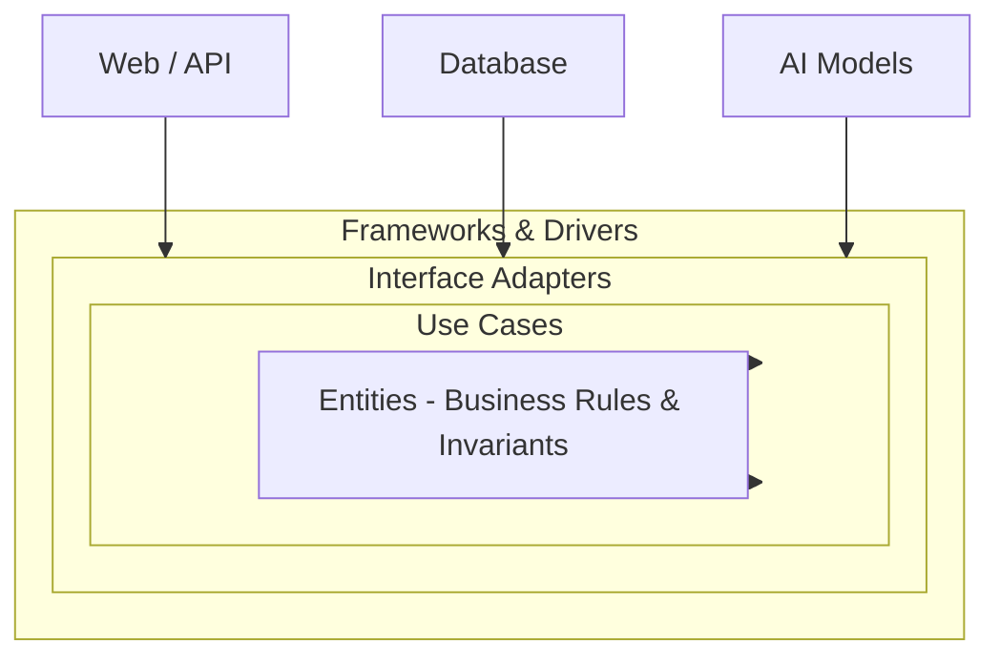

# Volume 08 - Clean Architecture

| Field | Value |
|---|---|
| Document ID | WORLD-VOL08-005 |
| Title | Clean Architecture |
| Version | 1.0 |
| Status | Approved |
| Classification | Internal |
| Founder | Mahesh Choudhary |

## Purpose

Clean Architecture is the foundational structuring discipline of every WORLD component. It exists to protect the enterprise's most valuable asset - its business logic - from the churn of frameworks, databases, user interfaces, and AI providers. In an AI-Native Business Operating System that must evolve for decades, the rules that govern how an invoice ages, how credit is granted, or how a purchase order is matched must remain stable even as the surrounding technology is repeatedly replaced. This chapter defines how WORLD applies the Dependency Rule so that business meaning, not infrastructure, sits at the center of the system.

## Scope

This chapter defines the layered concentric model, the direction of dependencies, and the placement of entities, use cases, interface adapters, and frameworks within a WORLD module. It governs how modules from the ERP Foundation (Vol 05) and Business Modules (Vol 06) are internally organized. It does not specify physical database schemas, wire-level API contracts, or deployment topology, which are defined in Volumes 09 through 12. It complements Hexagonal Architecture (WORLD-VOL08-006) and Domain-Driven Design (WORLD-VOL08-007), which describe boundary and modeling techniques used within the same layered structure.

## Concept

Clean Architecture organizes software as a set of concentric rings. At the core sit **Entities** - enterprise-wide business objects and invariants. Surrounding them are **Use Cases** - application-specific orchestration of those entities. Outside those are **Interface Adapters** - controllers, presenters, and gateways that translate between the use cases and the outside world. The outermost ring holds **Frameworks and Drivers** - the web framework, the database, the message bus, and external AI models.

The single governing law is the **Dependency Rule**: source-code dependencies point only inward. Inner rings know nothing of outer rings. An entity cannot import a database class; a use case cannot depend on a REST controller. Crossing a boundary inward-to-outward is achieved through interfaces defined by the inner ring and implemented by the outer ring - the classic dependency inversion. This yields a system where business rules are testable in isolation and infrastructure is a replaceable detail.

## Application in WORLD

Every WORLD module is authored as a clean architecture unit. Consider the Credit Management capability inside the Finance module (WORLD-VOL06-015). The `CustomerCreditProfile` entity enforces the invariant that exposure may never exceed an approved limit without a valid override. The `ReleaseOrderAgainstCredit` use case orchestrates that entity against a repository interface. A PostgreSQL adapter, a REST controller, and the AI Business Partner (Vol 03) all live in outer rings and depend inward. When WORLD later swaps its persistence engine or upgrades its AI provider, the credit invariant is untouched because it never referenced those details.

The AI layer is deliberately treated as an outermost detail. The AI Business Partner consumes use cases through the same interfaces a human-facing UI would; it never reaches into entities directly. This keeps AI a powerful but replaceable participant rather than a structural dependency.

## Key Components

| Component | Ring | Responsibility | WORLD Example |
|---|---|---|---|
| Entity | Core | Enterprise invariants and business rules | `CustomerCreditProfile`, `PurchaseOrder` |
| Use Case | Application | Orchestrate entities for one intent | `ReleaseOrderAgainstCredit` |
| Boundary Interface | Application | Contract implemented outward | `CreditRepository`, `NotificationPort` |
| Interface Adapter | Adapter | Translate to/from external form | REST controller, GL gateway, presenter |
| Framework / Driver | Outermost | Concrete technology | PostgreSQL, message bus, AI model |

## Trade-offs & Considerations

| Consideration | Benefit | Cost |
|---|---|---|
| Indirection via interfaces | Framework independence, high testability | More classes and mapping code |
| Strict dependency direction | Business logic survives tech change | Discipline required in reviews |
| Boundary DTOs | Decoupled layers | Object-to-object translation overhead |

WORLD accepts the additional indirection because the blueprint optimizes for a multi-decade lifespan. To avoid over-engineering small capabilities, teams may collapse presenter and controller responsibilities for trivial read paths, but the Dependency Rule is never relaxed. Anemic entities are treated as a defect: business rules belong in the core, not in use cases.

## Relationship to Other Layers

Clean Architecture is the internal skeleton that Hexagonal Architecture (WORLD-VOL08-006) exposes as explicit ports and adapters at the module edge. Domain-Driven Design (WORLD-VOL08-007) supplies the modeling vocabulary - aggregates, value objects, and bounded contexts - that populate the entity core. The Repository Pattern (WORLD-VOL08-013) and Dependency Injection (WORLD-VOL08-014) are the mechanisms that implement inward-pointing dependencies. Within the Modular Monolith (WORLD-VOL08-009), each module is a self-contained clean architecture unit, which is precisely what makes later extraction into a microservice (WORLD-VOL08-008) low-risk.

## Cross-References

- [Hexagonal Architecture](/docs/blueprint/volume-08-architecture/section-b-architectural-styles-and-patterns/06-hexagonal-architecture.md)
- [Domain-Driven Design](/docs/blueprint/volume-08-architecture/section-b-architectural-styles-and-patterns/07-domain-driven-design.md)
- [Modular Monolith](/docs/blueprint/volume-08-architecture/section-b-architectural-styles-and-patterns/09-modular-monolith.md)
- [ERP Foundation](/docs/blueprint/volume-05-erp-foundation/README.md)

## References

- [Vision and Philosophy](/docs/blueprint/volume-01-vision-and-philosophy/README.md)
- [Document Standards](/docs/governance/document-standards.md)

## Change Log

| Version | Date | Author | Notes |
|---|---|---|---|
| 1.0 | 2026-07-12 | Lead Software Engineer | Initial approved version. |
