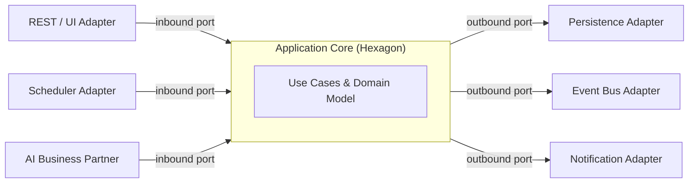

# Volume 08 - Hexagonal Architecture

| Field | Value |
|---|---|
| Document ID | WORLD-VOL08-006 |
| Title | Hexagonal Architecture |
| Version | 1.0 |
| Status | Approved |
| Classification | Internal |
| Founder | Mahesh Choudhary |

## Purpose

Hexagonal Architecture - also known as Ports and Adapters - defines how a WORLD module talks to the world without letting the world dictate its shape. Where Clean Architecture (WORLD-VOL08-005) establishes the inward dependency direction, Hexagonal Architecture makes the module's edges explicit and symmetric: every external interaction, whether a human clicking a button, a scheduled job, another module, or the AI Business Partner (Vol 03), enters through a named port. This makes WORLD modules uniformly testable, independently deployable, and resilient to the constant substitution of drivers that an AI-native platform demands.

## Scope

This chapter defines ports (the module's contracts), adapters (the technology-specific implementations), and the distinction between driving and driven sides. It governs how modules in the ERP Foundation (Vol 05) and Business Modules (Vol 06) expose and consume behavior. It excludes concrete transport specifications and schema definitions, which reside in Volumes 09 through 12. It should be read alongside Clean Architecture (WORLD-VOL08-005) and API First (WORLD-VOL08-010).

## Concept

A hexagon represents the application core. Its edges hold **ports** - technology-agnostic interfaces expressing what the core offers or requires. **Adapters** connect ports to specific technologies. There are two sides:

- **Driving (primary) adapters** initiate action against the core through **inbound ports** - for example a REST controller, a CLI, or the AI Business Partner invoking a use case.
- **Driven (secondary) adapters** are called by the core through **outbound ports** - for example a database gateway, a message publisher, or an email service.

The core defines the port interfaces; adapters conform to them. Because the same inbound port can be driven by a web request in production and a test harness in a unit test, and the same outbound port can be backed by PostgreSQL or an in-memory fake, the core becomes fully verifiable without any infrastructure.

## Application in WORLD

Consider the Procurement capability. Its core exposes an inbound port `ApprovePurchaseOrder`. In production this port is driven by a REST adapter; in an automated workflow it is driven by the Workflow Engine (WORLD-VOL08-015); in a conversational flow it is driven by the AI Business Partner. All three call the identical port, so approval logic is written and tested once. On the driven side, the core needs to persist the order and publish a `PurchaseOrderApproved` event; it declares outbound ports `PurchaseOrderRepository` and `DomainEventPublisher`. Production binds these to PostgreSQL and the event bus; tests bind them to in-memory fakes.

This symmetry is why WORLD can present a single business capability across web, API, scheduled automation, and AI conversation without duplicating rules. It also makes AI a first-class but non-privileged driver: the AI Business Partner uses the same doors as everyone else.

## Key Components

| Component | Side | Responsibility | WORLD Example |
|---|---|---|---|
| Inbound Port | Driving | Contract the core offers | `ApprovePurchaseOrder` |
| Driving Adapter | Driving | Translate external trigger to port call | REST controller, Workflow trigger, AI invocation |
| Application Core | Center | Use cases and domain model | Procurement decision logic |
| Outbound Port | Driven | Contract the core requires | `PurchaseOrderRepository`, `DomainEventPublisher` |
| Driven Adapter | Driven | Implement port with technology | PostgreSQL gateway, event bus publisher |

## Trade-offs & Considerations

| Consideration | Benefit | Cost |
|---|---|---|
| Explicit ports for every edge | Uniform testing, easy substitution | More interfaces to design and maintain |
| Symmetric driving/driven model | One capability, many channels | Requires disciplined port ownership |
| Adapter proliferation | Technology freedom | Risk of thin, redundant adapters |

WORLD adopts Hexagonal Architecture as the default module boundary because it directly enables the modular-monolith-first stance (WORLD-VOL08-009): a module whose edges are already ports can be extracted into a service simply by replacing an in-process adapter with a network adapter. The main risk - too many trivial ports - is mitigated by defining ports around business capabilities, not around every technical call.

## Relationship to Other Layers

Hexagonal Architecture externalizes the boundaries that Clean Architecture (WORLD-VOL08-005) defines internally; the two are complementary views of one design. Domain-Driven Design (WORLD-VOL08-007) determines where a hexagon's edges fall, since a bounded context is the natural unit of a hexagon. The Repository Pattern (WORLD-VOL08-013) is the archetypal outbound port, and Dependency Injection (WORLD-VOL08-014) wires adapters to ports at composition time. API First (WORLD-VOL08-010) formalizes the contracts that inbound adapters expose externally.

## Cross-References

- [Clean Architecture](/docs/blueprint/volume-08-architecture/section-b-architectural-styles-and-patterns/05-clean-architecture.md)
- [Domain-Driven Design](/docs/blueprint/volume-08-architecture/section-b-architectural-styles-and-patterns/07-domain-driven-design.md)
- [Modular Monolith](/docs/blueprint/volume-08-architecture/section-b-architectural-styles-and-patterns/09-modular-monolith.md)
- [AI Business Partner](/docs/blueprint/volume-03-ai-business-partner/README.md)

## References

- [Vision and Philosophy](/docs/blueprint/volume-01-vision-and-philosophy/README.md)
- [Document Standards](/docs/governance/document-standards.md)

## Change Log

| Version | Date | Author | Notes |
|---|---|---|---|
| 1.0 | 2026-07-12 | Lead Software Engineer | Initial approved version. |
