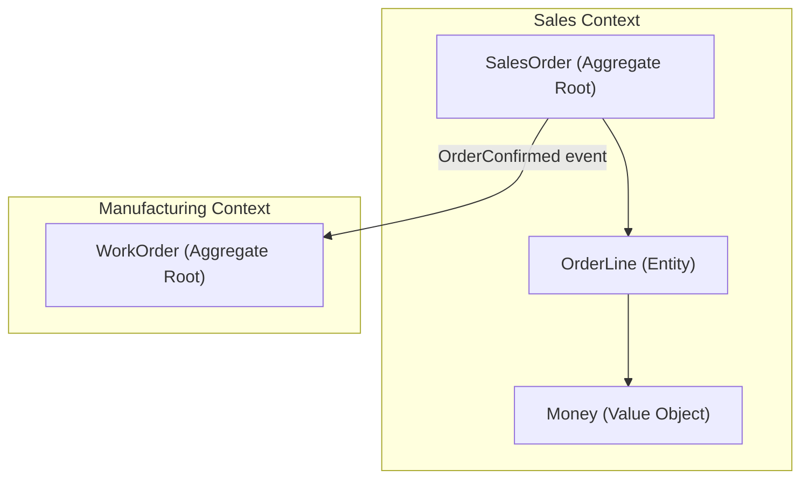

# Volume 08 - Domain-Driven Design

| Field | Value |
|---|---|
| Document ID | WORLD-VOL08-007 |
| Title | Domain-Driven Design |
| Version | 1.0 |
| Status | Approved |
| Classification | Internal |
| Founder | Mahesh Choudhary |

## Purpose

Domain-Driven Design (DDD) is the modeling discipline that gives WORLD's business logic its meaning. Clean and Hexagonal architectures describe how a module is structured; DDD describes what fills the core. For an AI-Native Business Operating System that spans finance, supply chain, manufacturing, and human capital, a shared, precise model of each business domain is essential - both so engineers build the right thing and so the AI Business Partner (Vol 03) can reason over concepts that carry genuine business semantics rather than opaque data. This chapter defines how WORLD identifies domains, draws bounded contexts, and models aggregates.

## Scope

This chapter covers strategic DDD (subdomains, bounded contexts, context mapping, ubiquitous language) and tactical DDD (aggregates, entities, value objects, domain events, domain services, repositories). It shapes the domain model realized in the ERP Foundation (Vol 05) and Business Modules (Vol 06). It does not define storage schemas or API payloads, which live in Volumes 09 through 11. It is applied within the structures of Clean Architecture (WORLD-VOL08-005) and Hexagonal Architecture (WORLD-VOL08-006).

## Concept

DDD begins with **strategic design**. The overall problem space is divided into **subdomains** - core (the differentiators, such as WORLD's AI-driven decisioning), supporting, and generic. Each is realized as a **bounded context**: an explicit boundary within which a single **ubiquitous language** holds and every term has one unambiguous meaning. The word "Order" means something specific in Sales and something different in Manufacturing; bounded contexts keep these from colliding. A **context map** then documents the relationships between contexts.

Within a context, **tactical design** provides building blocks. An **aggregate** is a cluster of objects treated as one consistency boundary, guarded by an **aggregate root** that enforces invariants. **Entities** have identity and lifecycle; **value objects** are immutable and defined only by their attributes; **domain events** record facts that have occurred; **domain services** hold logic that belongs to no single entity.

## Application in WORLD

WORLD's domain map is not arbitrary - it mirrors the Business Modules (Vol 06). Finance, Procurement, Sales, Manufacturing, and Human Capital are each modeled as one or more bounded contexts, and their boundaries become the seams of the Modular Monolith (WORLD-VOL08-009). Within the Sales context, `SalesOrder` is an aggregate root that enforces invariants such as "total must equal the sum of confirmed lines" and "a confirmed order cannot be edited, only amended." `Money` is a value object combining amount and currency so that arithmetic is always currency-safe.

Contexts communicate through domain events rather than shared tables. When a `SalesOrder` is confirmed, it emits `OrderConfirmed`; the Manufacturing context reacts by creating a `WorkOrder`. This event-driven integration keeps each context autonomous and gives the AI Business Partner a stream of business-meaningful facts to reason over. The ubiquitous language is captured in the module documentation and is the same vocabulary used in code, conversations, and AI prompts.

## Key Components

| Component | Type | Responsibility | WORLD Example |
|---|---|---|---|
| Bounded Context | Strategic | Boundary for one ubiquitous language | Sales, Procurement, Finance |
| Aggregate Root | Tactical | Enforce invariants, single entry point | `SalesOrder`, `PurchaseOrder` |
| Entity | Tactical | Object with identity and lifecycle | `OrderLine`, `Invoice` |
| Value Object | Tactical | Immutable, attribute-defined concept | `Money`, `Address`, `DateRange` |
| Domain Event | Tactical | Record of a business fact | `OrderConfirmed`, `PaymentReceived` |
| Domain Service | Tactical | Cross-entity business logic | `CreditEvaluationService` |

## Trade-offs & Considerations

| Consideration | Benefit | Cost |
|---|---|---|
| Bounded contexts | Autonomy, no term collision | Requires translation between contexts |
| Aggregate consistency boundaries | Clear invariants, safe concurrency | Cross-aggregate changes need eventual consistency |
| Ubiquitous language | Shared understanding, AI-ready semantics | Ongoing curation effort |

WORLD invests in DDD for its core subdomains where differentiation matters, and applies lighter modeling to generic subdomains such as notification or file storage, which may use off-the-shelf solutions. Over-modeling generic areas is treated as waste; under-modeling the core is treated as strategic risk.

## Relationship to Other Layers

DDD populates the entity core of Clean Architecture (WORLD-VOL08-005) and determines where the edges of a Hexagonal (WORLD-VOL08-006) module fall, since one bounded context typically equals one hexagon and one module of the Modular Monolith (WORLD-VOL08-009). Domain events are the payloads of Event-Driven Architecture (WORLD-VOL08-011), and aggregate roots are persisted through the Repository Pattern (WORLD-VOL08-013). When a bounded context must scale independently, it is the unit extracted into a Microservice (WORLD-VOL08-008).

## Cross-References

- [Clean Architecture](/docs/blueprint/volume-08-architecture/section-b-architectural-styles-and-patterns/05-clean-architecture.md)
- [Modular Monolith](/docs/blueprint/volume-08-architecture/section-b-architectural-styles-and-patterns/09-modular-monolith.md)
- [Microservices](/docs/blueprint/volume-08-architecture/section-b-architectural-styles-and-patterns/08-microservices.md)
- [Business Modules](/docs/blueprint/volume-06-business-modules/README.md)

## References

- [Vision and Philosophy](/docs/blueprint/volume-01-vision-and-philosophy/README.md)
- [Document Standards](/docs/governance/document-standards.md)

## Change Log

| Version | Date | Author | Notes |
|---|---|---|---|
| 1.0 | 2026-07-12 | Lead Software Engineer | Initial approved version. |
