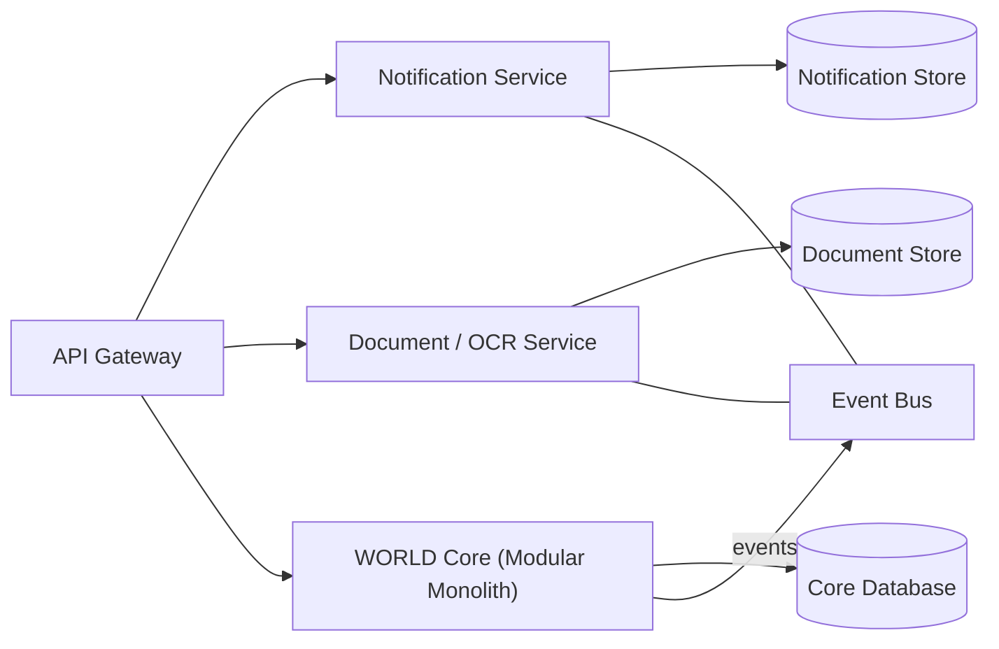

# Volume 08 - Microservices

| Field | Value |
|---|---|
| Document ID | WORLD-VOL08-008 |
| Title | Microservices |
| Version | 1.0 |
| Status | Approved |
| Classification | Internal |
| Founder | Mahesh Choudhary |

## Purpose

Microservices describe how WORLD decomposes selected capabilities into independently deployable, network-addressable services when - and only when - the business case justifies it. WORLD's stance is deliberate and pragmatic: the platform begins as a Modular Monolith (WORLD-VOL08-009) and extracts a bounded context into a microservice only where independent scaling, isolation, or lifecycle demands it. This chapter defines what a WORLD microservice is, when extraction is warranted, and the disciplines required to keep a distributed system reliable rather than merely fashionable.

## Scope

This chapter covers service boundaries, service ownership of data, inter-service communication, and the operational obligations of a distributed system. It defines the extraction decision, not the concrete infrastructure - deployment, orchestration, and networking specifics live in Volume 12 (Infrastructure), and API contracts in Volume 10. It must be read together with Modular Monolith (WORLD-VOL08-009), which is WORLD's default, and Domain-Driven Design (WORLD-VOL08-007), which defines the boundaries a service inherits.

## Concept

A microservice is a small, autonomous unit that owns a single business capability end to end: its own logic, its own data store, and its own deployment lifecycle. Services communicate only through explicit contracts - synchronous APIs or asynchronous events - never through a shared database. This autonomy enables independent scaling, independent release, and fault isolation, at the cost of introducing the fallacies of distributed computing: the network is unreliable, latency is non-zero, and consistency becomes eventual.

The critical design principle is that a service boundary must equal a bounded context boundary. Splitting a single consistency boundary across services creates distributed transactions and chatty coupling - the worst of both worlds. WORLD therefore treats microservices as an operational optimization of an already-clean modular design, not as a starting architecture.

## Application in WORLD

WORLD does not shatter the ERP into dozens of services on day one. Instead, the core business modules (Vol 06) run inside the Modular Monolith, and specific capabilities are extracted as services only when a concrete driver appears. Early candidates are capabilities with a scaling or isolation profile that differs sharply from transactional business logic: the Document and OCR ingestion service (bursty, compute-heavy), the Notification service (high fan-out, independently failing), and heavy AI inference workloads that require GPU-class resources separate from the transactional core.

Because each business module is already a clean, hexagonal, bounded context, extraction is mechanical: the in-process outbound adapter is replaced by a network adapter, and the module's events are published to the shared event bus instead of an in-memory dispatcher. The decision is governed by explicit criteria rather than preference.

| Extraction Driver | Extract as Service? | Rationale |
|---|---|---|
| Divergent scaling profile (e.g. GPU inference, OCR) | Yes | Independent horizontal/vertical scaling |
| Independent failure isolation required | Yes | Contain blast radius of an outage |
| Distinct release cadence or team ownership | Yes | Decouple deployment lifecycles |
| Strong transactional consistency with core | No | Avoid distributed transactions |
| Convenience or fashion only | No | Cost outweighs benefit |

## Key Components

| Component | Responsibility | WORLD Example |
|---|---|---|
| Service Boundary | One bounded context, autonomous | Notification, Document / OCR |
| Private Data Store | Data owned solely by the service | Notification store, document store |
| API Gateway | Single ingress, routing, cross-cutting concerns | Edge gateway to core and services |
| Event Bus | Asynchronous inter-service integration | Domain event distribution |
| Service Contract | Versioned interface between services | API and event schema (Vol 10) |

## Trade-offs & Considerations

| Consideration | Benefit | Cost |
|---|---|---|
| Independent deployability | Faster, isolated releases | Deployment and versioning complexity |
| Independent scalability | Right-size resources per capability | Network latency and partial failure |
| Data ownership per service | Loose coupling | Eventual consistency, no cross-service joins |
| Fault isolation | Contained outages | Distributed tracing and observability burden |

WORLD treats premature microservice adoption as a leading cause of failed platforms: it imposes distributed-systems cost before the domain is even stable. Accordingly, the burden of proof rests on extraction. A capability stays in the monolith until a driver in the table above is demonstrably met.

## Relationship to Other Layers

Microservices are the extraction target of the Modular Monolith (WORLD-VOL08-009); the two chapters express one continuous strategy - modular-monolith-first, extract where justified. Service boundaries are inherited directly from Domain-Driven Design (WORLD-VOL08-007) bounded contexts. Inter-service communication relies on Event-Driven Architecture (WORLD-VOL08-011) and API First (WORLD-VOL08-010), while each service internally retains Clean (WORLD-VOL08-005) and Hexagonal (WORLD-VOL08-006) structure. Scalability and cloud-native operations are elaborated in Section F.

## Cross-References

- [Modular Monolith](/docs/blueprint/volume-08-architecture/section-b-architectural-styles-and-patterns/09-modular-monolith.md)
- [Domain-Driven Design](/docs/blueprint/volume-08-architecture/section-b-architectural-styles-and-patterns/07-domain-driven-design.md)
- [Hexagonal Architecture](/docs/blueprint/volume-08-architecture/section-b-architectural-styles-and-patterns/06-hexagonal-architecture.md)
- [ERP Foundation](/docs/blueprint/volume-05-erp-foundation/README.md)

## References

- [Vision and Philosophy](/docs/blueprint/volume-01-vision-and-philosophy/README.md)
- [Document Standards](/docs/governance/document-standards.md)

## Change Log

| Version | Date | Author | Notes |
|---|---|---|---|
| 1.0 | 2026-07-12 | Lead Software Engineer | Initial approved version. |
