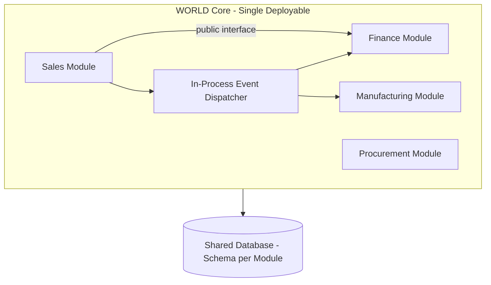

# Volume 08 - Modular Monolith

| Field | Value |
|---|---|
| Document ID | WORLD-VOL08-009 |
| Title | Modular Monolith |
| Version | 1.0 |
| Status | Approved |
| Classification | Internal |
| Founder | Mahesh Choudhary |

## Purpose

The Modular Monolith is WORLD's default and primary architectural style. It delivers the internal boundaries and modularity of a well-designed distributed system while retaining the operational simplicity, transactional integrity, and development velocity of a single deployable unit. For an AI-Native Business Operating System covering the full breadth of enterprise functions, starting as a modular monolith lets WORLD ship a coherent, consistent product quickly - and defer the cost of distribution until a specific capability genuinely demands it (see Microservices, WORLD-VOL08-008). This chapter defines the modular-monolith-first stance and the module discipline that makes it work.

## Scope

This chapter defines module boundaries, in-process communication, shared-kernel rules, and the conditions under which a module is later extracted into a service. It applies to the entire ERP Foundation (Vol 05) and Business Modules (Vol 06). It does not cover physical deployment or database provisioning, which reside in Volume 12. It is the counterpart to Microservices (WORLD-VOL08-008) and depends on the modeling of Domain-Driven Design (WORLD-VOL08-007).

## Concept

A modular monolith is a single deployable application composed of strongly bounded internal modules. Each module owns its domain logic and its data, exposes a narrow public interface, and hides everything else. Modules communicate in-process - through explicit interfaces or an in-memory event dispatcher - rather than over the network. Crucially, modules do not reach into each other's tables; the same data-ownership rule that governs microservices governs modules here.

The difference from a distributed system is the deployment and consistency model: because everything runs in one process against one database, WORLD can use ordinary ACID transactions across a business operation and avoids network latency, partial failure, and eventual-consistency complexity. The difference from a big ball of mud is enforced boundaries: modules are as isolated as services, only without the wire.

## Application in WORLD

WORLD's modules map one-to-one to the bounded contexts of Domain-Driven Design (WORLD-VOL08-007) and to the Business Modules of Vol 06. Each module - Sales, Procurement, Finance, Manufacturing, Human Capital - is internally a Clean (WORLD-VOL08-005) and Hexagonal (WORLD-VOL08-006) unit. Within the single database, each module owns its own schema; cross-schema foreign keys are prohibited, and cross-module data flows through public interfaces or domain events.

A concrete example: when Sales confirms an order, it publishes `OrderConfirmed` to the in-process dispatcher within the same transaction; Manufacturing and Finance react synchronously or via transactional outbox. Should the Document/OCR capability later need GPU scaling, it is extracted into a microservice by swapping its in-process adapter for a network adapter - no change to its domain logic. This is the payoff of the design: modularity now, distribution later, on demand.

| Aspect | Modular Monolith | Microservices |
|---|---|---|
| Deployment | Single unit | Independent per service |
| Cross-module transaction | Native ACID | Distributed / eventual |
| Communication | In-process | Network (API / events) |
| Operational complexity | Low | High |
| Independent scaling | No (whole app) | Yes (per service) |
| WORLD default | Yes | Only where justified |

## Key Components

| Component | Responsibility | WORLD Example |
|---|---|---|
| Module | Bounded context, owns logic and schema | Sales, Finance, Procurement |
| Public Interface | The only sanctioned entry into a module | `SalesModule.confirmOrder()` |
| In-Process Dispatcher | Synchronous/transactional intra-app events | `OrderConfirmed` distribution |
| Schema-per-Module | Data ownership within one database | `sales.*`, `finance.*` schemas |
| Shared Kernel | Minimal common types, tightly governed | `Money`, `EntityId` |

## Trade-offs & Considerations

| Consideration | Benefit | Cost |
|---|---|---|
| Single deployment | Operational simplicity, fast iteration | Whole app scales together |
| In-process ACID transactions | Strong consistency, no distributed sagas | Shared runtime failure domain |
| Enforced module boundaries | Extraction-ready, low coupling | Requires architectural governance |
| One codebase | Easy refactoring across modules | Discipline needed to prevent erosion |

The principal risk is boundary erosion - modules quietly importing each other's internals until the monolith degrades into a ball of mud. WORLD mitigates this with enforced module visibility, dependency linting, and architecture reviews. The reward is that the same discipline keeps every module extraction-ready, giving WORLD an evolutionary path rather than a big-bang rewrite.

## Relationship to Other Layers

The Modular Monolith is the container in which Clean (WORLD-VOL08-005) and Hexagonal (WORLD-VOL08-006) modules live, with Domain-Driven Design (WORLD-VOL08-007) defining each module's boundary. It is the direct counterpart of Microservices (WORLD-VOL08-008): the two form WORLD's single modular-monolith-first, extract-where-justified strategy. Event-Driven Architecture (WORLD-VOL08-011) provides the in-process and later cross-service messaging, and Section F governs how the monolith scales operationally.

## Cross-References

- [Microservices](/docs/blueprint/volume-08-architecture/section-b-architectural-styles-and-patterns/08-microservices.md)
- [Domain-Driven Design](/docs/blueprint/volume-08-architecture/section-b-architectural-styles-and-patterns/07-domain-driven-design.md)
- [Clean Architecture](/docs/blueprint/volume-08-architecture/section-b-architectural-styles-and-patterns/05-clean-architecture.md)
- [Business Modules](/docs/blueprint/volume-06-business-modules/README.md)

## References

- [Vision and Philosophy](/docs/blueprint/volume-01-vision-and-philosophy/README.md)
- [Document Standards](/docs/governance/document-standards.md)

## Change Log

| Version | Date | Author | Notes |
|---|---|---|---|
| 1.0 | 2026-07-12 | Lead Software Engineer | Initial approved version. |
