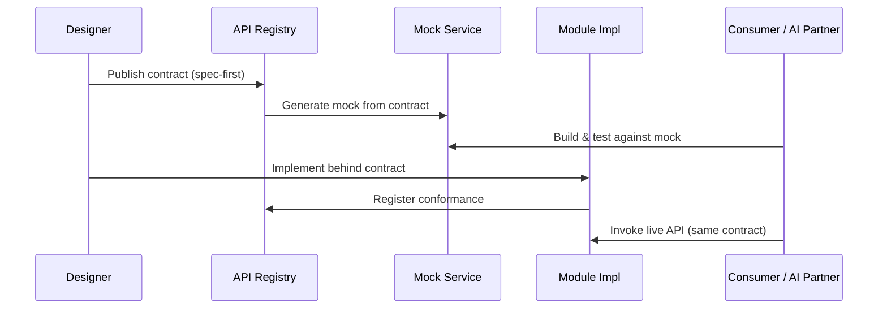

# Volume 08 - API First

| Field | Value |
|---|---|
| Document ID | WORLD-VOL08-010 |
| Title | API First |
| Version | 1.0 |
| Status | Approved |
| Classification | Internal |
| Founder | Mahesh Choudhary |

## Purpose

This chapter establishes API First as the foundational application-architecture discipline of WORLD. Every capability of the platform - the ERP Foundation (Vol 05), the Business Modules (Vol 06), and the AI Business Partner (Vol 03) - is defined, contracted, and consumed through an explicit interface before any implementation exists. The purpose is to guarantee that WORLD is programmable, composable, and machine-consumable by design rather than as an afterthought.

## Scope

Covered: the API-First principle, contract-first design, the interface lifecycle, the internal-and-external surface model, and the components that govern WORLD APIs. Excluded: concrete endpoint catalogs, payload schemas, versioning mechanics, and gateway configuration, which are specified in Volume 10 (API, future). This chapter defines the architectural stance; Volume 10 defines the wire-level detail.

## Concept

API First inverts the traditional build order. Rather than writing code and later exposing an interface, the team designs the contract first - the resources, operations, inputs, outputs, and errors - and treats that contract as the primary artifact. Implementation, tests, documentation, client SDKs, and mocks are all derived from it. From first principles, an operating system is only as valuable as the surface through which its functions can be invoked; WORLD is an AI-Native Business Operating System, so its surface must be equally legible to human developers and to autonomous AI agents. A contract that exists before code makes the platform predictable: consumers can build against a stable promise, and providers can evolve internals freely behind it.

## Application in WORLD

In WORLD, the API is the contract between every layer. A Business Module never reaches into another module's data; it calls a published interface. The AI Business Partner does not embed bespoke integrations; it perceives and acts through the same governed API surface that human clients use, which is what makes its actions auditable and reversible. Contracts are authored as machine-readable specifications, reviewed as architecture artifacts, and published to a central registry. Two surfaces are distinguished: an internal surface for module-to-module composition and an external surface for tenants, partners, and integrators. Both are first-class and both are versioned.

### Enterprise Example

A partner integrator must connect a logistics provider to WORLD's Order-to-Cash flow. Because the `Shipment` API contract is published before implementation, the integrator generates a client SDK and builds against a contract-derived mock on day one, in parallel with the WORLD team implementing the endpoint. When the live service ships, the integrator's code runs unchanged. Simultaneously, the AI Business Partner uses the identical `Shipment` contract to propose a carrier reallocation when a delay is detected - no special access path, no hidden integration.

## Key Components

| Component | Responsibility | Owner |
|---|---|---|
| Contract Specification | Machine-readable definition of resources, operations, and errors | Domain Architect |
| API Registry | Central catalog of published, versioned contracts | Platform Engineering |
| API Gateway | Routing, authentication, rate limiting, observability at the edge | Platform Engineering |
| Mock & SDK Generation | Contract-derived mocks and client libraries | Developer Experience |
| Governance Board | Design review, style compliance, deprecation approval | Architecture Council |

## Trade-offs & Considerations

API First front-loads design effort; teams invest in the contract before they can demonstrate running code, which can feel slower at the outset. This is deliberate: the cost is paid once, while the benefit - parallel development, stable consumers, and machine-consumability - compounds across every module and every release. The principal risk is contract drift, where implementation diverges from the published promise; WORLD mitigates this with conformance testing gated in the delivery pipeline. A second consideration is over-generalization: designing overly abstract contracts to anticipate unknown futures. The standard is to model the current business domain precisely and evolve the contract additively as needs emerge.

## Relationship to Other Layers

API First is the connective tissue of the WORLD application architecture. It sits above the domain and repository layers (Chapter 13) and is realized through Dependency Injection (Chapter 14), which supplies implementations behind each contract. It complements Event-Driven Architecture (Chapter 11): synchronous request/response commands travel through APIs, while asynchronous facts travel as events. For the AI Business Partner (Vol 03), the governed API surface is the sole channel of action, ensuring every autonomous decision is expressed through an auditable, permissioned contract.

## Cross-References

- [Event-Driven Architecture](/docs/blueprint/volume-08-architecture/section-c-application-architecture/11-event-driven-architecture.md)
- [Dependency Injection](/docs/blueprint/volume-08-architecture/section-c-application-architecture/14-dependency-injection.md)
- [Volume 03 - AI Business Partner](/docs/blueprint/volume-03-ai-business-partner/README.md)
- [Volume 06 - Business Modules](/docs/blueprint/volume-06-business-modules/README.md)

## References

- [Volume 01 - Vision and Philosophy](/docs/blueprint/volume-01-vision-and-philosophy/README.md)
- [Document Standards](/docs/governance/document-standards.md)

## Change Log

| Version | Date | Author | Notes |
|---|---|---|---|
| 1.0 | 2026-07-12 | Lead Software Engineer | Initial approved version. |
