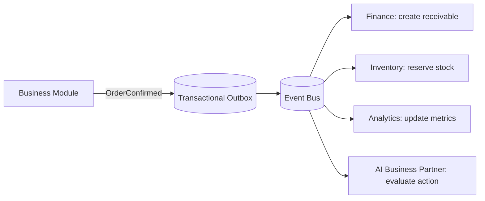

# Volume 08 - Event-Driven Architecture

| Field | Value |
|---|---|
| Document ID | WORLD-VOL08-011 |
| Title | Event-Driven Architecture |
| Version | 1.0 |
| Status | Approved |
| Classification | Internal |
| Founder | Mahesh Choudhary |

## Purpose

This chapter defines Event-Driven Architecture (EDA) as the asynchronous backbone of the WORLD application. It elevates the Event-Driven ERP established in Volume 05 (Chapter 12) to a platform-wide architectural pattern, so that every material business fact - across all Business Modules (Vol 06) and observed by the AI Business Partner (Vol 03) - is captured as an immutable event and propagated to any number of independent reactions.

## Scope

Covered: the event-driven concept, domain events, the publish/subscribe fabric, delivery and ordering guarantees, and the components that govern events in WORLD. Excluded: broker infrastructure sizing, topic partition tuning, and stream-processing topologies, which belong to the infrastructure volumes (Vol 09-12). This chapter is the architectural definition; Volume 05 Chapter 12 is its concrete realization within the ERP.

## Concept

An event is a statement that something happened - a fact, expressed in the past tense, that cannot be retracted. Event-Driven Architecture organizes a system around the production, detection, and consumption of such facts. From first principles, tight coupling arises when a component that records a change must also know every party interested in that change. EDA breaks this coupling: the producer announces the fact and moves on; consumers subscribe independently. This yields three properties WORLD requires - temporal decoupling (producer and consumer need not run at the same moment), extensibility (new reactions attach without touching producers), and observability (the event log is a complete, replayable history of the enterprise).

## Application in WORLD

WORLD adopts the same discipline defined for the Event-Driven ERP: when an aggregate changes, its owning module records a domain event and publishes it through a transactional outbox, guaranteeing the event is persisted atomically with the state change and delivered at-least-once. Events are named in past tense (`InvoiceIssued`, `StockReserved`), versioned, and tenant-tagged. Ordering is preserved per aggregate key. Consumers are idempotent and independent: Finance, Analytics, Notifications, and the AI Business Partner may all react to a single event with no coupling to the producer or to one another. This is the platform-wide generalization of Volume 05's ERP event fabric.

### Enterprise Example

A distributor confirms a large order. Order-to-Cash publishes `OrderConfirmed` exactly once via the outbox. Inventory reserves stock and, detecting a shortfall, publishes `StockShortfallDetected`. The AI Business Partner subscribes to that event, evaluates supplier lead times, and proposes a replenishment purchase order - while Finance has already booked the receivable from the original event. One business fact fanned out to four independent reactions, with no change to the producer and a complete, replayable audit trail retained for compliance and simulation.

## Key Components

| Component | Responsibility | Guarantee |
|---|---|---|
| Domain Event | Immutable, versioned record of a business fact | Past-tense, tenant-tagged |
| Transactional Outbox | Atomic persistence of state change and event | At-least-once delivery |
| Event Bus | Publish/subscribe transport and fan-out | Per-aggregate ordering |
| Consumer | Independent, idempotent reaction to an event | Safe on redelivery |
| Event Log | Durable, replayable store of history | Backfill for new subscribers |

## Trade-offs & Considerations

EDA trades the simplicity of synchronous calls for eventual consistency: a consumer sees a fact shortly after it occurs, not within the producing transaction. Systems must therefore be designed to tolerate brief windows of inconsistency, and consumers must be idempotent because at-least-once delivery permits duplicates. Debugging shifts from a single call stack to a distributed trace across the event log, which WORLD addresses with correlation identifiers and end-to-end observability. The reward for accepting these costs is a real-time, extensible nervous system whose reactions occur the instant a fact is recorded rather than in nightly batches.

## Relationship to Other Layers

Event-Driven Architecture is complementary to API First (Chapter 10): commands and queries travel synchronously through APIs, while facts travel asynchronously as events. CQRS (Chapter 12) frequently consumes events to build read models. The event fabric is the primary sensory stream of the AI Business Partner (Vol 03), letting it perceive every material change as it happens and act proactively. Within the platform it directly extends the Event-Driven ERP of Volume 05 and feeds Business Intelligence (Vol 04) as its canonical source of truth.

## Cross-References

- [API First](/docs/blueprint/volume-08-architecture/section-c-application-architecture/10-api-first.md)
- [CQRS](/docs/blueprint/volume-08-architecture/section-c-application-architecture/12-cqrs.md)
- [Volume 05 - Event-Driven ERP](/docs/blueprint/volume-05-erp-foundation/section-b-core-architecture/12-event-driven-erp.md)
- [Volume 03 - AI Business Partner](/docs/blueprint/volume-03-ai-business-partner/README.md)

## References

- [Volume 01 - Vision and Philosophy](/docs/blueprint/volume-01-vision-and-philosophy/README.md)
- [Document Standards](/docs/governance/document-standards.md)

## Change Log

| Version | Date | Author | Notes |
|---|---|---|---|
| 1.0 | 2026-07-12 | Lead Software Engineer | Initial approved version. |
