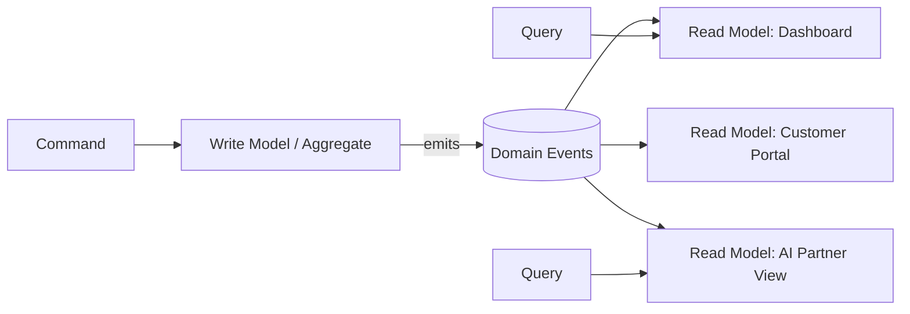

# Volume 08 - CQRS

| Field | Value |
|---|---|
| Document ID | WORLD-VOL08-012 |
| Title | CQRS |
| Version | 1.0 |
| Status | Approved |
| Classification | Internal |
| Founder | Mahesh Choudhary |

## Purpose

This chapter defines Command Query Responsibility Segregation (CQRS) as a WORLD application pattern that separates the models used to change state from the models used to read it. Its purpose is to let the transactional heart of the ERP Foundation (Vol 05) enforce invariants strictly while the many read surfaces of the Business Modules (Vol 06) and the AI Business Partner (Vol 03) are served by purpose-built, high-performance projections.

## Scope

Covered: the CQRS concept, the command and query paths, read-model projections, their relationship to events, and the components that implement the pattern in WORLD. Excluded: storage engine selection, projection deployment topology, and detailed schema design, which are specified in the data and infrastructure volumes (Vol 09-12). CQRS is applied selectively in WORLD, not universally; this chapter defines where and why.

## Concept

Most systems use one model for both writing and reading, forcing a single schema to satisfy two opposing pressures: writes demand normalization and strict validation, while reads demand denormalization and speed. From first principles these are different responsibilities, and conflating them produces a model that serves neither well. CQRS separates them. A command expresses an intent to change state and is handled by a write model that owns the business rules; a query requests information and is served by a read model shaped for the exact view a consumer needs. The two models may share a store or, more powerfully, be kept in separate stores synchronized by domain events.

## Application in WORLD

WORLD applies CQRS where read and write demands genuinely diverge - high-traffic dashboards, analytical projections, and AI perception surfaces. The write side is the authoritative aggregate: it validates commands and, on success, emits domain events through the event fabric (Chapter 11). Read models subscribe to those events and maintain denormalized projections tailored to their audience. A Finance ageing dashboard, a customer portal, and the AI Business Partner's situational view are three distinct projections of the same underlying facts, each optimized independently. Simpler modules without this divergence use a single model; CQRS is a deliberate choice, not a default.

### Enterprise Example

When an accountant posts a payment, the command hits the Receivables aggregate, which validates the allocation and emits `PaymentApplied`. Three read models react: the treasury dashboard updates its cash position projection, the customer portal refreshes the invoice status, and the AI Business Partner recomputes days-sales-outstanding to decide whether to recommend a collections action. Each projection is queried at its own scale and cadence, and none of them slows the write path that guards financial correctness.

## Key Components

| Component | Responsibility | Path |
|---|---|---|
| Command | Expresses intent to change state | Write |
| Command Handler | Loads the aggregate and enforces invariants | Write |
| Write Model (Aggregate) | Authoritative state and business rules | Write |
| Projection | Builds a read model from domain events | Read |
| Query Handler | Serves a shaped view to a consumer | Read |

## Trade-offs & Considerations

CQRS adds moving parts. Separate read and write models introduce eventual consistency between them, so a consumer may briefly query a projection that has not yet caught up to the latest command; WORLD sets explicit freshness expectations per read model and surfaces them to clients. The pattern also raises operational overhead - more code paths, more projections to maintain and rebuild. Because of this, WORLD deliberately avoids applying CQRS everywhere; it is reserved for cases where the performance, scalability, or clarity gains justify the added complexity. Read models are rebuildable by replaying events, which turns a projection bug into a recoverable, non-fatal condition.

## Relationship to Other Layers

CQRS is tightly coupled to Event-Driven Architecture (Chapter 11): domain events are the mechanism by which read models stay synchronized with the write side. It works through the Repository Pattern (Chapter 13), which persists and reconstitutes the write-side aggregates, and it is exposed through API First (Chapter 10), where commands and queries appear as distinct operations in the contract. For the AI Business Partner (Vol 03), dedicated read models provide a low-latency, purpose-built perception surface without ever compromising the transactional integrity of the ERP write path.

## Cross-References

- [Event-Driven Architecture](/docs/blueprint/volume-08-architecture/section-c-application-architecture/11-event-driven-architecture.md)
- [Repository Pattern](/docs/blueprint/volume-08-architecture/section-c-application-architecture/13-repository-pattern.md)
- [Volume 05 - Transaction Lifecycle](/docs/blueprint/volume-05-erp-foundation/section-b-core-architecture/16-transaction-lifecycle.md)
- [Volume 03 - AI Business Partner](/docs/blueprint/volume-03-ai-business-partner/README.md)

## References

- [Volume 01 - Vision and Philosophy](/docs/blueprint/volume-01-vision-and-philosophy/README.md)
- [Document Standards](/docs/governance/document-standards.md)

## Change Log

| Version | Date | Author | Notes |
|---|---|---|---|
| 1.0 | 2026-07-12 | Lead Software Engineer | Initial approved version. |
