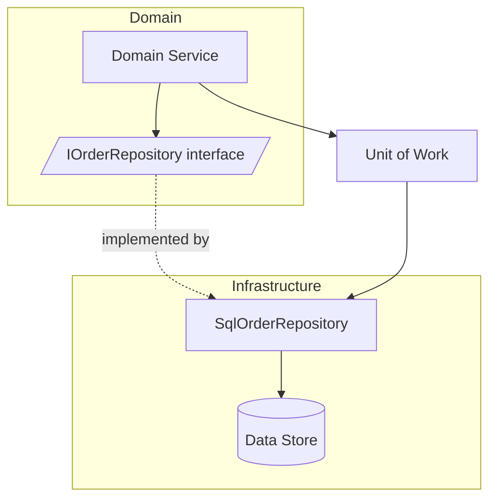

# Volume 08 - Repository Pattern

| Field | Value |
|---|---|
| Document ID | WORLD-VOL08-013 |
| Title | Repository Pattern |
| Version | 1.0 |
| Status | Approved |
| Classification | Internal |
| Founder | Mahesh Choudhary |

## Purpose

This chapter defines the Repository Pattern as the standard means by which WORLD isolates its domain logic from data persistence. Its purpose is to give every Business Module (Vol 06) and the ERP Foundation (Vol 05) a collection-like abstraction over aggregates, so that domain code expresses business intent without depending on how or where data is stored.

## Scope

Covered: the repository concept, the abstraction boundary, aggregate persistence, the unit of work, and the components that implement the pattern in WORLD. Excluded: specific database technologies, query optimization, migration mechanics, and physical schema, which are detailed in the data volumes (Vol 09-12). This chapter defines the domain-facing contract; storage internals live behind it.

## Concept

Business logic should reason about domain objects - an `Order`, a `LedgerAccount`, a `WorkOrder` - not about tables, rows, or SQL. The Repository Pattern provides an in-memory illusion of a collection of aggregates: code adds, retrieves, and removes them as though from a set, while a concrete implementation translates those operations into storage actions. From first principles, this enforces the dependency rule of clean architecture (Chapter 05): the domain defines an interface it needs, and the infrastructure supplies the implementation. The domain thus depends only on an abstraction it owns, never on a database driver, which keeps business rules portable, testable in isolation, and immune to changes in storage technology.

## Application in WORLD

In WORLD, each aggregate root has a repository interface declared in the domain layer and an implementation provided by the infrastructure layer through Dependency Injection (Chapter 14). Repositories deal only in whole aggregates, preserving consistency boundaries: a caller loads an `Invoice` with its lines, mutates it through domain methods, and saves it as a unit. A Unit of Work coordinates changes across repositories within a single transaction and, on commit, cooperates with the transactional outbox so domain events are persisted atomically with state (Chapter 11). Read-heavy projections under CQRS (Chapter 12) may bypass repositories and query read models directly, keeping the repository focused on the transactional write path.

### Enterprise Example

A credit-hold routine in the Order-to-Cash module needs to release held orders for a customer whose balance has cleared. The domain service calls `orderRepository.findHeldByCustomer(customerId)`, iterates the returned `Order` aggregates, invokes `order.release()` on each, and commits through the Unit of Work. The service contains no SQL and no knowledge of the storage engine. When WORLD later moves that module's persistence to a different store for scale, only the repository implementation changes; the credit-hold business logic is untouched and its unit tests, which use an in-memory repository, still pass.

## Key Components

| Component | Responsibility | Layer |
|---|---|---|
| Repository Interface | Domain-owned contract for aggregate persistence | Domain |
| Repository Implementation | Translates operations to the data store | Infrastructure |
| Aggregate Root | Consistency boundary loaded and saved as a unit | Domain |
| Unit of Work | Coordinates changes across repositories in one transaction | Application |
| In-Memory Fake | Test double implementing the interface | Test |

## Trade-offs & Considerations

The repository adds a layer of indirection, and misapplied it can degrade into a thin, leaky wrapper over a data-access library that adds ceremony without value. WORLD guards against this by scoping repositories to aggregate roots and forbidding generic, all-purpose query methods that expose storage concerns. A second consideration is the temptation to leak query flexibility - arbitrary filters and joins - through the interface; this couples the domain to storage capabilities and is disallowed, with complex read needs served by CQRS read models instead. The benefit of accepting a modest indirection cost is a domain that is storage-agnostic, unit-testable without a database, and resilient to infrastructure change.

## Relationship to Other Layers

The Repository Pattern is the persistence seam of the WORLD application architecture. It realizes the dependency inversion of Clean and Hexagonal architectures (Chapters 05-06) and is wired at runtime by Dependency Injection (Chapter 14). It underpins the write side of CQRS (Chapter 12) by loading and saving aggregates, and it collaborates with the event fabric (Chapter 11) so that persistence and event emission are atomic. For the AI Business Partner (Vol 03), repositories ensure that any state the Partner changes flows through the same validated aggregate boundaries as human-initiated changes.

## Cross-References

- [CQRS](/docs/blueprint/volume-08-architecture/section-c-application-architecture/12-cqrs.md)
- [Dependency Injection](/docs/blueprint/volume-08-architecture/section-c-application-architecture/14-dependency-injection.md)
- [Volume 05 - Business Object Model](/docs/blueprint/volume-05-erp-foundation/section-b-core-architecture/14-business-object-model.md)
- [Volume 06 - Business Modules](/docs/blueprint/volume-06-business-modules/README.md)

## References

- [Volume 01 - Vision and Philosophy](/docs/blueprint/volume-01-vision-and-philosophy/README.md)
- [Document Standards](/docs/governance/document-standards.md)

## Change Log

| Version | Date | Author | Notes |
|---|---|---|---|
| 1.0 | 2026-07-12 | Lead Software Engineer | Initial approved version. |
