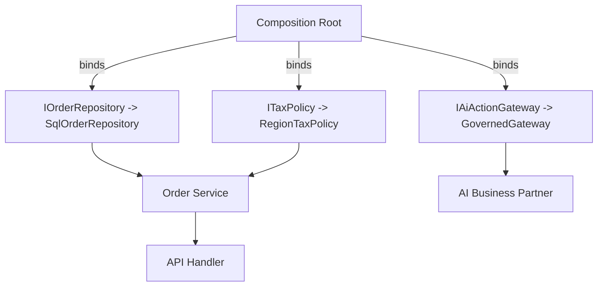

# Volume 08 - Dependency Injection

| Field | Value |
|---|---|
| Document ID | WORLD-VOL08-014 |
| Title | Dependency Injection |
| Version | 1.0 |
| Status | Approved |
| Classification | Internal |
| Founder | Mahesh Choudhary |

## Purpose

This chapter defines Dependency Injection (DI) as the mechanism WORLD uses to assemble its components from independent, replaceable parts. Its purpose is to make the platform's collaborators - repositories, gateways, policies, and AI adapters - supplied to a component rather than constructed by it, so that the ERP Foundation (Vol 05), the Business Modules (Vol 06), and the AI Business Partner (Vol 03) remain loosely coupled, testable, and configurable.

## Scope

Covered: the DI concept, inversion of control, composition and lifetimes, and the components that implement it in WORLD. Excluded: framework-specific container syntax, package structure, and build wiring, which are detailed in the engineering-standards volumes (Vol 09-12). This chapter defines the architectural principle and its role; concrete container configuration is an implementation detail.

## Concept

When a class constructs its own collaborators, it becomes bound to their concrete types, their configuration, and their lifecycles. Dependency Injection inverts this: a component declares the abstractions it needs - typically as constructor parameters - and an external assembler supplies concrete implementations. This is the practical expression of the Inversion of Control principle. From first principles, it separates two concerns that are usually tangled: what a component does, and how its dependencies are chosen and built. A component that receives its dependencies can be tested with fakes, reconfigured per tenant or environment, and reused in different compositions without modification, because it no longer knows or cares which concrete collaborator it holds.

## Application in WORLD

WORLD standardizes on constructor injection against interfaces owned by the domain and application layers. A composition root - one per deployable - is the single place where the object graph is wired: it binds each abstraction (an `IOrderRepository`, a `ITaxPolicy`, an `IAiActionGateway`) to a concrete implementation and defines its lifetime. This is what makes the Repository Pattern (Chapter 13) and API-First contracts (Chapter 10) pluggable at runtime. Cross-cutting behaviors such as authorization, logging, and caching are injected as decorators, keeping business components clean. Tenant- and environment-specific variation - a different tax engine, a sandboxed AI gateway - is achieved by binding different implementations at the composition root, with no change to business code.

### Enterprise Example

The tax calculation in the Order-to-Cash module depends on an `ITaxPolicy` abstraction. In production for a European tenant, the composition root binds it to a VAT implementation; for a United States tenant, to a sales-tax implementation; in automated tests, to a deterministic fake returning fixed rates. The order service that consumes `ITaxPolicy` is written once and never edited across these three contexts. When the AI Business Partner proposes a pricing change, it is handed the same injected policy and gateway, so its calculations and permissions are identical to those of the human-facing path - by construction, not by convention.

## Key Components

| Component | Responsibility | Concern |
|---|---|---|
| Abstraction (Interface) | Declares a needed capability | Domain / Application |
| Implementation | Concrete behavior bound to the abstraction | Infrastructure |
| Composition Root | Single place where the object graph is wired | Startup |
| DI Container | Resolves and constructs the object graph | Runtime |
| Lifetime Policy | Defines singleton, scoped, or transient reuse | Runtime |

## Trade-offs & Considerations

DI introduces indirection between the point of use and the point of construction, which can obscure at a glance which concrete type is running - a cost WORLD accepts in exchange for testability and configurability, and mitigates by centralizing all wiring in one composition root. Misuse of a container as a global service locator, where components pull dependencies on demand, reintroduces hidden coupling and is prohibited; injection is explicit through constructors. Lifetime management requires care, since a wrongly scoped dependency can leak state across requests or tenants. Handled with discipline, DI yields components that are independently developed, safely tested, and recomposed without edits - the foundation of WORLD's modularity.

## Relationship to Other Layers

Dependency Injection is the assembly mechanism beneath the entire application architecture. It operationalizes the dependency inversion of Clean and Hexagonal architectures (Chapters 05-06), supplies the concrete implementations behind Repository interfaces (Chapter 13), and instantiates the handlers that serve API-First contracts (Chapter 10) and CQRS commands and queries (Chapter 12). For the AI Business Partner (Vol 03), DI is what guarantees the Partner acts through the same governed gateways and policies as every other client, making its autonomy safe, permissioned, and auditable by design.

## Cross-References

- [API First](/docs/blueprint/volume-08-architecture/section-c-application-architecture/10-api-first.md)
- [Repository Pattern](/docs/blueprint/volume-08-architecture/section-c-application-architecture/13-repository-pattern.md)
- [CQRS](/docs/blueprint/volume-08-architecture/section-c-application-architecture/12-cqrs.md)
- [Volume 03 - AI Business Partner](/docs/blueprint/volume-03-ai-business-partner/README.md)

## References

- [Volume 01 - Vision and Philosophy](/docs/blueprint/volume-01-vision-and-philosophy/README.md)
- [Document Standards](/docs/governance/document-standards.md)

## Change Log

| Version | Date | Author | Notes |
|---|---|---|---|
| 1.0 | 2026-07-12 | Lead Software Engineer | Initial approved version. |
