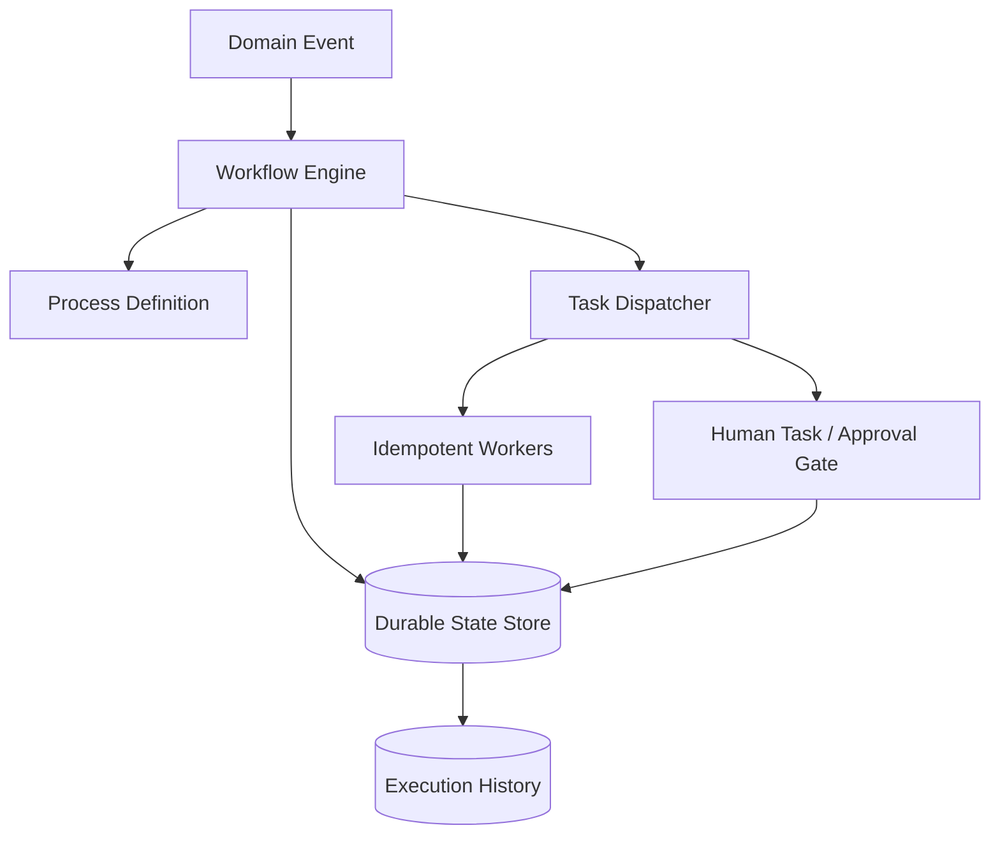

# Volume 08 - Workflow Engine

| Field | Value |
|---|---|
| Document ID | WORLD-VOL08-015 |
| Title | Workflow Engine |
| Version | 1.0 |
| Status | Approved |
| Classification | Internal |
| Founder | Mahesh Choudhary |

## Purpose

This chapter defines the Workflow Engine as a shared platform engine of WORLD - the component that turns declarative process definitions into reliable, long-running, auditable executions. It elevates the Workflow Engine established in Volume 05 (Chapter 31) from an ERP capability to a platform-wide service consumed by every Business Module (Vol 06) and orchestrated on behalf of the AI Business Partner (Vol 03).

## Scope

Covered: the workflow concept, how WORLD applies process orchestration, the engine's core components, its execution and durability guarantees, and its trade-offs. Excluded: individual business process content (owned by Vol 06 modules), the decision logic invoked by workflows (owned by the Rules Engine, Chapter 16), and infrastructure sizing of the state store and worker pool (Vol 09-12). This chapter is the architectural definition; Volume 05 Chapter 31 is its concrete realization within the ERP.

## Concept

A workflow is a durable, stateful coordination of steps that advances a business process from an initiating event to a terminal outcome. From first principles, business processes are long-lived, span multiple services, and must survive crashes, restarts, and human delays measured in days. Ordinary code cannot hold that state safely across such durations. A Workflow Engine solves this by separating the *definition* of a process (a graph of tasks, gateways, timers, and events) from its *execution* (a persisted instance whose every transition is recorded). This separation delivers three properties WORLD requires: durability (an instance resumes exactly where it stopped after any failure), visibility (the position and history of every instance are inspectable), and evolvability (process definitions change without rewriting application code).

## Application in WORLD

WORLD treats orchestration as a first-class platform service. Business Modules and the AI Business Partner do not implement retries, timers, or state machines themselves; they submit a workflow definition and signal events. The engine consumes domain events from the Event-Driven fabric (Chapter 11), persists each instance's state transactionally, dispatches tasks to idempotent workers, and enforces timeouts and compensations. Human tasks - approvals, reviews, exceptions - are first-class steps that pause an instance until a person or an approved AI recommendation resolves them. Every transition is written to an immutable execution history, making each process fully replayable for audit and simulation.

### Enterprise Example

A supplier invoice arrives and Accounts Payable publishes `InvoiceReceived`. The engine starts a three-way-match workflow: it invokes the Rules Engine to compare invoice, purchase order, and goods receipt. A tolerance breach routes the instance to a human approval gate, where the AI Business Partner attaches a grounded recommendation. Once the approver accepts, the workflow triggers payment scheduling and closes. If the approver is absent for two days, a timer escalates to their manager. The instance survives every service restart in between, and its complete history is retained for compliance.

## Key Components

| Component | Responsibility | Guarantee |
|---|---|---|
| Process Definition | Declarative graph of tasks, gateways, timers, events | Versioned, immutable per version |
| Workflow Engine Core | Advances instances through their definition | Deterministic replay |
| Durable State Store | Persists instance state and position | Crash-safe, exactly-resumed |
| Task Dispatcher | Assigns work to idempotent workers | At-least-once dispatch |
| Human Task Manager | Pauses for approvals and exceptions | Bound to identity and role |
| Execution History | Immutable log of every transition | Replayable and auditable |

## Trade-offs & Considerations

Orchestration trades the simplicity of inline code for the operational weight of a stateful engine: definitions must be versioned so that in-flight instances complete under the version they started with, and workers must be idempotent because at-least-once dispatch permits redelivery. Long-running state introduces the risk of orphaned or stuck instances, which WORLD mitigates with timers, escalation paths, and monitoring of instance age. The reward is decisive: processes that reliably span days and services, survive failure, and expose a complete audit trail - impossible to achieve with ad hoc application code.

## Relationship to Other Layers

The Workflow Engine is the orchestrator that binds the platform engines together. It consumes events from Event-Driven Architecture (Chapter 11), delegates every decision to the Rules Engine (Chapter 16), retrieves context from the Knowledge Engine (Chapter 17), and routes recommendations and approvals through the AI Layer (Chapter 18). Business Modules (Vol 06) supply the process definitions; the AI Business Partner (Vol 03) both triggers workflows and participates in their human gates. It is the connective tissue that makes WORLD's autonomy safe and observable.

## Cross-References

- [Rules Engine](/docs/blueprint/volume-08-architecture/section-d-platform-engines/16-rules-engine.md)
- [AI Layer](/docs/blueprint/volume-08-architecture/section-d-platform-engines/18-ai-layer.md)
- [Volume 05 - Workflow Engine](/docs/blueprint/volume-05-erp-foundation/section-e-engines/31-workflow-engine.md)
- [Volume 06 - Business Modules](/docs/blueprint/volume-06-business-modules/README.md)

## References

- [Volume 01 - Vision and Philosophy](/docs/blueprint/volume-01-vision-and-philosophy/README.md)
- [Document Standards](/docs/governance/document-standards.md)

## Change Log

| Version | Date | Author | Notes |
|---|---|---|---|
| 1.0 | 2026-07-12 | Lead Software Engineer | Initial approved version. |
