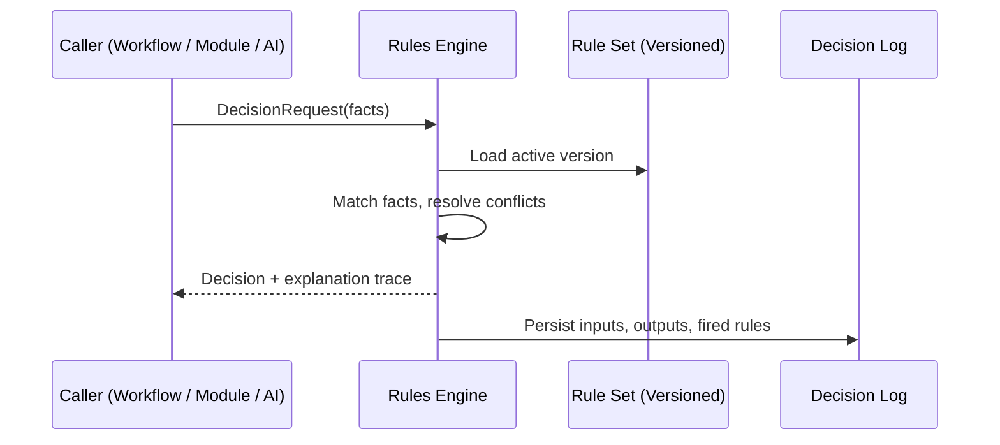

# Volume 08 - Rules Engine

| Field | Value |
|---|---|
| Document ID | WORLD-VOL08-016 |
| Title | Rules Engine |
| Version | 1.0 |
| Status | Approved |
| Classification | Internal |
| Founder | Mahesh Choudhary |

## Purpose

This chapter defines the Rules Engine as a shared platform engine of WORLD - the component that externalizes business decisions from application code so they can be authored, versioned, and changed by the business without redeployment. It elevates the Rules Engine established in Volume 05 (Chapter 35) into a platform-wide decision service consumed by every Business Module (Vol 06), the Workflow Engine (Chapter 15), and the AI Business Partner (Vol 03).

## Scope

Covered: the concept of externalized decisioning, how WORLD applies declarative rules, the engine's components, its evaluation guarantees, and its trade-offs. Excluded: the orchestration that invokes rules (owned by the Workflow Engine, Chapter 15), the model-based judgment of the AI Layer (Chapter 18), and rule authoring tooling and infrastructure (Vol 09-12). This chapter is the architectural definition; Volume 05 Chapter 35 is its concrete realization within the ERP.

## Concept

A business rule is a statement of policy - a condition and its consequence - that governs how the enterprise behaves. From first principles, policy changes far more often than the software that enforces it: credit limits, discount tiers, tax treatments, and approval thresholds shift with markets and regulation. Embedding such policy in imperative code couples volatile business intent to slow engineering cycles. A Rules Engine breaks this coupling by expressing decisions declaratively - as data evaluated at runtime - rather than as compiled logic. This yields three properties WORLD requires: transparency (a decision can state exactly which rules fired and why), agility (policy changes without code changes), and consistency (one authoritative decision applied identically everywhere it is invoked).

## Application in WORLD

WORLD treats decisioning as a stateless platform service. A caller submits a decision request with facts; the engine matches those facts against the active, versioned rule set and returns a decision with a full explanation trace. Rules are grouped into decision services (for example, *credit approval* or *discount eligibility*), each independently versioned so that a decision can be reproduced exactly as it was made on any past date. The Workflow Engine delegates every branch to the Rules Engine rather than hard-coding conditions, and the AI Business Partner consults the same services to keep its recommendations aligned with governing policy. Every evaluation is logged with its inputs, outputs, and the rules that fired.

### Enterprise Example

A sales order for a strategic customer requests a 22 percent discount. Order Management calls the *discount eligibility* decision service with the customer tier, order value, and margin. The engine evaluates the active rule set: tier-A customers may receive up to 20 percent automatically; anything higher requires finance approval. It returns `Requires Approval` with the exact rules that fired. The Workflow Engine reads this decision and routes the order to a human approval gate. Weeks later, an auditor reproduces the identical decision against the versioned rule set - the outcome is provably the same.

## Key Components

| Component | Responsibility | Guarantee |
|---|---|---|
| Rule | Declarative condition and consequence | Human-readable, testable |
| Decision Service | Named, versioned group of related rules | Reproducible per version |
| Inference Core | Matches facts and resolves conflicts | Deterministic evaluation |
| Explanation Trace | Records which rules fired and why | Full transparency |
| Decision Log | Persists every request and outcome | Auditable and replayable |

## Trade-offs & Considerations

Externalizing decisions trades the directness of inline conditionals for the discipline of managing a rule catalogue: rules can conflict, overlap, or grow into an unmaintainable thicket without clear ownership, conflict-resolution strategy, and testing. Versioning is essential so that historical decisions remain reproducible, and evaluation must stay stateless and fast because it sits on transactional paths. The reward is the ability for the business to change policy safely in hours rather than release cycles, with every decision explained and every past decision reproducible - a foundation for both compliance and trustworthy AI action.

## Relationship to Other Layers

The Rules Engine is the deterministic judgment of the platform, complementary to the probabilistic judgment of the AI Layer (Chapter 18): rules encode known, auditable policy, while the AI Layer reasons over ambiguity. The Workflow Engine (Chapter 15) is its primary caller, delegating every branch to it. The Knowledge Engine (Chapter 17) supplies contextual facts as rule inputs. The AI Business Partner (Vol 03) uses rule services as guardrails, ensuring its recommendations never contradict governing policy.

## Cross-References

- [Workflow Engine](/docs/blueprint/volume-08-architecture/section-d-platform-engines/15-workflow-engine.md)
- [AI Layer](/docs/blueprint/volume-08-architecture/section-d-platform-engines/18-ai-layer.md)
- [Volume 05 - Rules Engine](/docs/blueprint/volume-05-erp-foundation/section-e-engines/35-rules-engine.md)
- [Volume 03 - AI Business Partner](/docs/blueprint/volume-03-ai-business-partner/README.md)

## References

- [Volume 01 - Vision and Philosophy](/docs/blueprint/volume-01-vision-and-philosophy/README.md)
- [Document Standards](/docs/governance/document-standards.md)

## Change Log

| Version | Date | Author | Notes |
|---|---|---|---|
| 1.0 | 2026-07-12 | Lead Software Engineer | Initial approved version. |
