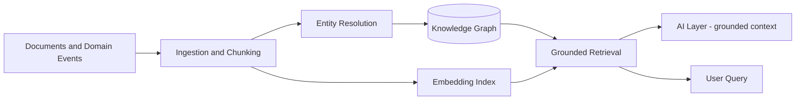

# Volume 08 - Knowledge Engine

| Field | Value |
|---|---|
| Document ID | WORLD-VOL08-017 |
| Title | Knowledge Engine |
| Version | 1.0 |
| Status | Approved |
| Classification | Internal |
| Founder | Mahesh Choudhary |

## Purpose

This chapter defines the Knowledge Engine as a shared platform engine of WORLD - the component that transforms the enterprise's dispersed data and documents into structured, retrievable, grounded knowledge that both people and the AI Business Partner (Vol 03) can trust. It is the memory and context service of the platform, and the architectural anticipation of the future Knowledge Engine volume (Vol 14).

## Scope

Covered: the concept of enterprise knowledge, how WORLD applies grounded retrieval, the engine's components, its correctness guarantees, and its trade-offs. Excluded: the reasoning that consumes knowledge (owned by the AI Layer, Chapter 18), the orchestration that requests it (Workflow Engine, Chapter 15), and the storage and indexing infrastructure (Vol 09-12). This chapter is the architectural definition; the future Volume 14 will provide its full realization.

## Concept

Knowledge is information placed in context and made answerable. From first principles, an enterprise's understanding of itself is scattered across transactional records, documents, policies, and events, in incompatible shapes and locations. Raw data cannot answer a question; it must first be organized, related, and grounded in an authoritative source. A Knowledge Engine solves this by ingesting heterogeneous sources, structuring them into a semantic representation - entities, relationships, and vectorized meaning - and serving retrieval that returns not only an answer but the exact evidence behind it. This yields three properties WORLD requires: grounding (every answer traces to a citable source), recall (relevant knowledge surfaces regardless of where it lives), and freshness (knowledge updates as the enterprise changes).

## Application in WORLD

WORLD treats knowledge as a governed platform service, not a search box. The engine ingests domain events and documents from across the modules, resolves entities into a knowledge graph, and indexes textual content as embeddings for semantic retrieval. When the AI Layer (Chapter 18) reasons, it does not rely on model memory; it queries the Knowledge Engine, which returns ranked, access-controlled passages with provenance. This grounding is what makes AI recommendations verifiable. Retrieval respects tenant isolation and row-level permissions, so a user or AI action only ever sees knowledge it is entitled to see.

### Enterprise Example

A finance manager asks the AI Business Partner why gross margin fell in the northern region last quarter. The Knowledge Engine retrieves the relevant sales and cost records from the knowledge graph, the applicable pricing policy document, and the supplier contract that changed - each with a citation. The AI Layer reasons over this grounded evidence and answers that a renegotiated freight clause raised landed cost, linking directly to the contract clause. The manager verifies the source in one click. No claim is made without traceable evidence.

## Key Components

| Component | Responsibility | Guarantee |
|---|---|---|
| Ingestion Pipeline | Captures documents and events, chunks content | Source-linked |
| Entity Resolution | Maps records to canonical entities | Deduplicated, consistent |
| Knowledge Graph | Stores entities and their relationships | Queryable structure |
| Embedding Index | Vectorizes content for semantic recall | Meaning-based retrieval |
| Grounded Retrieval | Returns ranked answers with provenance | Every answer cited |
| Access Governor | Enforces tenant and permission scope | No entitlement leakage |

## Trade-offs & Considerations

Grounded knowledge trades the immediacy of unmediated model recall for the cost of maintaining an indexed, governed corpus: ingestion pipelines must keep pace with change or knowledge grows stale, embeddings must be re-computed as content evolves, and retrieval quality depends on disciplined chunking and entity resolution. Access control must be enforced at retrieval time, never after generation, to prevent leakage. The reward is the single most important property of trustworthy enterprise AI - every answer is grounded in a citable, permissioned source, converting a plausible-sounding assistant into a verifiable one.

## Relationship to Other Layers

The Knowledge Engine is the grounding substrate of the platform. The AI Layer (Chapter 18) depends on it for the retrieval-augmented context that makes reasoning trustworthy. The Rules Engine (Chapter 16) draws contextual facts from it as decision inputs. The Workflow Engine (Chapter 15) queries it to enrich process context. It consumes the Event-Driven fabric (Chapter 11) as its freshest source of truth and is the direct architectural precursor to the future Knowledge Engine (Vol 14).

## Cross-References

- [AI Layer](/docs/blueprint/volume-08-architecture/section-d-platform-engines/18-ai-layer.md)
- [Rules Engine](/docs/blueprint/volume-08-architecture/section-d-platform-engines/16-rules-engine.md)
- [Volume 03 - AI Business Partner](/docs/blueprint/volume-03-ai-business-partner/README.md)
- [Volume 04 - Business Intelligence](/docs/blueprint/volume-04-business-intelligence/README.md)

## References

- [Volume 01 - Vision and Philosophy](/docs/blueprint/volume-01-vision-and-philosophy/README.md)
- [Document Standards](/docs/governance/document-standards.md)

## Change Log

| Version | Date | Author | Notes |
|---|---|---|---|
| 1.0 | 2026-07-12 | Lead Software Engineer | Initial approved version. |
