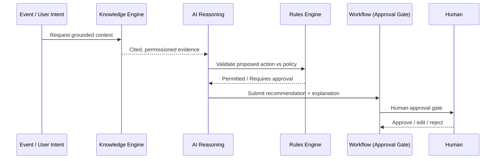

# Volume 08 - AI Layer

| Field | Value |
|---|---|
| Document ID | WORLD-VOL08-018 |
| Title | AI Layer |
| Version | 1.0 |
| Status | Approved |
| Classification | Internal |
| Founder | Mahesh Choudhary |

## Purpose

This chapter defines the AI Layer as the shared platform engine that embeds the AI Business Partner (Vol 03) into WORLD's architecture. It specifies how machine intelligence is composed with the deterministic engines - Workflow (Chapter 15), Rules (Chapter 16), and Knowledge (Chapter 17) - and how it is governed under the safeguards of Volume 03 Section G so that autonomy is always grounded, explainable, and controllable.

## Scope

Covered: the cognition concept, how WORLD embeds and governs the AI Business Partner, the layer's components, its safety guarantees, and its trade-offs. Excluded: the cognitive design of the AI Business Partner itself (owned by Vol 03), the knowledge substrate it queries (Chapter 17), and model hosting infrastructure (Vol 09-12). This chapter is the architectural definition of where and how AI acts within the platform.

## Concept

Artificial intelligence in an enterprise is only valuable when it is grounded, bounded, and accountable. From first principles, a probabilistic model reasons fluently but can also fabricate, and it has no inherent knowledge of a specific enterprise's data or policy. Deployed naively it is a liability. The AI Layer resolves this by treating the model not as an oracle but as one reasoning component inside a disciplined pipeline: it may only reason over knowledge that has been grounded (Chapter 17), it must respect decisions made by policy (Chapter 16), and its conclusions are actions proposed into governed workflows (Chapter 15) rather than executed unilaterally. This yields the three properties WORLD requires of any autonomous behaviour: grounding (no claim without cited evidence), governance (no consequential action without an approval gate), and explainability (every recommendation carries its reasoning and sources).

## Application in WORLD

The AI Business Partner is embedded architecturally as a four-stage pipeline. First, **grounding**: the layer retrieves permissioned, cited context from the Knowledge Engine rather than trusting model memory. Second, **reasoning**: the model interprets the grounded context and the user or event intent. Third, **recommendation**: it produces a proposed action with an explanation and confidence, checked against the Rules Engine so it never contradicts policy. Fourth, **human-approval gates**: consequential actions are routed into the Workflow Engine as human tasks, where an accountable person approves, edits, or rejects. Only reversible, low-risk, policy-permitted actions execute autonomously; everything else waits for a human. Every stage is logged for audit under Volume 03 Section G governance.

### Enterprise Example

Inventory publishes `StockShortfallDetected` for a critical component. The AI Layer grounds itself in supplier lead times, open purchase orders, and the approved-vendor policy from the Knowledge Engine. It reasons that a replenishment order to the primary supplier restores cover within the service level. It drafts a purchase order and validates it against the Rules Engine, which flags that the value exceeds the autonomous threshold. The recommendation - with its evidence and reasoning - is submitted to a Workflow approval gate. The procurement manager reviews the citations, approves, and the order is placed. The AI acted, but a human remained accountable.

## Key Components

| Component | Responsibility | Governed By |
|---|---|---|
| Grounding Service | Retrieves cited, permissioned context | Knowledge Engine (Ch 17) |
| Reasoning Core | Interprets intent over grounded evidence | Vol 03 cognition |
| Recommendation Composer | Produces action, explanation, confidence | Vol 03 Section G |
| Policy Guardrail | Validates action against business rules | Rules Engine (Ch 16) |
| Approval Gate | Routes consequential actions to humans | Workflow Engine (Ch 15) |
| Audit Trail | Logs grounding, reasoning, decisions | Vol 03 Section G governance |

## Trade-offs & Considerations

Embedding AI as a governed pipeline trades raw autonomy and latency for trust: grounding and policy validation add steps before any recommendation, and approval gates deliberately slow consequential actions. This is a design choice, not a limitation - unbounded autonomy is unacceptable in an enterprise system of record. The layer must also degrade safely: when grounding is insufficient or confidence is low, it must decline or escalate rather than guess. Managed this way, the AI Layer converts a fluent but fallible model into an accountable partner whose every action is grounded, policy-compliant, explainable, and, where it matters, human-approved.

## Relationship to Other Layers

The AI Layer is the intelligence that the other platform engines make safe. It depends on the Knowledge Engine (Chapter 17) for grounding, the Rules Engine (Chapter 16) for policy guardrails, and the Workflow Engine (Chapter 15) for approval gates and execution. It perceives the enterprise through the Event-Driven fabric (Chapter 11). Together these realize the AI Business Partner of Volume 03 under the governance of Volume 03 Section G - the defining capability of WORLD as an AI-Native Business Operating System.

## Cross-References

- [Knowledge Engine](/docs/blueprint/volume-08-architecture/section-d-platform-engines/17-knowledge-engine.md)
- [Rules Engine](/docs/blueprint/volume-08-architecture/section-d-platform-engines/16-rules-engine.md)
- [Workflow Engine](/docs/blueprint/volume-08-architecture/section-d-platform-engines/15-workflow-engine.md)
- [Volume 03 - AI Business Partner](/docs/blueprint/volume-03-ai-business-partner/README.md)

## References

- [Volume 01 - Vision and Philosophy](/docs/blueprint/volume-01-vision-and-philosophy/README.md)
- [Document Standards](/docs/governance/document-standards.md)

## Change Log

| Version | Date | Author | Notes |
|---|---|---|---|
| 1.0 | 2026-07-12 | Lead Software Engineer | Initial approved version. |
