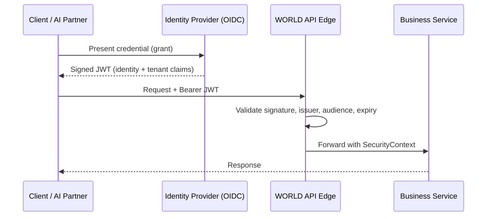

# Volume 08 - Authentication

| Field | Value |
|---|---|
| Document ID | WORLD-VOL08-019 |
| Title | Authentication |
| Version | 1.0 |
| Status | Approved |
| Classification | Internal |
| Founder | Mahesh Choudhary |

## Purpose

This chapter defines authentication as the cross-cutting concern by which WORLD establishes *who* is making a request before any business logic runs. Its purpose is to give the platform a single, uniform notion of identity - for human users, machine clients, and the AI Business Partner (Vol 03) alike - so that every downstream layer, from the ERP Foundation (Vol 05) to the Business Modules (Vol 06), can trust the caller's identity without re-verifying it.

## Scope

Covered: the authentication concept, identity establishment, token issuance and verification, and the components that implement it in WORLD. Excluded: authorization decisions (Chapter 20), the detailed cryptographic and threat design (Vol 12, future), and identity-provider onboarding procedures. This chapter defines the architectural principle; concrete key management and credential storage are implementation details governed by the Security Model (Vol 05, ch 61).

## Concept

Authentication answers one question: is the caller who they claim to be? From first principles, it separates *identity assertion* from *identity verification*. A caller presents a credential - a password, a client secret, a signed assertion - and the system verifies it against a trusted authority before minting a short-lived, verifiable proof of identity. That proof, rather than the original credential, then travels with the request. This separation matters because credentials are long-lived secrets that must never spread through the system, whereas proofs of identity can be scoped, time-boxed, and validated cheaply at every hop. Authentication establishes identity only; it deliberately says nothing about what that identity is permitted to do.

## Application in WORLD

WORLD centralizes authentication in an Identity Provider (IdP) that implements OpenID Connect (OIDC) on top of OAuth 2.0. Human users authenticate interactively (with support for multi-factor authentication); machine clients and integrations authenticate with the OAuth 2.0 client-credentials grant. In all cases the IdP issues a signed JSON Web Token (JWT) whose claims carry the subject identity, the tenant, the token lifetime, and the audience. Every service validates this token at its edge - checking signature, issuer, audience, and expiry - and constructs a uniform `SecurityContext` that is injected (Chapter 14) into request handling. The AI Business Partner is a first-class authenticated principal: it acts under its own delegated identity, bound to the tenant and the user session on whose behalf it operates, so its actions are never anonymous.

### Enterprise Example

A finance analyst signs in to WORLD through the IdP with multi-factor authentication and receives a JWT scoped to their tenant, valid for a short window. When they ask the AI Business Partner to reconcile a ledger, the Partner does not reuse the analyst's raw token; it obtains its own delegated token that names the analyst as the originating subject and carries the same tenant claim. A nightly batch integration, by contrast, authenticates with the client-credentials grant and receives a service-account token bound to no human user. All three tokens are validated identically at the API edge, producing three distinct but uniform `SecurityContext` objects - so every module sees a consistent identity regardless of how the caller arrived.

## Key Components

| Component | Responsibility | Concern |
|---|---|---|
| Identity Provider (IdP) | Verifies credentials and issues tokens (OIDC/OAuth 2.0) | Identity |
| Credential | Long-lived secret proving a claim of identity | Client |
| Access Token (JWT) | Short-lived, signed proof of identity carried per request | Transport |
| Token Validator | Verifies signature, issuer, audience, and expiry at the edge | Infrastructure |
| SecurityContext | Uniform in-process representation of the authenticated principal | Application |

## Trade-offs & Considerations

Token-based authentication buys statelessness and horizontal scale - any service can validate a JWT without a central session lookup - at the cost of revocation latency, since a valid token remains usable until it expires. WORLD accepts this trade and mitigates it with short token lifetimes, refresh flows, and a revocation list for high-risk events. Centralizing identity in one IdP concentrates trust, which simplifies rotation and audit but makes the IdP a critical dependency that must be highly available. Delegated AI identities add power and risk in equal measure: they let the Partner act autonomously, so they must be tightly scoped and fully traceable, which the delegated-token model enforces by naming the originating human subject.

## Relationship to Other Layers

Authentication is the first cross-cutting gate every request passes. It produces the `SecurityContext` that Authorization (Chapter 20) consumes to make access decisions, and the authenticated principal that Logging (Chapter 21) records for every auditable action. It depends on the Security Model (Vol 05, ch 61) for its cryptographic and key-management foundations, and it underwrites the AI Business Partner's autonomy (Vol 03) by ensuring the Partner always acts as a named, delegated, and verifiable identity rather than an anonymous process.

## Cross-References

- [Authorization](/docs/blueprint/volume-08-architecture/section-e-cross-cutting-concerns/20-authorization.md)
- [Logging](/docs/blueprint/volume-08-architecture/section-e-cross-cutting-concerns/21-logging.md)
- [Volume 05 - ERP Foundation (Security Model, ch 61)](/docs/blueprint/volume-05-erp-foundation/README.md)
- [Volume 03 - AI Business Partner](/docs/blueprint/volume-03-ai-business-partner/README.md)

## References

- [Volume 01 - Vision and Philosophy](/docs/blueprint/volume-01-vision-and-philosophy/README.md)
- [Document Standards](/docs/governance/document-standards.md)

## Change Log

| Version | Date | Author | Notes |
|---|---|---|---|
| 1.0 | 2026-07-12 | Lead Software Engineer | Initial approved version. |
