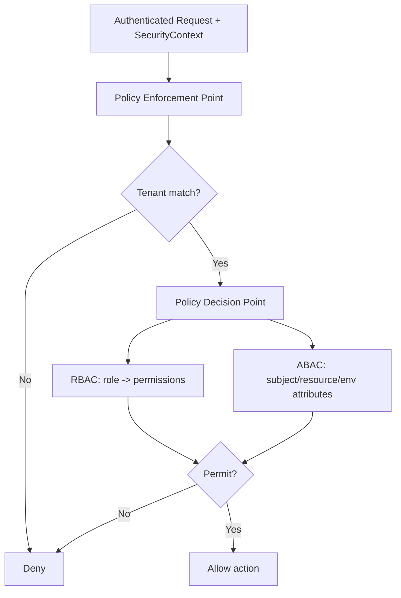

# Volume 08 - Authorization

| Field | Value |
|---|---|
| Document ID | WORLD-VOL08-020 |
| Title | Authorization |
| Version | 1.0 |
| Status | Approved |
| Classification | Internal |
| Founder | Mahesh Choudhary |

## Purpose

This chapter defines authorization as the cross-cutting concern that decides *what* an authenticated identity is permitted to do. Its purpose is to give WORLD a single, consistent access-decision model that governs every human user, machine client, and the AI Business Partner (Vol 03) uniformly, aligned with the Permissions model (Vol 05, ch 27) and the Security Model (Vol 05, ch 61), and enforcing strict multi-tenant isolation across the ERP Foundation (Vol 05) and Business Modules (Vol 06).

## Scope

Covered: the authorization concept, the RBAC and ABAC models WORLD combines, tenant isolation, and the components that render access decisions. Excluded: establishing identity (Chapter 19) and the detailed policy-language and cryptographic design (Vol 12, future). This chapter defines the architectural principle and its enforcement points; the concrete permission catalog is owned by Vol 05, ch 27.

## Concept

Authorization begins where authentication ends: the caller's identity is known, and the system must now decide whether a specific action on a specific resource is allowed. From first principles, an access decision is a function of three inputs - the *subject* (who), the *action* (what operation), and the *resource* (on what, in which tenant and context) - evaluated against a set of policies. Two models express these policies. Role-Based Access Control (RBAC) grants permissions to roles and assigns roles to subjects, which is simple and auditable. Attribute-Based Access Control (ABAC) evaluates rules over attributes of the subject, resource, and environment, which is expressive and context-sensitive. Neither alone is sufficient at enterprise scale: RBAC coarsely answers *may this role act*, while ABAC finely answers *may this subject act on this record now*.

## Application in WORLD

WORLD combines both. RBAC provides the coarse-grained baseline - roles such as `FinanceApprover` or `ModuleAdmin` map to permission sets defined in the Permissions catalog (Vol 05, ch 27). ABAC layers fine-grained, contextual rules on top: ownership, monetary thresholds, data classification, and time or location constraints. Every request carries the `SecurityContext` produced by authentication (Chapter 19); a central Policy Decision Point (PDP) evaluates the applicable policies and returns permit or deny, which Policy Enforcement Points (PEPs) at the API edge and in the domain layer enforce. Tenant isolation is non-negotiable and evaluated first: the tenant claim in the `SecurityContext` must match the resource's tenant, so no policy can ever grant cross-tenant access. The AI Business Partner is subject to the identical PDP; its delegated identity may act only within the permissions of the human on whose behalf it operates, never beyond them.

### Enterprise Example

A payables clerk holds the `FinanceApprover` role, which RBAC says may approve invoices. When the clerk - or the AI Business Partner acting for them - attempts to approve a $250,000 invoice, ABAC intervenes: a policy rule caps this role's approval at $50,000 and requires the resource's tenant to match the subject's tenant. The PDP therefore denies the action and routes it to a higher-authority role. The same invoice belonging to a different tenant is rejected outright at the tenant-isolation gate before any role or threshold is consulted. Every decision - permit or deny, and the rule that produced it - is recorded for audit (Chapter 21).

## Key Components

| Component | Responsibility | Concern |
|---|---|---|
| Policy Decision Point (PDP) | Evaluates policies and returns permit/deny | Application |
| Policy Enforcement Point (PEP) | Intercepts requests and enforces the decision | Edge / Domain |
| Role Definition (RBAC) | Maps roles to permission sets (Vol 05, ch 27) | Governance |
| Attribute Policy (ABAC) | Rules over subject, resource, and environment attributes | Governance |
| Tenant Isolation Guard | Rejects any cross-tenant access before evaluation | Infrastructure |

## Trade-offs & Considerations

Combining RBAC and ABAC balances simplicity against expressiveness, at the cost of a more complex policy surface that must be governed carefully to avoid conflicting or shadowed rules; WORLD manages this by centralizing evaluation in one PDP and versioning policies as governed artifacts. Fine-grained ABAC evaluation adds per-request cost, mitigated by caching stable decisions (Chapter 23) while never caching tenant-isolation outcomes. The system defaults to deny: absence of an explicit permit is a denial, so a missing policy fails safely closed. Delegated AI authority is deliberately bounded by the acting human's permissions, ensuring the Partner can never escalate its own access.

## Relationship to Other Layers

Authorization consumes the identity that Authentication (Chapter 19) establishes and feeds the audit trail that Logging (Chapter 21) records. It realizes the Permissions model (Vol 05, ch 27) and the Security Model (Vol 05, ch 61) as runtime enforcement, and it is the guardrail that makes the AI Business Partner's autonomy (Vol 03) safe by confining every delegated action within governed, tenant-scoped policy.

## Cross-References

- [Authentication](/docs/blueprint/volume-08-architecture/section-e-cross-cutting-concerns/19-authentication.md)
- [Logging](/docs/blueprint/volume-08-architecture/section-e-cross-cutting-concerns/21-logging.md)
- [Volume 05 - ERP Foundation (Permissions, ch 27; Security Model, ch 61)](/docs/blueprint/volume-05-erp-foundation/README.md)
- [Volume 03 - AI Business Partner](/docs/blueprint/volume-03-ai-business-partner/README.md)

## References

- [Volume 01 - Vision and Philosophy](/docs/blueprint/volume-01-vision-and-philosophy/README.md)
- [Document Standards](/docs/governance/document-standards.md)

## Change Log

| Version | Date | Author | Notes |
|---|---|---|---|
| 1.0 | 2026-07-12 | Lead Software Engineer | Initial approved version. |
