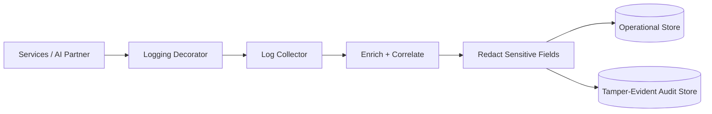

# Volume 08 - Logging

| Field | Value |
|---|---|
| Document ID | WORLD-VOL08-021 |
| Title | Logging |
| Version | 1.0 |
| Status | Approved |
| Classification | Internal |
| Founder | Mahesh Choudhary |

## Purpose

This chapter defines logging as the cross-cutting concern that produces WORLD's durable, structured record of what the system did and why. Its purpose is to make every meaningful action - by a human user, a machine client, or the AI Business Partner (Vol 03) - observable, explainable, and auditable after the fact, giving operators, auditors, and the platform itself a trustworthy account of behavior across the ERP Foundation (Vol 05) and Business Modules (Vol 06).

## Scope

Covered: the logging concept, structured and correlated events, the audit trail, and the components that capture and route logs. Excluded: real-time health signals and alerting (Chapter 22), and long-term log retention and forensic tooling (Vol 12, future). This chapter defines the architectural principle; log-store sizing and pipeline operations are implementation details.

## Concept

A log is a fact about something that happened, recorded at the moment it happened. From first principles, useful logging requires three properties. First, events must be *structured* - emitted as machine-readable fields rather than free-form prose - so they can be queried and aggregated. Second, they must be *correlated* - every event carries a trace identifier that links it to the request that caused it - so a single business action can be reconstructed across many services. Third, they must be *classified* by intent: operational logs help engineers diagnose behavior, while audit logs form a tamper-evident record of security- and business-significant decisions. Conflating these three is the common failure; separating them is what makes a log estate valuable rather than merely voluminous.

## Application in WORLD

WORLD emits structured events (key-value fields, not strings) from every service. Each event carries a correlation identifier propagated from the API edge, the authenticated subject and tenant from the `SecurityContext` (Chapter 19), the action, and the outcome. Logging is applied as an injected decorator (Chapter 14) around business components, so handlers stay clean and no code path can silently skip it. Two streams are separated at the source: an *operational* stream for diagnostics and a *tamper-evident audit* stream for authentication events, authorization decisions (Chapter 20), and consequential business changes. The AI Business Partner is logged with special care: every reasoning step, tool invocation, and state change it makes is recorded under its delegated identity, so its autonomous behavior is fully reconstructable. All streams flow through a pipeline that enriches, redacts sensitive fields, and routes events to their stores.

### Enterprise Example

A vendor payment is initiated by the AI Business Partner on a controller's behalf. A single correlation identifier ties together the API request, the authorization decision that approved it, the ledger update, and the outbound payment instruction - across four services. When an auditor later asks why the payment was made, the audit stream reconstructs the full chain: the delegated identity, the human on whose behalf it acted, the policy rule that permitted it, and the exact values changed. Sensitive fields such as bank account numbers appear redacted in the operational stream but are preserved, access-controlled, in the audit store - so diagnostics never leak data that only auditors may see.

## Key Components

| Component | Responsibility | Concern |
|---|---|---|
| Logging Decorator | Wraps components to emit events without touching business code | Application |
| Structured Event | Machine-readable record with subject, tenant, action, outcome | Transport |
| Correlation Identifier | Links all events of one request across services | Cross-service |
| Redaction Filter | Removes or masks sensitive fields before storage | Infrastructure |
| Audit Store | Tamper-evident record of security and business decisions | Governance |

## Trade-offs & Considerations

Rich logging aids diagnosis and audit but competes with performance, storage cost, and privacy; WORLD resolves this by logging structured events at calibrated levels, sampling high-volume operational traffic while never sampling the audit stream. Redaction is mandatory and applied before persistence, since a leaked secret in a log is a breach regardless of intent. Separating operational and audit streams costs pipeline complexity but is essential: audit records must be immutable and independently access-controlled, whereas operational logs are transient and freely queryable. Comprehensive logging of the AI Business Partner adds volume, accepted deliberately because explainability of autonomous action is a governance requirement, not an option.

## Relationship to Other Layers

Logging records the identities that Authentication (Chapter 19) establishes and the decisions that Authorization (Chapter 20) renders, turning them into a durable audit trail. It supplies the raw events that Monitoring (Chapter 22) aggregates into health and alerting signals, and it underwrites the governance guarantees of Vol 03 by making every autonomous action of the AI Business Partner explainable and reviewable after the fact.

## Cross-References

- [Authentication](/docs/blueprint/volume-08-architecture/section-e-cross-cutting-concerns/19-authentication.md)
- [Authorization](/docs/blueprint/volume-08-architecture/section-e-cross-cutting-concerns/20-authorization.md)
- [Monitoring](/docs/blueprint/volume-08-architecture/section-e-cross-cutting-concerns/22-monitoring.md)
- [Volume 03 - AI Business Partner](/docs/blueprint/volume-03-ai-business-partner/README.md)

## References

- [Volume 01 - Vision and Philosophy](/docs/blueprint/volume-01-vision-and-philosophy/README.md)
- [Document Standards](/docs/governance/document-standards.md)

## Change Log

| Version | Date | Author | Notes |
|---|---|---|---|
| 1.0 | 2026-07-12 | Lead Software Engineer | Initial approved version. |
