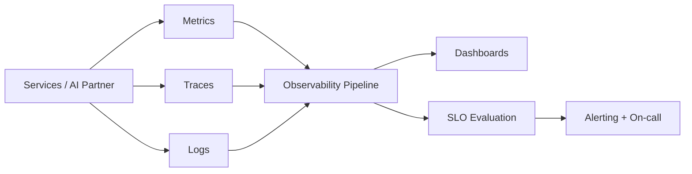

# Volume 08 - Monitoring

| Field | Value |
|---|---|
| Document ID | WORLD-VOL08-022 |
| Title | Monitoring |
| Version | 1.0 |
| Status | Approved |
| Classification | Internal |
| Founder | Mahesh Choudhary |

## Purpose

This chapter defines monitoring as the cross-cutting concern that tells WORLD, in near real time, whether the platform is healthy and behaving as intended. Its purpose is to turn the raw signals emitted across the ERP Foundation (Vol 05), the Business Modules (Vol 06), and the AI Business Partner (Vol 03) into actionable insight - detecting degradation before users feel it and giving operators the evidence to respond.

## Scope

Covered: the monitoring concept, the three observability signals, service-level objectives, alerting, and the components of the observability pipeline. Excluded: the durable audit trail (Chapter 21), incident-response runbooks, and detailed capacity planning (owned by operations volumes). This chapter defines the architectural principle; dashboard layouts and alert thresholds are implementation details tuned per environment.

## Concept

Monitoring is the continuous measurement of a running system against expectations. From first principles it rests on three complementary signals. *Metrics* are cheap numeric time series - request rate, error rate, latency, saturation - ideal for alerting and trend detection. *Traces* follow a single request across service boundaries, revealing where time is spent and where failures originate. *Logs* (Chapter 21) supply the detailed context behind a metric spike or a broken trace. Together these three signals form observability: the property that lets operators ask new questions of a system without deploying new code. A crucial distinction underlies the discipline: monitoring tests *known* conditions you predicted, while observability lets you investigate *unknown* conditions you did not - WORLD is designed for both.

## Application in WORLD

WORLD instruments every service to emit metrics, propagate distributed traces using the same correlation identifier as logging (Chapter 21), and expose health endpoints. Signals are collected by an observability pipeline that aggregates, stores, and visualizes them, and that evaluates alerting rules against Service-Level Objectives (SLOs). Each SLO defines a target - for example, 99.9% of API requests served under 300 milliseconds - and an error budget that quantifies acceptable failure before action is required. The AI Business Partner is monitored as a first-class subsystem: beyond infrastructure health, WORLD tracks Partner-specific signals such as action success rate, decision latency, and escalation frequency, so that anomalous autonomous behavior surfaces as an alert rather than a surprise. Tenant-level metrics ensure one tenant's load or errors are visible in isolation.

### Enterprise Example

An SLO requires the Order-to-Cash checkout to complete under 300 milliseconds for 99.9% of requests. One afternoon, latency metrics for a single tenant breach the threshold and begin consuming the error budget. An alert fires. The on-call engineer opens the correlated trace for a slow request and sees that time is concentrated in a tax-policy lookup; the linked logs show a cache miss storm after a configuration change. Because metrics detected the symptom, traces localized the cause, and logs explained it, the engineer resolves the incident by restoring the cache warm-up (Chapter 23) - before the wider tenant base is affected and well inside the error budget.

## Key Components

| Component | Responsibility | Concern |
|---|---|---|
| Metrics Collector | Gathers numeric time series (rate, errors, latency, saturation) | Infrastructure |
| Distributed Tracing | Follows one request across service boundaries | Cross-service |
| Health Endpoint | Reports liveness and readiness of a service | Application |
| SLO + Error Budget | Defines targets and acceptable failure margin | Governance |
| Alerting Engine | Evaluates rules and notifies on-call responders | Operations |

## Trade-offs & Considerations

Monitoring adds instrumentation overhead and generates high-cardinality data that is costly to store and query; WORLD controls this by standardizing a core metric set, sampling traces, and scoping cardinality deliberately. Alerting must be tuned against a real tension: too sensitive and responders suffer fatigue and ignore signals, too coarse and incidents go unseen - SLO-based alerting on error budgets, rather than on raw thresholds, keeps alerts tied to user impact. Monitoring answers *what and where* but not always *why*; it is therefore paired with logging and tracing for root cause. Treating the AI Business Partner as a monitored subsystem is a deliberate cost, justified because autonomous action demands autonomous oversight.

## Relationship to Other Layers

Monitoring consumes the structured events and correlation identifiers produced by Logging (Chapter 21) and joins them with metrics and traces into a unified observability picture. It validates that Authentication (Chapter 19), Authorization (Chapter 20), and Caching (Chapter 23) perform within their objectives, and it gives the governance framework of Vol 03 the operational assurance that the AI Business Partner is behaving within expected bounds.

## Cross-References

- [Logging](/docs/blueprint/volume-08-architecture/section-e-cross-cutting-concerns/21-logging.md)
- [Caching](/docs/blueprint/volume-08-architecture/section-e-cross-cutting-concerns/23-caching.md)
- [Authorization](/docs/blueprint/volume-08-architecture/section-e-cross-cutting-concerns/20-authorization.md)
- [Volume 03 - AI Business Partner](/docs/blueprint/volume-03-ai-business-partner/README.md)

## References

- [Volume 01 - Vision and Philosophy](/docs/blueprint/volume-01-vision-and-philosophy/README.md)
- [Document Standards](/docs/governance/document-standards.md)

## Change Log

| Version | Date | Author | Notes |
|---|---|---|---|
| 1.0 | 2026-07-12 | Lead Software Engineer | Initial approved version. |
