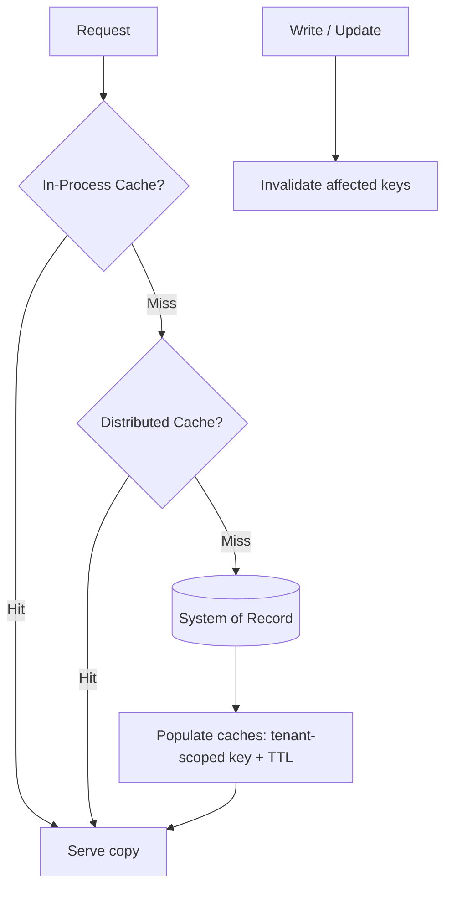

# Volume 08 - Caching

| Field | Value |
|---|---|
| Document ID | WORLD-VOL08-023 |
| Title | Caching |
| Version | 1.0 |
| Status | Approved |
| Classification | Internal |
| Founder | Mahesh Choudhary |

## Purpose

This chapter defines caching as the cross-cutting concern that trades a small, controlled amount of staleness for large gains in speed and scale. Its purpose is to let WORLD serve frequent, expensive reads quickly and reduce load on the ERP Foundation (Vol 05) and Business Modules (Vol 06), while preserving correctness and strict tenant isolation - so that both human users and the AI Business Partner (Vol 03) experience a responsive platform.

## Scope

Covered: the caching concept, cache topologies and placement, invalidation, tenant safety, and the components that implement caching in WORLD. Excluded: authorization decision caching internals (Chapter 20), and the tuning of individual cache sizes and eviction parameters, which are environment-specific implementation details. This chapter defines the architectural principle and its guardrails.

## Concept

A cache is a copy of data kept closer to its point of use than the system of record. From first principles, caching exploits two facts: reads vastly outnumber writes for most data, and recomputing or re-fetching the same result repeatedly is wasteful. By storing a result the first time it is produced and serving the copy thereafter, a cache converts expensive work into a cheap lookup. The unavoidable cost is *staleness*: the copy can diverge from the source after a write. Every caching decision is therefore a deliberate answer to one question - how much staleness is acceptable for this data, and how will the copy be invalidated when the source changes? Data that must always be exact (a permission decision's tenant scope, a financial balance at posting) is cached narrowly or not at all; data that tolerates seconds of lag (reference lists, computed views) is cached aggressively.

## Application in WORLD

WORLD applies caching in layers. A per-instance *in-process* cache serves the hottest, smallest data with the lowest latency. A shared *distributed* cache holds larger, cross-instance data and gives every service a consistent view. Read-through caching is the default: the cache loads from the system of record on a miss and serves copies on subsequent hits. Caching is applied as an injected decorator (Chapter 14), keeping business logic unaware of it. Two rules are absolute. First, every cache key is namespaced by tenant, so no cached value can ever cross a tenant boundary - the same guarantee Authorization (Chapter 20) enforces. Second, writes invalidate or update affected keys immediately, and time-to-live (TTL) bounds staleness as a safety net. The AI Business Partner reads through the same caches as human paths, so it sees an identical, tenant-scoped view of data.

### Enterprise Example

The product catalog for a large retail tenant is read on nearly every order but changes only a few times a day. WORLD caches it: the distributed cache holds the catalog with a short TTL, and each service also keeps the hottest items in-process. A checkout that once cost a database query per line item now serves from cache, cutting latency dramatically and shielding the database during peak load. When a merchandiser updates a price, the write path immediately invalidates that product's key across the caches, so the next read reloads the correct value - bounded staleness for reference data, but exactness at the moment of change. Every key is prefixed with the tenant identifier, so a neighboring tenant's catalog can never be served by mistake.

## Key Components

| Component | Responsibility | Concern |
|---|---|---|
| In-Process Cache | Lowest-latency copy of hottest data per instance | Application |
| Distributed Cache | Shared, cross-instance cache with consistent view | Infrastructure |
| Cache Decorator | Applies caching around components transparently | Application |
| Invalidation Policy | Evicts or updates keys on write; enforces TTL | Consistency |
| Tenant-Scoped Key | Namespaces every entry to prevent cross-tenant leakage | Isolation |

## Trade-offs & Considerations

Caching is a bet that staleness is cheaper than latency, and the bet must be sized per data type: cache too aggressively and users act on stale data, cache too little and the platform pays full cost on every read. WORLD tunes this with per-type TTLs and immediate write invalidation, defaulting to not caching anything whose exactness is safety- or money-critical. Distributed caching introduces its own failure modes - stampedes on cold keys and consistency lag between instances - mitigated with request coalescing and short TTLs. The single non-negotiable rule is tenant-scoped keying: a cache that leaks across tenants is a security defect, not merely a bug, which is why isolation is built into the key structure rather than checked after the fact.

## Relationship to Other Layers

Caching sits beneath the read paths of every module, transparently accelerating the queries served through Repository interfaces (Chapter 13) and CQRS read models (Chapter 12). It shares its tenant-isolation guarantee with Authorization (Chapter 20), exposes hit-rate and latency signals to Monitoring (Chapter 22), and gives the AI Business Partner (Vol 03) the same fast, tenant-correct view of data as every other client - ensuring the Partner's responsiveness never comes at the expense of consistency or isolation.

## Cross-References

- [Authorization](/docs/blueprint/volume-08-architecture/section-e-cross-cutting-concerns/20-authorization.md)
- [Monitoring](/docs/blueprint/volume-08-architecture/section-e-cross-cutting-concerns/22-monitoring.md)
- [Repository Pattern](/docs/blueprint/volume-08-architecture/section-c-application-architecture/13-repository-pattern.md)
- [Volume 06 - Business Modules](/docs/blueprint/volume-06-business-modules/README.md)

## References

- [Volume 01 - Vision and Philosophy](/docs/blueprint/volume-01-vision-and-philosophy/README.md)
- [Document Standards](/docs/governance/document-standards.md)

## Change Log

| Version | Date | Author | Notes |
|---|---|---|---|
| 1.0 | 2026-07-12 | Lead Software Engineer | Initial approved version. |
