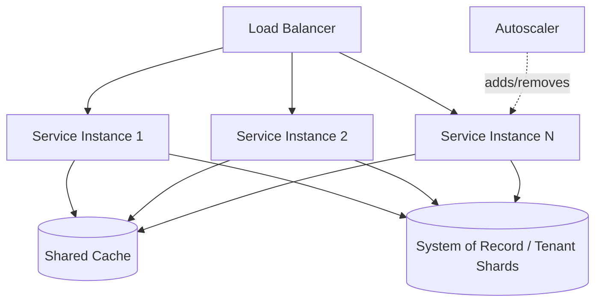

# Volume 08 - Scalability

| Field | Value |
|---|---|
| Document ID | WORLD-VOL08-024 |
| Title | Scalability |
| Version | 1.0 |
| Status | Approved |
| Classification | Internal |
| Founder | Mahesh Choudhary |

## Purpose

This chapter defines scalability as the architectural property that lets WORLD serve one tenant or ten thousand without redesign, keeping latency and cost predictable as load grows. Its purpose is to establish, from first principles, how the platform adds capacity so that the ERP Foundation (Vol 05), the Business Modules (Vol 06), and the AI Business Partner (Vol 03) all remain responsive under real enterprise demand. It aligns the architecture-level view here with the Scalability Strategy defined in Vol 05 (Chapter 59) and defers physical infrastructure detail to Vol 11.

## Scope

Covered: the scalability concept, horizontal versus vertical scaling, statelessness, partitioning by tenant, and the components that let WORLD grow. Excluded: concrete instance sizing, autoscaler thresholds, and provider-specific capacity limits, which are environment-dependent and belong to Vol 11. This chapter defines the principle and its guardrails, not the runtime tuning values.

## Concept

Scalability is the ability to increase capacity in proportion to added resources, without a corresponding collapse in performance or a rewrite of the system. From first principles, a system scales when its work can be divided across independent units that do not contend for a shared bottleneck. Two axes exist. *Vertical* scaling adds power to a single unit - more CPU, more memory - and is simple but bounded by the largest machine available. *Horizontal* scaling adds more units and is effectively unbounded, but only works if the units are independent: any shared, mutable state becomes the ceiling. The core design move, therefore, is to push state out of the compute tier and into purpose-built stores, so that compute becomes a fleet of interchangeable, disposable workers. A system that is stateless at the compute tier can scale by simply adding copies.

## Application in WORLD

WORLD is built to scale horizontally by default. Application services are stateless: a request carries its own context and can be served by any instance, so the platform grows by adding instances behind a load balancer rather than enlarging any single one. Session and cache state live in shared stores (Chapter 23), and durable state lives in the system of record - never in a service's memory. The natural unit of partitioning is the *tenant*: because every request, key, and query is already tenant-scoped for isolation, the same boundary becomes the sharding boundary, letting WORLD distribute tenants across capacity without cross-tenant coupling. Write-heavy and read-heavy paths scale independently, following the CQRS separation (Chapter 12): read models can be replicated widely while the write path is protected. The AI Business Partner scales on the same fleet, so intelligence capacity grows with the platform rather than as a separate silo.

### Enterprise Example

A WORLD customer runs a quarterly sales campaign that multiplies order volume tenfold for three days. Because order-processing services are stateless, the autoscaler observes rising queue depth and request latency and adds instances horizontally; each new instance joins the load-balanced pool and immediately serves traffic, drawing shared state from the distributed cache and tenant shards rather than warming a local copy. Read traffic on the product catalog is absorbed by replicated read models, while the protected write path posts orders without contention. When the campaign ends, the fleet scales back down and cost returns to baseline. No tenant experiences degraded latency, and no neighboring tenant is affected, because capacity was added along the tenant-partitioned boundary that already governs isolation.

## Key Components

| Component | Responsibility | Scaling Axis |
|---|---|---|
| Stateless Service | Serves any request from any instance | Horizontal |
| Load Balancer | Distributes requests across the instance fleet | Horizontal |
| Autoscaler | Adds or removes instances from demand signals | Horizontal |
| Tenant Shard | Partitions durable state along the tenant boundary | Data |
| Read Replica | Serves replicated read models independently of writes | Read |
| Shared State Store | Holds session/cache state outside compute | Enabling |

## Trade-offs & Considerations

Horizontal scale is the default because it is unbounded, but it is only free when statelessness is preserved; a single hidden in-memory dependency turns the fleet back into one bottlenecked machine, so WORLD treats compute-tier state as an architectural defect. Sharding by tenant keeps units independent but concentrates the risk of a single very large tenant outgrowing one shard - mitigated by the ability to isolate such a tenant onto dedicated capacity. Vertical scaling is retained for stores that are genuinely hard to partition, accepted as a bounded, deliberate exception. The guiding rule is that added load should be answerable by added instances, and any component that breaks that property is redesigned rather than merely enlarged.

## Relationship to Other Layers

Scalability rests on the statelessness that Caching (Chapter 23) enables by externalizing state, and on the read/write separation that CQRS (Chapter 12) provides. It shares its partitioning boundary with Authorization and tenant isolation, and it is observed through the load and latency signals surfaced by Monitoring (Chapter 22). It is the architectural counterpart to the Vol 05 Scalability Strategy (Chapter 59) and the foundation on which Cloud Native (Chapter 25) and Deployment (Chapter 26) operationalize elastic capacity for the AI Business Partner (Vol 03).

## Cross-References

- [Cloud Native](/docs/blueprint/volume-08-architecture/section-f-operations-and-scale/25-cloud-native.md)
- [Caching](/docs/blueprint/volume-08-architecture/section-e-cross-cutting-concerns/23-caching.md)
- [Volume 05 - ERP Foundation (Scalability Strategy)](/docs/blueprint/volume-05-erp-foundation/README.md)
- [Volume 03 - AI Business Partner](/docs/blueprint/volume-03-ai-business-partner/README.md)

## References

- [Volume 01 - Vision and Philosophy](/docs/blueprint/volume-01-vision-and-philosophy/README.md)
- [Document Standards](/docs/governance/document-standards.md)

## Change Log

| Version | Date | Author | Notes |
|---|---|---|---|
| 1.0 | 2026-07-12 | Lead Software Engineer | Initial approved version. |
