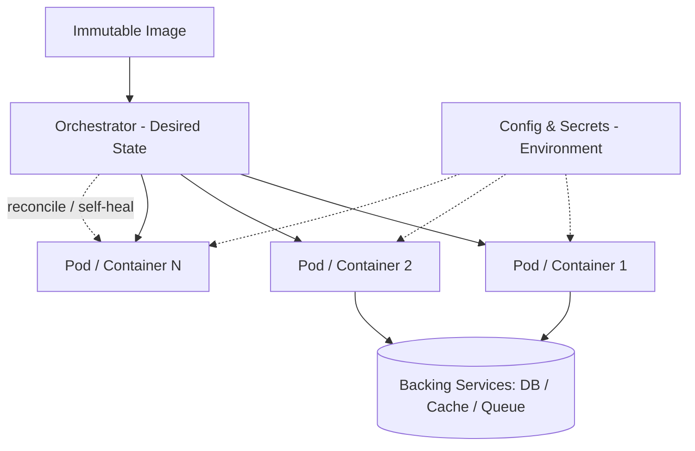

# Volume 08 - Cloud Native

| Field | Value |
|---|---|
| Document ID | WORLD-VOL08-025 |
| Title | Cloud Native |
| Version | 1.0 |
| Status | Approved |
| Classification | Internal |
| Founder | Mahesh Choudhary |

## Purpose

This chapter defines what it means for WORLD to be cloud native: designed from the ground up to run as elastic, disposable, orchestrated units on commodity infrastructure rather than as long-lived servers. Its purpose is to establish the principles - containerization, orchestration, and twelve-factor discipline - that let the ERP Foundation (Vol 05), the Business Modules (Vol 06), and the AI Business Partner (Vol 03) be deployed, scaled, healed, and replaced automatically, turning the scalability property of Chapter 24 into an operational reality.

## Scope

Covered: the cloud-native concept, containers and images, orchestration, the twelve-factor principles as applied to WORLD, and configuration-as-environment. Excluded: the specific orchestrator distribution, cluster sizing, and provider service selection, which are infrastructure decisions deferred to Vol 11. This chapter defines the architectural posture and the contract every WORLD service must satisfy to run in the cloud-native fabric.

## Concept

Cloud native is a design stance, not a hosting location: a system is cloud native when its units are packaged as self-contained, immutable images, run by an orchestrator that treats them as replaceable cattle, and are built to assume the underlying infrastructure is transient. From first principles, three ideas combine. *Containers* bundle an application with its dependencies into one immutable artifact, so the same image runs identically in every environment. *Orchestration* declares a desired state - how many copies, how they connect, how they recover - and a control loop continuously reconciles reality to that declaration, restarting or rescheduling failed units automatically. The *twelve-factor* principles make services fit for this world: explicit dependencies, configuration supplied by the environment, backing services treated as attached resources, statelessness, and disposability with fast startup and graceful shutdown. Together these make a service reproducible, elastic, and self-healing.

## Application in WORLD

Every WORLD service is packaged as an immutable container image built once and promoted unchanged through environments; nothing is patched in place. An orchestrator holds the desired state for each service and reconciles it continuously - if an instance dies, it is replaced; if load rises, more replicas are scheduled, realizing the horizontal scaling of Chapter 24. WORLD adheres to the twelve-factor contract: services are stateless and store nothing durable locally, configuration and secrets are injected from the environment rather than baked into images, and databases, caches, and queues are attached backing services addressed by configuration. Health and readiness signals let the orchestrator route traffic only to instances that are truly serving. The AI Business Partner runs as first-class cloud-native workloads on the same fabric, so its capacity is scheduled, healed, and scaled by the same control loop as every other service.

### Enterprise Example

During a routine node failure in the underlying cluster, three WORLD service instances vanish without warning. Because those services are disposable and stateless, the orchestrator detects the loss against its declared desired state and reschedules replacement containers onto healthy nodes within seconds; each new container starts from the same immutable image, reads its configuration and secrets from the environment, attaches to the shared database and cache as backing services, and begins passing readiness checks before the load balancer sends it traffic. No operator is paged, no data is lost, and no tenant notices - the failure is absorbed by the control loop rather than escalated to a human, which is precisely the resilience the cloud-native posture is designed to deliver.

## Key Components

| Component | Responsibility | Twelve-Factor Principle |
|---|---|---|
| Container Image | Immutable, self-contained deployable artifact | Build/release/run separation |
| Orchestrator | Reconciles desired state; heals and schedules | Disposability |
| Config & Secrets Injection | Supplies environment-specific values at runtime | Config |
| Backing Service Binding | Attaches DB, cache, queue by configuration | Backing services |
| Health & Readiness Probe | Signals when an instance may receive traffic | Disposability |
| Stateless Service | Holds no durable local state | Processes |

## Trade-offs & Considerations

Cloud native trades the familiarity of long-lived servers for the discipline of immutability and externalized state, and the discipline is non-negotiable: a service that writes durable data locally or reads configuration from its image will not survive rescheduling and undermines the whole model. Orchestration adds operational complexity and a learning curve, accepted because it converts manual recovery into automatic reconciliation. Immutable images enlarge the build pipeline but eliminate configuration drift between environments. The single guiding rule is that any instance must be replaceable at any moment with no loss of correctness; every twelve-factor principle exists to protect that property.

## Relationship to Other Layers

Cloud native operationalizes the Scalability (Chapter 24) property by making instances elastic and disposable, and it provides the substrate that Deployment (Chapter 26) targets and that Disaster Recovery (Chapter 27) relies on for rapid, repeatable reconstruction. It depends on state being externalized through Caching (Chapter 23) and the system of record, and it exposes health signals consumed by Monitoring (Chapter 22). For the AI Business Partner (Vol 03), it guarantees the same automated resilience and elasticity as every other WORLD workload.

## Cross-References

- [Scalability](/docs/blueprint/volume-08-architecture/section-f-operations-and-scale/24-scalability.md)
- [Deployment](/docs/blueprint/volume-08-architecture/section-f-operations-and-scale/26-deployment.md)
- [Monitoring](/docs/blueprint/volume-08-architecture/section-e-cross-cutting-concerns/22-monitoring.md)
- [Volume 05 - ERP Foundation](/docs/blueprint/volume-05-erp-foundation/README.md)

## References

- [Volume 01 - Vision and Philosophy](/docs/blueprint/volume-01-vision-and-philosophy/README.md)
- [Document Standards](/docs/governance/document-standards.md)

## Change Log

| Version | Date | Author | Notes |
|---|---|---|---|
| 1.0 | 2026-07-12 | Lead Software Engineer | Initial approved version. |
