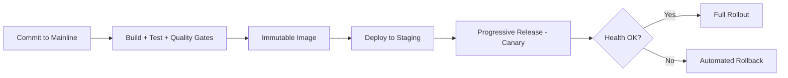

# Volume 08 - Deployment

| Field | Value |
|---|---|
| Document ID | WORLD-VOL08-026 |
| Title | Deployment |
| Version | 1.0 |
| Status | Approved |
| Classification | Internal |
| Founder | Mahesh Choudhary |

## Purpose

This chapter defines deployment as the disciplined, automated path by which a change to WORLD travels from a committed source revision to running production capacity - safely, repeatably, and without downtime. Its purpose is to establish the principles of continuous integration and delivery that let the ERP Foundation (Vol 05), the Business Modules (Vol 06), and the AI Business Partner (Vol 03) evolve continuously while preserving the correctness, isolation, and availability every tenant depends on.

## Scope

Covered: the deployment concept, the CI/CD pipeline, immutable promotion, progressive release strategies, and automated rollback. Excluded: the specific pipeline tooling, credential management mechanics, and per-environment approval chains, which are operational configuration deferred to Vol 11. This chapter defines the deployment contract and its safety guarantees, not the vendor implementation.

## Concept

Deployment is the act of making a new version of software the live version, and its central problem is risk: every change can introduce a fault, so the goal is to deliver changes in small, frequent, reversible increments rather than large, rare, irreversible ones. From first principles, three ideas govern safe delivery. *Continuous integration* merges and validates every change against the whole automatically, so defects surface early and small. *Immutable promotion* builds one artifact and moves that exact artifact through environments, so what is tested is precisely what runs. *Progressive release* exposes a new version to a growing fraction of traffic while watching health signals, so a bad change is caught by a few rather than all, and *automated rollback* returns to the last good version faster than a human could react. Small batches plus fast reversal make change routine rather than dangerous.

## Application in WORLD

WORLD delivers through an automated pipeline triggered by every commit to the mainline. The pipeline builds one immutable image (Chapter 25), runs the automated test suite and quality gates, and, on success, promotes that same image through staging to production - never rebuilding along the way. Releases are progressive: a new version is rolled out to a small slice of instances first, its health signals are compared against the running baseline through Monitoring (Chapter 22), and the rollout advances only while those signals stay healthy. If they degrade, the pipeline halts and rolls back automatically to the prior image. Because services are stateless and instances are disposable, releases happen with no downtime - old instances drain while new ones take traffic. The AI Business Partner ships through the identical pipeline, so intelligence improvements inherit the same testing, progressive exposure, and rollback safety as any other change.

### Enterprise Example

An engineer merges a change to the invoicing module. The pipeline builds a single image, runs the full test suite, and promotes the artifact to staging where integration checks pass. It then releases the new version to five percent of production instances. Within minutes, Monitoring detects that invoice-posting latency on the canary is rising abnormally while error rates tick up. The pipeline never advances the rollout; it automatically drains the canary instances and restores the previous image, returning production to full health before the vast majority of tenants ever touched the new version. The faulty change is reverted in source, and the same pipeline will carry the fix forward - the incident is contained by process, not by heroics.

## Key Components

| Component | Responsibility | Stage |
|---|---|---|
| CI Pipeline | Builds and validates every change automatically | Integration |
| Immutable Artifact | Single tested image promoted unchanged | Build |
| Quality Gate | Blocks promotion on failed tests or checks | Integration |
| Progressive Release Controller | Shifts traffic gradually to the new version | Release |
| Health Gate | Advances or halts rollout on live signals | Release |
| Automated Rollback | Restores the last good version on failure | Recovery |

## Trade-offs & Considerations

Continuous delivery trades the illusory comfort of infrequent, heavily gated releases for the real safety of small, frequent, reversible ones; large batches feel controlled but concentrate risk, so WORLD deliberately keeps changes small. Progressive release costs some rollout time and requires trustworthy health signals - which is why it is coupled tightly to Monitoring - but it converts a potential outage into a contained canary incident. Automated rollback demands that every change be backward compatible with the running version during the overlap window, a discipline enforced especially around schema and contract changes. The guiding rule is that any deployment must be reversible automatically and faster than a human response; a change that cannot be safely rolled back is re-engineered until it can.

## Relationship to Other Layers

Deployment targets the cloud-native fabric of Chapter 25 and delivers the elastic capacity defined by Scalability (Chapter 24). It is inseparable from Monitoring (Chapter 22), whose signals gate every progressive release and trigger rollback, and it is the routine, low-risk counterpart to the exceptional recovery flows of Disaster Recovery (Chapter 27). For the AI Business Partner (Vol 03), it provides the safe, continuous path by which the Partner's capabilities are improved without risking tenant stability.

## Cross-References

- [Cloud Native](/docs/blueprint/volume-08-architecture/section-f-operations-and-scale/25-cloud-native.md)
- [Disaster Recovery](/docs/blueprint/volume-08-architecture/section-f-operations-and-scale/27-disaster-recovery.md)
- [Monitoring](/docs/blueprint/volume-08-architecture/section-e-cross-cutting-concerns/22-monitoring.md)
- [Volume 03 - AI Business Partner](/docs/blueprint/volume-03-ai-business-partner/README.md)

## References

- [Volume 01 - Vision and Philosophy](/docs/blueprint/volume-01-vision-and-philosophy/README.md)
- [Document Standards](/docs/governance/document-standards.md)

## Change Log

| Version | Date | Author | Notes |
|---|---|---|---|
| 1.0 | 2026-07-12 | Lead Software Engineer | Initial approved version. |
