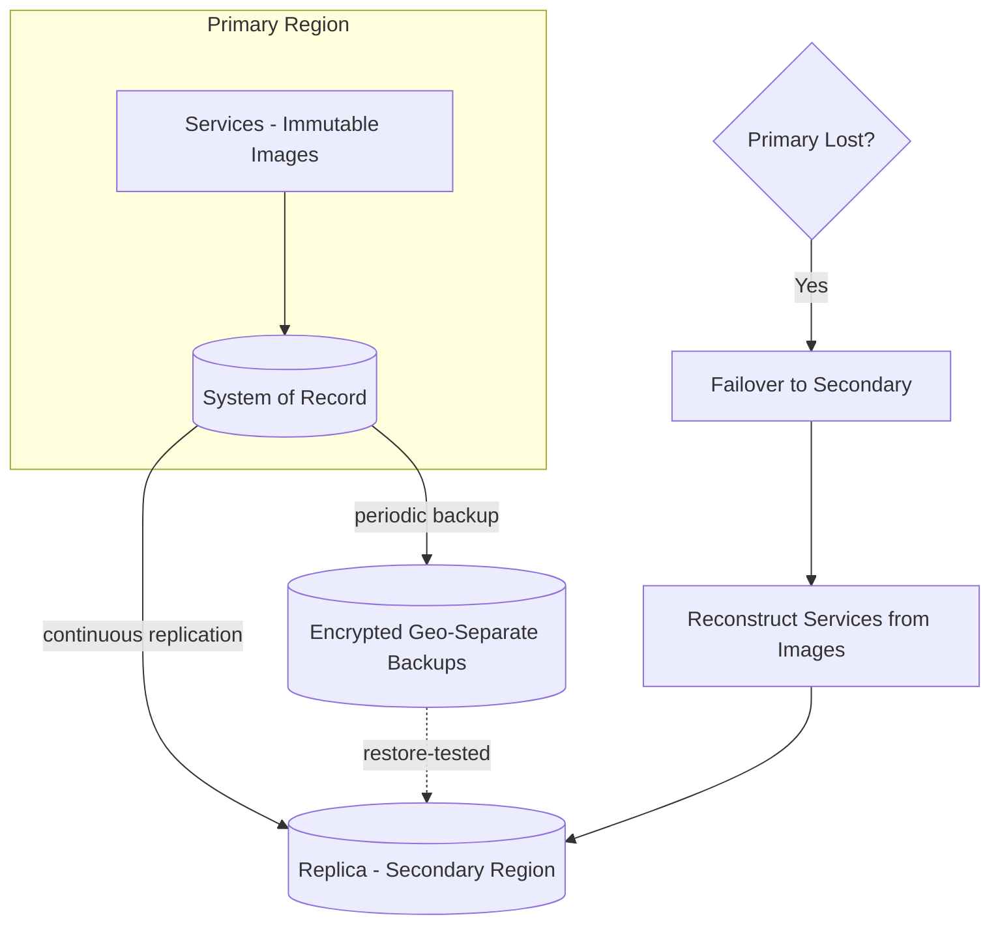

# Volume 08 - Disaster Recovery

| Field | Value |
|---|---|
| Document ID | WORLD-VOL08-027 |
| Title | Disaster Recovery |
| Version | 1.0 |
| Status | Approved |
| Classification | Internal |
| Founder | Mahesh Choudhary |

## Purpose

This chapter defines disaster recovery as WORLD's disciplined capacity to survive the loss of infrastructure - a failed region, a corrupted store, a catastrophic outage - and restore service and data within agreed limits. Its purpose is to establish the principles of recovery objectives, backup and restore, and multi-region posture so that the ERP Foundation (Vol 05), the Business Modules (Vol 06), and the AI Business Partner (Vol 03) can be brought back to a correct, tenant-isolated state after events that ordinary self-healing cannot absorb.

## Scope

Covered: the disaster-recovery concept, Recovery Time and Recovery Point Objectives, backup and restore, failover, and multi-region posture. Excluded: exact objective values per tenant tier, provider replication mechanics, and the operational runbooks and drill schedules, which are deferred to Vol 11. This chapter defines the recovery contract and its guarantees, not the site-specific procedures.

## Concept

Disaster recovery answers a different question than day-to-day resilience: not "how does the system heal a lost instance" but "how does the business survive losing an entire environment." Two objectives frame every decision. The *Recovery Time Objective* (RTO) is the maximum acceptable time to restore service after a disaster - how long the business can be down. The *Recovery Point Objective* (RPO) is the maximum acceptable data loss measured in time - how far back the last recoverable state may be. From first principles, meeting a tight RPO requires frequent, geographically separate copies of data, and meeting a tight RTO requires the ability to stand up compute and reconnect to those copies quickly. Because compute in a cloud-native system is disposable and reproducible from immutable images, the hard problem of recovery is almost always the *data*: recovery discipline is fundamentally about protecting and rapidly restoring durable state.

## Application in WORLD

WORLD protects durable state with continuous, encrypted, geographically separated backups and replication of the system of record, sized so that the last recoverable point stays within the RPO. Because services are stateless and built from immutable images (Chapter 25), the compute tier is not backed up - it is reconstructed by the orchestrator from source images, which keeps RTO low. WORLD maintains a multi-region posture: durable state is replicated to a secondary region so that, on the loss of the primary, traffic can fail over and services can be reconstituted there. Backups are restore-tested, not merely taken, because an untested backup is a hypothesis rather than a guarantee. Throughout recovery, tenant isolation is preserved - restored data carries the same tenant scoping as live data - and the AI Business Partner is recovered as part of the same fabric, returning to a correct, tenant-scoped view once the system of record is restored.

### Enterprise Example

A regional infrastructure outage takes the primary region entirely offline during business hours. WORLD declares a disaster and initiates failover. Because the system of record has been replicated continuously to the secondary region, the last recoverable data point is within seconds of the failure, satisfying the RPO. The orchestrator in the secondary region reconstructs the stateless services from their immutable images and attaches them to the replicated data, and traffic is redirected there - service is restored well within the RTO. Every restored record retains its tenant scoping, so no tenant sees another's data during or after recovery. Once the primary region returns, it is resynchronized and demoted to standby. The outage becomes a bounded, recoverable event rather than an existential one, because both data and the means to rebuild compute were prepared in advance.

## Key Components

| Component | Responsibility | Objective Served |
|---|---|---|
| Backup Store | Continuous, encrypted, geo-separated copies of state | RPO |
| Cross-Region Replica | Near-real-time copy of the system of record | RPO |
| Failover Controller | Redirects traffic to the secondary region | RTO |
| Image-Based Reconstruction | Rebuilds stateless compute from immutable images | RTO |
| Restore Test | Verifies backups are actually recoverable | Assurance |
| Tenant-Scoped Restore | Preserves isolation through recovery | Isolation |

## Trade-offs & Considerations

Every reduction in RTO and RPO costs money and complexity: tighter objectives demand more frequent replication, warmer standby capacity, and more rigorous drills, so WORLD sets objectives by tenant criticality rather than pursuing zero uniformly. Multi-region posture adds replication cost and consistency considerations, accepted because a single-region system cannot survive a regional loss. The most common failure in disaster recovery is discovering during a real event that backups were never restorable - which is why restore testing is mandatory, not optional. The guiding rule is that recovery must be a rehearsed, measured capability with proven RTO and RPO, never an untested assumption; a backup that has not been restored does not count.

## Relationship to Other Layers

Disaster recovery builds directly on Cloud Native (Chapter 25), whose immutable images and orchestration make compute cheap to reconstruct, and on the tenant partitioning of Scalability (Chapter 24), which lets recovery preserve isolation. It is the exceptional counterpart to the routine, reversible changes of Deployment (Chapter 26), and it depends on Monitoring (Chapter 22) to detect the conditions that declare a disaster. For the AI Business Partner (Vol 03), it guarantees that after any catastrophe the Partner returns to a correct, tenant-scoped state alongside the rest of WORLD.

## Cross-References

- [Scalability](/docs/blueprint/volume-08-architecture/section-f-operations-and-scale/24-scalability.md)
- [Cloud Native](/docs/blueprint/volume-08-architecture/section-f-operations-and-scale/25-cloud-native.md)
- [Deployment](/docs/blueprint/volume-08-architecture/section-f-operations-and-scale/26-deployment.md)
- [Volume 05 - ERP Foundation](/docs/blueprint/volume-05-erp-foundation/README.md)

## References

- [Volume 01 - Vision and Philosophy](/docs/blueprint/volume-01-vision-and-philosophy/README.md)
- [Document Standards](/docs/governance/document-standards.md)

## Change Log

| Version | Date | Author | Notes |
|---|---|---|---|
| 1.0 | 2026-07-12 | Lead Software Engineer | Initial approved version. |
