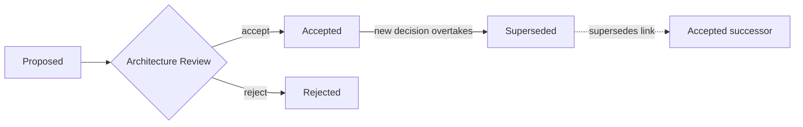

# Volume 08 - Architecture Decision Records

| Field | Value |
|---|---|
| Document ID | WORLD-VOL08-028 |
| Title | Architecture Decision Records |
| Version | 1.0 |
| Status | Approved |
| Classification | Internal |
| Founder | Mahesh Choudhary |

## Purpose

This chapter defines the Architecture Decision Record (ADR) as the governance instrument through which WORLD captures every significant architectural choice, the context that forced it, and the consequences it accepts. Its purpose is to convert architecture from tribal memory into a durable, reviewable ledger - so that any engineer, at any future point, can understand not only *what* WORLD decided but *why*, and can revisit that decision on evidence rather than on speculation.

## Scope

Covered: the ADR concept, how records are authored and governed in WORLD, the anatomy of a record, a worked sample ADR, and the trade-offs of decision journaling. Excluded: the fitness functions and deprecation mechanics that carry the architecture forward (Chapter 29), and the day-to-day code-review process. This chapter defines the principle and the lifecycle; the canonical file layout lives in the ADR template appendix referenced below.

## Concept

An architectural decision is any choice that is costly to reverse and broad in blast radius - a boundary drawn between modules, a persistence strategy, a protocol between the AI Business Partner and the ERP Foundation. From first principles, such decisions share three traits: they are made under uncertainty, they exclude alternatives, and their rationale decays from memory faster than their consequences fade from the system. An ADR is a short, immutable document that freezes the decision at the moment it is made: the forces in tension, the option chosen, the options rejected, and the consequences knowingly accepted. Records are never edited once approved - they are *superseded* by newer records, so the ledger reads as an honest history rather than a retouched present. This immutability is what distinguishes an ADR from ordinary documentation: it is a decision, timestamped and owned, not a description of current state.

## Application in WORLD

WORLD maintains a single, ordered ADR log spanning the whole platform. Any change that alters a public contract, a data-ownership boundary, a cross-cutting concern, or the autonomy envelope of the AI Business Partner requires an ADR before implementation merges. Authors draft from the shared template, circulate the record as `Proposed`, and the architecture review accepts it as `Accepted`, returns it, or marks it `Rejected`. Decisions specific to the AI Business Partner - for example, what actions it may take without human confirmation - are first-class ADRs, because autonomy boundaries are exactly the kind of high-blast-radius choice the ledger exists to preserve. Each record is numbered, linked from the chapters it affects, and, when overtaken, explicitly connected to the record that supersedes it.

### Enterprise Example

Early in WORLD's design, teams debated whether tenants should share one database with a tenant key or receive isolated schemas. The choice was costly to reverse and touched every module. Rather than settle it in a meeting whose reasoning would evaporate, the team wrote ADR-014. Two years later, when a regulated industry solution (Vol 07) demanded stronger isolation, an engineer opened ADR-014, saw precisely which forces had been weighed and which had been deferred, and authored ADR-041 to introduce optional schema isolation - superseding the original for that tenant class without relitigating settled ground.

## Key Components

| Component | Responsibility | Owner |
|---|---|---|
| Context | States the forces, constraints, and problem in tension | Author |
| Decision | Records the option chosen, in active voice | Author |
| Status | Tracks lifecycle: Proposed, Accepted, Rejected, Superseded | Review |
| Consequences | Names the positive, negative, and neutral outcomes accepted | Author |
| Supersedes / Superseded-by | Links the record into the decision history | Review |

### Sample ADR

**ADR-041: Optional Schema Isolation for Regulated Tenants**

- **Status:** Accepted (supersedes ADR-014 for regulated tenant class)
- **Context:** A shared-database, tenant-keyed model serves the majority of tenants efficiently, but regulated industry solutions require demonstrable physical separation of tenant data to satisfy audit obligations. The shared model cannot evidence isolation to an auditor's satisfaction.
- **Decision:** Introduce an optional per-tenant schema for tenants flagged as regulated, provisioned by the same platform tooling, while retaining the shared model as the default for all other tenants.
- **Consequences:** Positive - regulated tenants gain auditable isolation and per-schema encryption keys. Negative - the persistence layer must support two provisioning paths, raising operational complexity. Neutral - application code remains isolation-agnostic behind the data-access boundary.

## Trade-offs & Considerations

ADRs impose a real cost: authoring discipline and review latency on the critical path of change. WORLD accepts this deliberately, because the alternative - undocumented decisions - imposes a larger, deferred cost when future engineers reverse-engineer intent from code. The discipline must be calibrated: recording *every* choice drowns the signal, so the threshold is significance, not activity. Records must stay honest - an ADR that omits the rejected options or the negative consequences is worse than none, because it manufactures false confidence. Finally, immutability requires cultural commitment: the temptation to quietly edit a stale record must be resisted in favor of superseding it.

## Relationship to Other Layers

The ADR ledger is the connective tissue of Volume 08. It records the reasoning behind the architectural styles (Section B), the module boundaries of the Application Architecture (Section C), and the cross-cutting concerns (Section E). It feeds directly into Future Evolution (Chapter 29): fitness functions are frequently the enforcement mechanism for a consequence an ADR accepted, and every deprecation begins as a superseding record. It also anchors decisions about the AI Business Partner (Vol 03) and the ERP Foundation (Vol 05) so their evolution stays traceable.

## Cross-References

- [Future Evolution](/docs/blueprint/volume-08-architecture/section-g-governance-and-evolution/29-future-evolution.md)
- [ADR Template Appendix](/docs/blueprint/volume-08-architecture/appendices/architecture-decision-record-template.md)
- [Volume 03 - AI Business Partner](/docs/blueprint/volume-03-ai-business-partner/README.md)
- [Volume 05 - ERP Foundation](/docs/blueprint/volume-05-erp-foundation/README.md)

## References

- [Volume 01 - Vision and Philosophy](/docs/blueprint/volume-01-vision-and-philosophy/README.md)
- [Document Standards](/docs/governance/document-standards.md)

## Change Log

| Version | Date | Author | Notes |
|---|---|---|---|
| 1.0 | 2026-07-12 | Lead Software Engineer | Initial approved version. |
