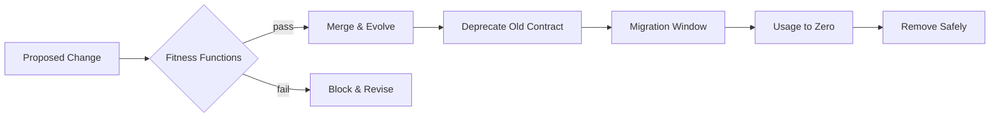

# Volume 08 - Future Evolution

| Field | Value |
|---|---|
| Document ID | WORLD-VOL08-029 |
| Title | Future Evolution |
| Version | 1.0 |
| Status | Approved |
| Classification | Internal |
| Founder | Mahesh Choudhary |

## Purpose

This chapter defines how the WORLD architecture is designed to change - safely, continuously, and without erosion. Its purpose is to establish evolution as a first-class architectural property rather than an afterthought: to give WORLD the mechanisms to absorb new business modules, new industry solutions, and a steadily more capable AI Business Partner, while guaranteeing that the qualities the platform depends on are never quietly lost as it grows.

## Scope

Covered: the concept of evolutionary architecture, WORLD's fitness functions, the deprecation lifecycle, and how change is governed over time. Excluded: the immutable decision ledger itself (Chapter 28) and specific product roadmap dates - this chapter deliberately commits to *mechanisms of change*, not to a schedule. It defines how WORLD evolves; it does not predict when any particular capability ships.

## Concept

Every long-lived system faces the same first-principles tension: business needs change faster than architecture can be safely rewritten, yet unmanaged change causes architectural erosion - the slow drift of a system away from its intended qualities. Evolutionary architecture resolves this by treating guided change as the normal state and by making the system's essential qualities *executable*. The instrument is the fitness function: an automated, objective test that measures whether an architectural characteristic - a latency budget, a dependency rule, a tenant-isolation guarantee - still holds after a change. Where an ADR (Chapter 28) records a decision in prose, a fitness function enforces its consequence in code, failing the build the moment reality diverges from intent. Evolution, in this model, is not occasional and heroic; it is incremental and continuously verified.

## Application in WORLD

WORLD encodes its non-negotiable qualities as fitness functions that run in the continuous-integration pipeline. Dependency-direction functions assert that Business Modules (Vol 06) never import each other except through published contracts; performance functions assert that core Order-to-Cash paths stay inside their latency SLOs; isolation functions assert that no query can cross a tenant boundary. The AI Business Partner (Vol 03) is governed by its own fitness functions - guardrails that verify it cannot exceed its approved autonomy envelope even as its models improve. When a capability must retire, WORLD follows an explicit deprecation lifecycle rather than deleting abruptly: a contract is marked deprecated, consumers are given a supported migration window, usage is monitored to zero, and only then is the old path removed - each stage anchored to a superseding ADR.

### Enterprise Example

A new Business Module needs a richer customer contract than the shared Customer engine exposes. Instead of extending the contract in place and risking every existing consumer, the team publishes a versioned successor and marks the original deprecated - a decision captured as an ADR. A fitness function now reports how many callers still use the old contract. Over the migration window, teams move across; the function's count falls; monitoring (Chapter 22) confirms zero traffic on the deprecated path. Only then is it removed. The platform gained a capability, and not one consumer broke, because evolution was staged and measured rather than assumed.

## Key Components

| Component | Responsibility | Enforcement |
|---|---|---|
| Fitness Function | Tests that an architectural quality still holds | CI pipeline, automated |
| Dependency Rule | Guards module and layer boundaries | Static analysis |
| Autonomy Guardrail | Keeps the AI Business Partner within its envelope | Runtime + CI checks |
| Deprecation Marker | Signals a contract is retiring, starts the clock | Contract registry |
| Migration Window | Grants consumers supported time to move | Governance policy |

## Trade-offs & Considerations

Fitness functions cost engineering effort to build and maintain, and a poorly written one either passes trivially - offering false assurance - or fails noisily, breeding the same fatigue that undermines alerting. WORLD therefore invests only in functions that guard genuinely load-bearing qualities. Evolutionary architecture also trades short-term convenience for long-term integrity: shipping a breaking change directly is faster today than staging a deprecation, but the deferred cost of broken consumers and lost trust is far higher. Committing to mechanisms rather than dates is itself a deliberate stance - it keeps the architecture honest about uncertainty and prevents roadmap promises from ossifying into architectural debt.

## Relationship to Other Layers

Future Evolution is the forward-looking counterpart to the Architecture Decision Records of Chapter 28: ADRs record why the architecture is as it is, while fitness functions and the deprecation lifecycle govern how it becomes what it will be. It relies on Monitoring (Vol 08 Section E) to observe usage as contracts retire, on the Application Architecture (Section C) to define the boundaries that dependency functions protect, and on the governance framework of the AI Business Partner (Vol 03) to keep autonomy expansion measured and reversible.

## Cross-References

- [Architecture Decision Records](/docs/blueprint/volume-08-architecture/section-g-governance-and-evolution/28-architecture-decision-records.md)
- [Monitoring](/docs/blueprint/volume-08-architecture/section-e-cross-cutting-concerns/22-monitoring.md)
- [Volume 03 - AI Business Partner](/docs/blueprint/volume-03-ai-business-partner/README.md)
- [Volume 06 - Business Modules](/docs/blueprint/volume-06-business-modules/README.md)

## References

- [Volume 01 - Vision and Philosophy](/docs/blueprint/volume-01-vision-and-philosophy/README.md)
- [Document Standards](/docs/governance/document-standards.md)

## Change Log

| Version | Date | Author | Notes |
|---|---|---|---|
| 1.0 | 2026-07-12 | Lead Software Engineer | Initial approved version. |
