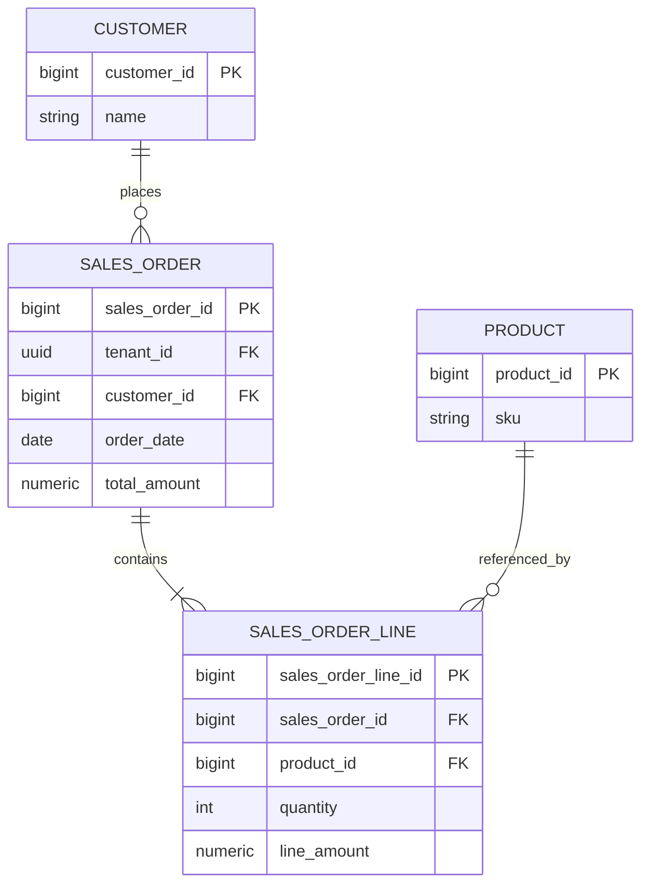
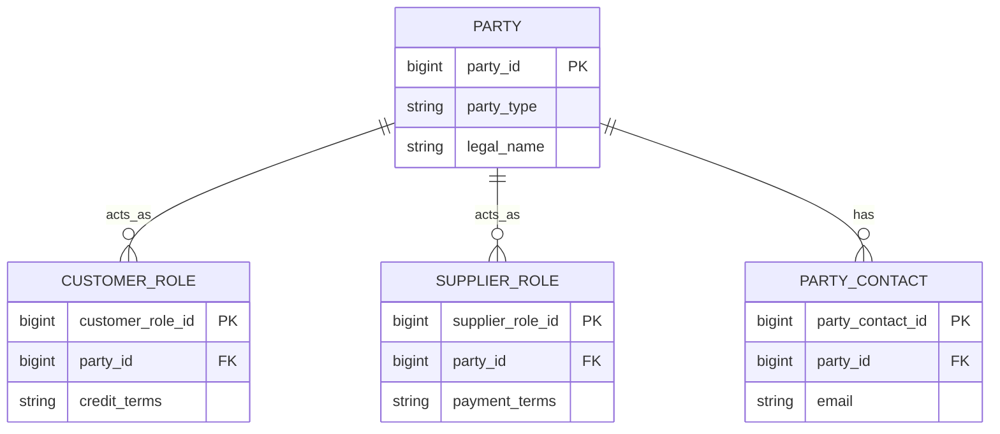
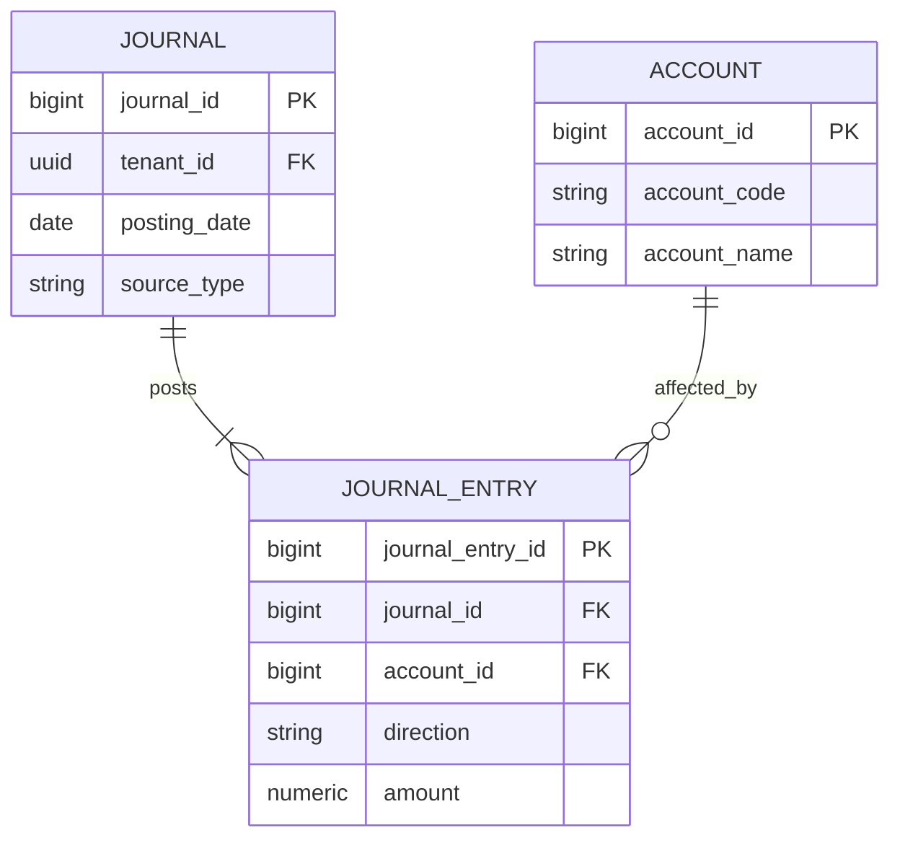
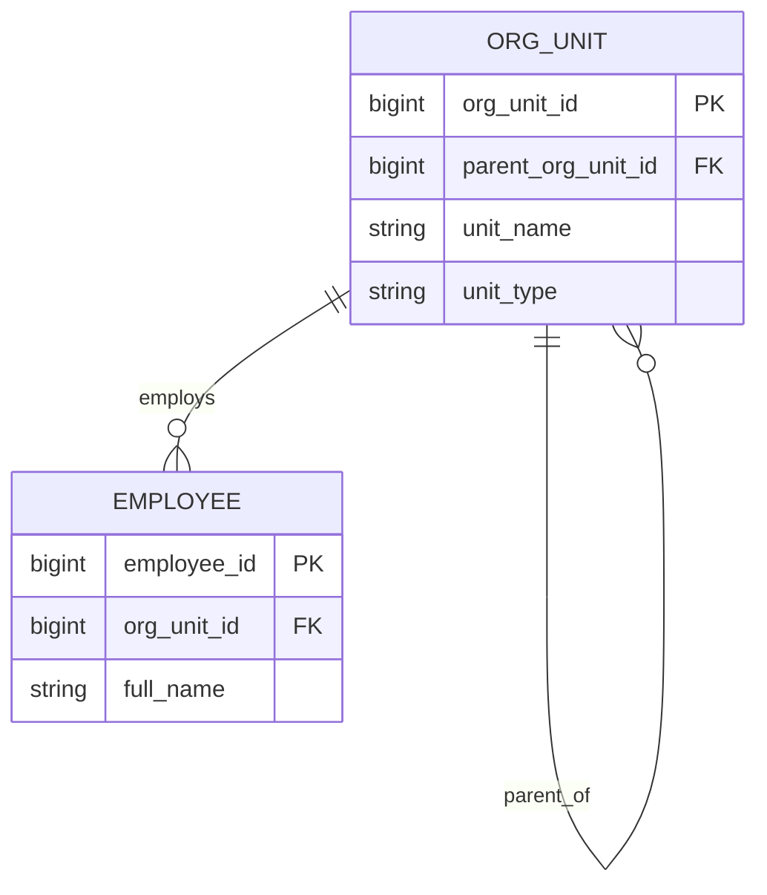
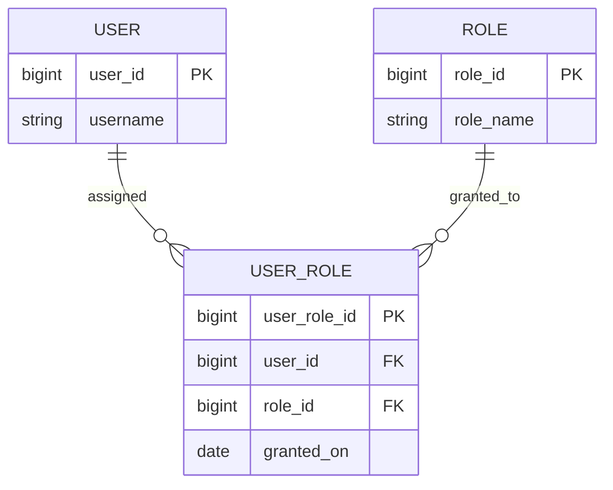

# Volume 09 - ER Diagram Catalog

| Field | Value |
|---|---|
| Document ID | WORLD-VOL09-A4 |
| Title | ER Diagram Catalog |
| Version | 1.0 |
| Status | Approved |
| Classification | Internal |
| Founder | Mahesh Choudhary |

## Purpose

This appendix catalogs the standard entity-relationship modeling patterns used across Project WORLD and gives a canonical, syntactically valid Mermaid `erDiagram` example of each. Its purpose is to standardize how data structures are modeled and drawn, so that a schema in one module can be read the same way as a schema in another. Recurring modeling patterns make the data tier reviewable, teachable, and machine-readable, and they let the AI Business Partner and human engineers reason about the same structural vocabulary.

## Scope

The catalog covers the ER patterns WORLD uses most: the header-line (document) pattern, the party/role pattern, the ledger/journal pattern, the hierarchy (self-referencing) pattern, and the many-to-many associative pattern. For each it states intent, when to use it, and a Mermaid `erDiagram` example. It does not mandate a drawing tool; Mermaid is the default because it is text-based and version-controllable. It does not replace the Data Dictionary Template (Appendix A3), which governs attribute-level specification.

## Pattern Index

| Pattern | Primary Question It Answers | When to Use |
|---|---|---|
| Header-Line (Document) | How is a document and its repeating detail rows structured? | Orders, invoices, journals, receipts, any master-detail document. |
| Party / Role | How do people and organizations play different roles over time? | Customers, suppliers, employees that are the same party in multiple roles. |
| Ledger / Journal | How are financial or quantity movements recorded immutably? | Accounting entries, stock movements, any double-entry or append-only ledger. |
| Hierarchy (Self-Referencing) | How is a recursive tree of the same entity represented? | Org charts, chart of accounts, category trees, bill of materials. |
| Many-to-Many (Associative) | How are two entities linked with their own attributes? | Order-to-product, user-to-role, product-to-tag associations. |

### Header-Line (Document) Pattern

Use for any business document with a header carrying document-level facts and one or more detail lines. The header owns identity and totals; each line references the header and a referenced item.

### Party / Role Pattern

Use when the same real-world party (a person or organization) participates as different roles across the business. A single party record carries identity; role records attach role-specific attributes, avoiding duplication of the party.

### Ledger / Journal Pattern

Use for immutable, append-only movements such as accounting entries or stock transactions. A journal header groups balanced entries; each entry line posts a signed amount against an account. Corrections are made by new reversing entries, never by mutation.

### Hierarchy (Self-Referencing) Pattern

Use to model a recursive tree of a single entity type, where each row optionally references a parent of the same table. Suits organization units, chart of accounts, category trees, and bills of material.

### Many-to-Many (Associative) Pattern

Use when two entities relate many-to-many and the relationship itself carries attributes. An associative (junction) entity holds the two foreign keys plus any relationship data, and its own surrogate key.

## Cross-References

- [Entity Relationship Strategy](/docs/blueprint/volume-09-database/section-c-data-modeling/12-entity-relationship-strategy.md)
- [Normalization](/docs/blueprint/volume-09-database/section-c-data-modeling/13-normalization.md)
- [Data Dictionary Template](/docs/blueprint/volume-09-database/appendices/data-dictionary-template.md)

## References

- [Volume 01 - Vision and Philosophy](/docs/blueprint/volume-01-vision-and-philosophy/README.md)
- [Document Standards](/docs/governance/document-standards.md)

## Change Log

| Version | Date | Author | Notes |
|---|---|---|---|
| 1.0 | 2026-07-12 | Lead Software Engineer | Initial approved version. |
