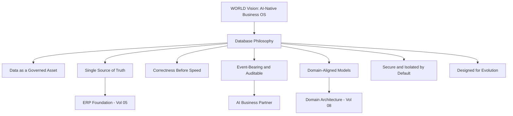

# Volume 09 - Database Philosophy

| Field | Value |
|---|---|
| Document ID | WORLD-VOL09-001 |
| Title | Database Philosophy |
| Version | 1.0 |
| Status | Approved |
| Classification | Internal |
| Founder | Mahesh Choudhary |

## Purpose

This chapter establishes the enduring beliefs that govern how Project WORLD persists, protects, and serves data. The database is not a passive store beneath the application; in an AI-native business operating system it is the authoritative memory of the enterprise and the factual substrate on which the AI Business Partner reasons and acts. This philosophy fixes the durable commitments that every later chapter of Volume 09 - modeling, performance, security, lifecycle, and governance - must honor. Where a downstream design choice conflicts with a belief stated here, the belief prevails unless a recorded Architecture Decision Record supersedes it.

## Scope

The chapter defines WORLD's database philosophy: what the data tier is for, the principles that constrain its design, and how those principles are applied and traded off. It is technology-independent and does not prescribe a specific engine, physical schema, or vendor. It applies to every data store that participates in WORLD - operational, analytical, and knowledge stores alike - and is realized by the ERP data foundation of Volume 05 (Section F) and the domain architecture of Volume 08.

## Concept

A database philosophy is a small set of first-principles beliefs, each paired with a rationale, that constrains data design without dictating implementation. It answers a prior question to any schema: what does the enterprise consider true, who may assert it, and how long must it endure. WORLD treats data as a durable, governed, single-sourced asset rather than a byproduct of applications. Three convictions follow. First, **data outlives code**: applications, frameworks, and even engines are replaced, but the customer, the ledger entry, and the production order persist for years, so the model must be designed for that horizon. Second, **truth is single-sourced**: every fact has exactly one authoritative home, and all other copies are derivations. Third, **the database is observable and event-bearing**: material state changes are recorded as immutable facts, giving both the audit trail and the AI Business Partner a trustworthy account of what happened.

## Application in WORLD

WORLD adopts seven database beliefs, each serving the AI Business Partner and the ERP Foundation directly.

Each belief is operationalized. *Data as a governed asset* means every entity has an accountable data owner and a defined quality standard. *Single source of truth* means master and reference data are mastered once and shared, never re-keyed per module. *Correctness before speed* means transactional integrity and constraints are never sacrificed for convenience; performance is engineered around correctness, not instead of it. *Event-bearing and auditable* means the data tier records immutable events for every material change, feeding audit, business intelligence (Volume 04), and AI reasoning. *Domain-aligned models* means schemas mirror the bounded contexts of Volume 08 rather than technical convenience.

## Key Components

| # | Belief | Statement | Primary Beneficiary |
|---|---|---|---|
| 1 | Data as a Governed Asset | Every entity has an owner, a steward, and a quality standard | Governance and trust |
| 2 | Single Source of Truth | Each fact has one authoritative home; copies are derivations | ERP Foundation (Vol 05) |
| 3 | Correctness Before Speed | Integrity and constraints are never traded for performance | Financial and legal accuracy |
| 4 | Event-Bearing | Material state changes are recorded as immutable events | Audit, BI (Vol 04), AI |
| 5 | Domain-Aligned | Schemas mirror bounded contexts, not technical layers | Domain Architecture (Vol 08) |
| 6 | Secure by Default | Deny by default; isolate tenants; encrypt and log access | Multi-tenant trust |
| 7 | Designed for Evolution | Prefer additive, reversible schema change over rewrites | Longevity |

**Enterprise example:** A distributor onboards a new supplier. Because WORLD holds a *single source of truth*, the supplier is mastered once in the master-data store and instantly available to Procurement, Finance, and Inventory without re-entry. Because the data tier is *event-bearing*, the creation emits an immutable event that the AI Business Partner observes to pre-populate payment terms and flag duplicate vendors, all under *secure-by-default* tenancy isolation - with no data copied into module-local tables.

## Trade-offs & Considerations

These beliefs impose real costs. Event-bearing storage and full auditability increase write volume and retention, addressed by the partitioning, archival, and retention chapters of Sections D and F. Strict single-sourcing can slow a team that would prefer a private copy, so WORLD provides governed read models and caches instead of duplicated masters. Correctness-before-speed may reject a denormalization that a report author wants; the resolution is a governed analytical store (Chapter 08), not a compromise of the operational model. The governing rule is that these beliefs may be balanced against one another only through a recorded decision, never silently violated.

## Relationship to Other Layers

This philosophy is the contract between the data tier and the rest of WORLD. The AI Business Partner depends on the event-bearing and single-source beliefs to reason on trustworthy facts. The ERP Foundation (Volume 05, Section F) is realized through single-sourcing and domain alignment. The Business Modules (Volume 06) inherit these beliefs as data constraints, and the Domain Architecture (Volume 08) supplies the bounded contexts that shape the schemas. Downstream chapters on enterprise data architecture and database standards translate this philosophy into structure and rules.

## Cross-References

- [Enterprise Data Architecture](/docs/blueprint/volume-09-database/section-a-database-foundations/02-enterprise-data-architecture.md)
- [Database Standards](/docs/blueprint/volume-09-database/section-a-database-foundations/03-database-standards.md)
- [Volume 05 - ERP Foundation](/docs/blueprint/volume-05-erp-foundation/README.md)
- [Volume 08 - Architecture](/docs/blueprint/volume-08-architecture/README.md)

## References

- [Volume 01 - Vision and Philosophy](/docs/blueprint/volume-01-vision-and-philosophy/README.md)
- [Document Standards](/docs/governance/document-standards.md)

## Change Log

| Version | Date | Author | Notes |
|---|---|---|---|
| 1.0 | 2026-07-12 | Lead Software Engineer | Initial approved version. |
