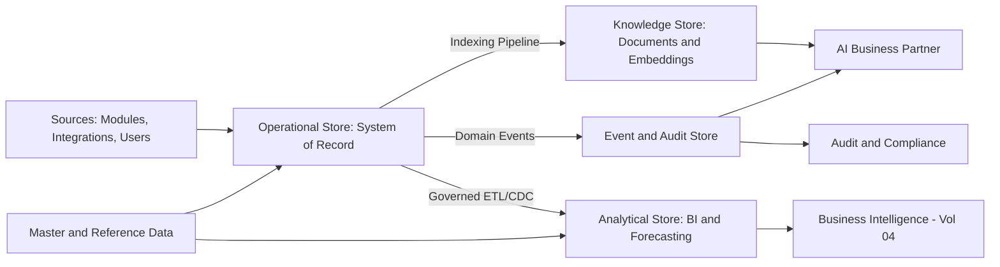

# Volume 09 - Enterprise Data Architecture

| Field | Value |
|---|---|
| Document ID | WORLD-VOL09-002 |
| Title | Enterprise Data Architecture |
| Version | 1.0 |
| Status | Approved |
| Classification | Internal |
| Founder | Mahesh Choudhary |

## Purpose

This chapter defines the enterprise-wide shape of WORLD's data tier: the layers, stores, and flows through which data enters, is mastered, is transformed, and is served. Where the Database Philosophy (Chapter 01) fixes what WORLD believes about data, this chapter fixes how those beliefs are structured into an architecture. It is the reference model that every subsequent chapter of Volume 09 elaborates and that the Business Modules of Volume 06 consume. Its purpose is to guarantee that a single logical model of enterprise truth serves operational transactions, analytical insight, and AI reasoning without fragmentation.

## Scope

The chapter describes the logical data architecture: the categories of data, the stores that hold them, the movement of data between them, and the boundaries that isolate tenants and entities. It is conceptual and does not fix physical DDL, engine selection, or deployment topology, which belong to Volume 11 (Infrastructure) and the physical appendices. It covers operational, analytical, and knowledge data and their interfaces to the API tier (Volume 10). It applies across all thirty-two business modules and four platform engines of WORLD.

## Concept

Enterprise data architecture is the discipline of organizing an organization's data into coherent layers with defined ownership, flow, and contracts, so that many consumers can rely on consistent facts. The organizing idea in WORLD is **separation by purpose with unity of truth**: different workloads - high-integrity transactions, high-volume analytics, and semantic AI retrieval - have genuinely different access patterns and therefore deserve different stores, yet they must all derive from one authoritative account of enterprise facts. WORLD resolves this tension with a layered model. Operational stores own the authoritative transactional truth and enforce integrity. Analytical stores hold governed, denormalized derivations for reporting and forecasting. Knowledge stores hold documents, embeddings, and semantic indexes for AI retrieval. Movement between layers is explicit, event-driven, and one-directional from the operational system of record outward, so derivations never silently become sources.

## Application in WORLD

The reference model organizes data into five logical layers bound to WORLD's domains.

The operational store is the system of record, aligned to the bounded contexts of Volume 08 and enforcing the ERP data model of Volume 05. Master and reference data are mastered once and fed into both operational and analytical layers, preserving the single-source belief. Every material change emits a domain event into the event and audit store, which is immutable and append-only. Governed pipelines - change-data-capture and scheduled transformation - derive the analytical store, while an indexing pipeline populates the knowledge store with documents and vector embeddings for AI retrieval.

## Key Components

| Layer | Purpose | Data Category | Primary Consumer |
|---|---|---|---|
| Operational Store | Authoritative transactions with full integrity | Transactional, Operational | Business Modules (Vol 06) |
| Master and Reference | Single-sourced shared entities and code sets | Master, Reference | All modules and layers |
| Event and Audit Store | Immutable record of every material change | Event, Audit | Audit, AI Business Partner |
| Analytical Store | Governed derivations for reporting and forecast | Analytical | Business Intelligence (Vol 04) |
| Knowledge Store | Documents, embeddings, semantic indexes | Knowledge | AI Business Partner |

**Enterprise example:** A retailer records a sales invoice. The operational store commits it under full transactional integrity and emits an `InvoicePosted` event to the audit store. Change-data-capture propagates the invoice into the analytical store, where the AI Business Partner's demand forecast refreshes overnight; simultaneously the indexing pipeline embeds the invoice's linked contract into the knowledge store so the AI can answer questions about terms. One authoritative event, three governed derivations, zero re-keying - and a complete audit trail for compliance.

## Trade-offs & Considerations

Separation by purpose introduces latency and duplication: analytical and knowledge stores lag the operational store by the pipeline interval, so WORLD is explicit that only the operational and master layers are authoritative and the rest are eventually consistent derivations. Maintaining multiple stores raises operational cost and pipeline complexity, mitigated by standardized event contracts and the naming and modeling standards of Chapter 03. A single unified store would be simpler but would force analytics and AI to compete with transactions for the same resources, harming both. The governing rule is one source of truth, many governed views - never many sources.

## Relationship to Other Layers

This architecture realizes the ERP data foundation of Volume 05 (Section F) and mirrors the domain boundaries of Volume 08. It feeds Business Intelligence (Volume 04) through the analytical layer and the AI Business Partner through the event and knowledge layers. It exposes its data to applications through the API contracts of Volume 10 and is deployed onto the topology defined in Volume 11 (Infrastructure). The data categories named here are elaborated in Section B, and the modeling of the operational store is detailed in Section C.

## Cross-References

- [Database Philosophy](/docs/blueprint/volume-09-database/section-a-database-foundations/01-database-philosophy.md)
- [Database Standards](/docs/blueprint/volume-09-database/section-a-database-foundations/03-database-standards.md)
- [Volume 05 - ERP Foundation](/docs/blueprint/volume-05-erp-foundation/README.md)
- [Volume 08 - Architecture](/docs/blueprint/volume-08-architecture/README.md)

## References

- [Volume 01 - Vision and Philosophy](/docs/blueprint/volume-01-vision-and-philosophy/README.md)
- [Document Standards](/docs/governance/document-standards.md)

## Change Log

| Version | Date | Author | Notes |
|---|---|---|---|
| 1.0 | 2026-07-12 | Lead Software Engineer | Initial approved version. |
