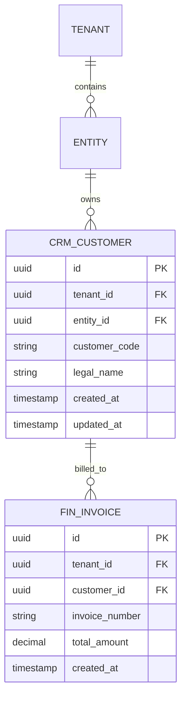

# Volume 09 - Database Standards

| Field | Value |
|---|---|
| Document ID | WORLD-VOL09-003 |
| Title | Database Standards |
| Version | 1.0 |
| Status | Approved |
| Classification | Internal |
| Founder | Mahesh Choudhary |

## Purpose

This chapter fixes the concrete, enforceable rules that every database object in Project WORLD must follow. Where the philosophy states beliefs and the architecture states structure, standards state the specific conventions that make thousands of tables across thirty-two modules legible, consistent, and safe to evolve. Standards are what allow any engineer, and the AI Business Partner itself, to read an unfamiliar schema and understand it without a guide. They exist to prevent the slow decay that follows when every team names, keys, and types its data differently.

## Scope

The chapter defines standards for naming, keys and identifiers, data typing, temporal and audit columns, tenancy and entity scoping, constraints, and schema change management. It is engine-independent and conceptual: it prescribes conventions, not vendor-specific DDL syntax. It applies to every object in the operational, analytical, event, and knowledge stores defined in Chapter 02, and it is normative for all Business Modules (Volume 06) and platform engines. Physical performance structures are governed by Section D; this chapter governs form and consistency.

## Concept

A standard is a fixed choice among equally valid options, adopted so that consistency itself becomes a feature. The value of a standard is not that any single rule is optimal but that the rule is universal, so that structure becomes predictable. WORLD's standards rest on three commitments. First, **every object is self-describing**: its name reveals its domain, kind, and role, so `crm_customer` and `fin_journal_entry` are legible at a glance. Second, **every row is accountable and scoped**: mandatory audit and tenancy columns record who created and changed each row and to which tenant and entity it belongs, enforcing the secure-by-default and multi-entity beliefs. Third, **every identifier is stable and non-semantic**: surrogate keys never encode business meaning, so business changes never break references. Standards are testable; a schema either conforms or it does not, and conformance is checked in review.

## Application in WORLD

Standards are applied uniformly across every store and enforced at schema-review and pipeline-validation time.

Every table carries a non-semantic surrogate primary key (`id`), a `tenant_id`, and where relevant an `entity_id`, giving structural tenant and multi-company isolation consistent with Volume 05. Business identifiers such as `customer_code` and `invoice_number` are stored as distinct, uniquely constrained attributes, never as primary keys. Foreign keys are named for the referenced entity with an `_id` suffix. Mandatory temporal columns (`created_at`, `updated_at`) and audit references appear on every operational table, and monetary values use fixed-precision decimals - never floating point - to honor correctness before speed.

## Key Components

| Standard | Convention | Rationale |
|---|---|---|
| Table naming | `<domain>_<entity>`, singular, snake_case | Self-describing and domain-aligned |
| Primary key | Non-semantic surrogate `id` (UUID) | Stable references immune to business change |
| Business key | Distinct attribute with unique constraint | Separates identity from meaning |
| Foreign key | `<referenced_entity>_id` | Predictable, readable relationships |
| Tenancy scope | Mandatory `tenant_id`, optional `entity_id` | Structural multi-tenant isolation |
| Audit columns | `created_at`, `updated_at`, `created_by` | Accountability and traceability |
| Money type | Fixed-precision decimal, explicit currency | Financial correctness, no rounding drift |
| Schema change | Additive, backward-compatible, versioned | Designed-for-evolution belief |

**Enterprise example:** A module team needs to add loyalty tiers to customers. Under WORLD standards they add a nullable `loyalty_tier` column to `crm_customer` - an additive, backward-compatible change - rather than altering the primary key or creating a parallel table. Because the surrogate `id` is unchanged, every `fin_invoice.customer_id` reference remains valid, existing reports keep working, and the AI Business Partner immediately understands the new column from its self-describing name. No migration of references, no downtime.

## Trade-offs & Considerations

Standards trade local flexibility for global consistency. Mandatory audit and tenancy columns add storage and a small write cost to every table, accepted because isolation and traceability are non-negotiable in a multi-tenant OS. Surrogate keys require an extra unique constraint to protect the business key, a deliberate cost that keeps identity stable. Strict additive-only change management can feel slow when a team wishes to restructure aggressively; the resolution is a governed, versioned migration path rather than an ad-hoc break. The governing rule is that a standard may be revised for everyone through a recorded decision, but never quietly ignored for one table.

## Relationship to Other Layers

These standards operationalize the philosophy of Chapter 01 and give concrete form to the layers of Chapter 02. They are inherited by every Business Module (Volume 06) and enforced against the domain models of Volume 08. The tenancy and entity conventions realize the multi-company foundation of Volume 05 and are relied upon by the multi-tenant chapters of Section H. The API tier (Volume 10) maps its contracts onto these standardized structures, and the physical performance structures of Section D are layered on top of the forms fixed here.

## Cross-References

- [Database Philosophy](/docs/blueprint/volume-09-database/section-a-database-foundations/01-database-philosophy.md)
- [Enterprise Data Architecture](/docs/blueprint/volume-09-database/section-a-database-foundations/02-enterprise-data-architecture.md)
- [Volume 05 - ERP Foundation](/docs/blueprint/volume-05-erp-foundation/README.md)
- [Volume 06 - Business Modules](/docs/blueprint/volume-06-business-modules/README.md)

## References

- [Volume 01 - Vision and Philosophy](/docs/blueprint/volume-01-vision-and-philosophy/README.md)
- [Document Standards](/docs/governance/document-standards.md)

## Change Log

| Version | Date | Author | Notes |
|---|---|---|---|
| 1.0 | 2026-07-12 | Lead Software Engineer | Initial approved version. |
