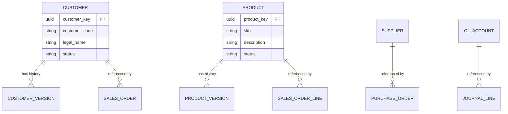

# Volume 09 - Master Data

| Field | Value |
|---|---|
| Document ID | WORLD-VOL09-004 |
| Title | Master Data |
| Version | 1.0 |
| Status | Approved |
| Classification | Internal |
| Founder | Mahesh Choudhary |

## Purpose

This chapter specifies how master data is modeled, persisted, and protected in the WORLD database tier. Where Volume 05 Section F defines master data as a conceptual and governance contract, this chapter defines the physical and architectural realization: identity strategy, storage patterns, uniqueness enforcement, versioning, and the constraints that make master data the trustworthy backbone every other data category references.

## Scope

This document covers the database treatment of master data across all WORLD tenants: entity identity, table structure principles, referential integrity, history and versioning, deduplication support, and stewardship enforcement at the schema level. It does not redefine the business ownership model (Volume 05) nor the modeling techniques of normalization and denormalization, which are detailed in Section C.

## Concept

Master data represents the durable business objects that exist independently of any single event and are referenced repeatedly across transactions: customers, suppliers, products, materials, employees, general-ledger accounts, cost centers, and locations. From first principles, the database's obligation to master data is stability of identity. A master record is created once, referenced by potentially millions of rows, and changed rarely and deliberately. The identifier that binds those references together must never be reused, silently reassigned, or deleted while dependents survive.

This leads to three physical design commitments. First, every master entity carries a system-generated surrogate key that is immutable for the life of the record, decoupled from any human-facing business code that may change. Second, master records are never hard-deleted; they are deactivated through a status attribute so historical transactions that reference them remain valid. Third, controlled change is captured as versioned history rather than in-place overwrite, so the state of a master record at any point in time can be reconstructed.

## Application in WORLD

In WORLD, each master domain is persisted in a dedicated schema owned by a named steward function. The database enforces the stewardship contract described in Volume 05 through constraints rather than convention: mandatory attributes are `NOT NULL`, business codes carry unique indexes scoped to the tenant, and status transitions are guarded so a record cannot move to `Active` without the attributes its downstream consumers require.

The AI Business Partner treats master data as authoritative context and may propose creates or updates, but every proposed change routes through the same schema-enforced stewardship path a human change would, preserving one governed source of identity.

## Key Components

| Component | Database Responsibility | Example |
|---|---|---|
| Surrogate key | Immutable system identity, primary reference target | `customer_key` UUID |
| Business code | Human-facing unique identifier, mutable under control | `customer_code` CUST-00187 |
| Attribute set | Governed descriptive columns with validation constraints | Legal name, credit limit, tax profile |
| Status lifecycle | Enforces activate/deactivate instead of delete | `status` Active, Deactivated |
| Version history | Point-in-time reconstruction of record state | `customer_version` table |
| Match keys | Support deduplication and survivorship | Normalized name, tax ID hash |

## Trade-offs & Considerations

The central trade-off is normalization against read performance. Fully normalized master schemas guarantee a single point of change and eliminate update anomalies, but wide transactional reads may join many master tables. WORLD resolves this by keeping the system of record normalized while projecting denormalized, read-optimized master snapshots for high-volume paths (see Section C). Versioned history increases storage and write cost; WORLD accepts this because auditability and temporal reconstruction are non-negotiable for an enterprise ledger. Surrogate keys add an indirection that complicates human debugging, but the immutability they provide is worth the cost given the volume of dependent references.

## Relationship to Other Layers

Master data is the anchor that transactional data (Chapter 06) references and that analytical data (Chapter 08) uses as conformed dimensions. Reference data (Chapter 05) supplies the controlled code values that master attributes draw upon. Metadata management (Chapter 10) catalogs master schemas, ownership, and lineage. Upward, this chapter realizes the master-data governance contract of Volume 05 Section F and supplies the stable identities that the Business Modules of Volume 06 operate on.

### Enterprise Example

A manufacturer onboards a new supplier in WORLD. The database issues an immutable `supplier_key`, assigns the human-facing `supplier_code`, and enforces mandatory tax and payment-term attributes before the status may become `Active`. Deduplication match keys flag a near-identical existing supplier for steward review. Once activated, thousands of purchase orders reference the surrogate key. When the supplier is retired years later, its record is deactivated, preserving every historical purchase order that still points to it.

## Cross-References

- [Reference Data](/docs/blueprint/volume-09-database/section-b-data-categories/05-reference-data.md)
- [Transactional Data](/docs/blueprint/volume-09-database/section-b-data-categories/06-transactional-data.md)
- [Metadata Management](/docs/blueprint/volume-09-database/section-b-data-categories/10-metadata-management.md)
- [Volume 05 - ERP Foundation, Master Data](/docs/blueprint/volume-05-erp-foundation/section-f-data-foundation/45-master-data.md)

## References

- [Volume 01 - Vision and Philosophy](/docs/blueprint/volume-01-vision-and-philosophy/README.md)
- [Document Standards](/docs/governance/document-standards.md)

## Change Log

| Version | Date | Author | Notes |
|---|---|---|---|
| 1.0 | 2026-07-12 | Lead Software Engineer | Initial approved version. |
