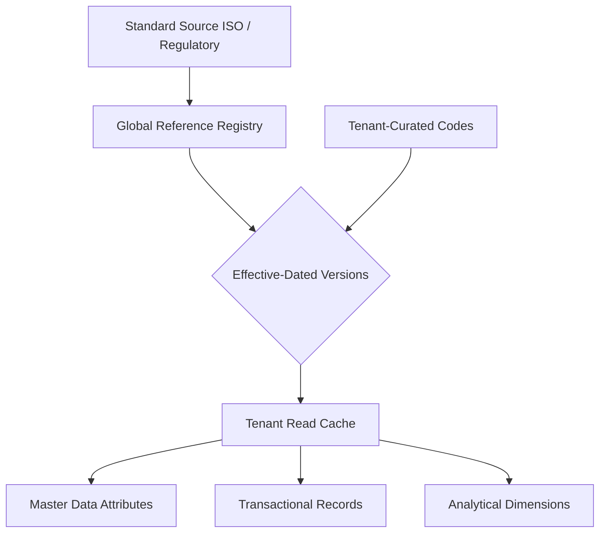

# Volume 09 - Reference Data

| Field | Value |
|---|---|
| Document ID | WORLD-VOL09-005 |
| Title | Reference Data |
| Version | 1.0 |
| Status | Approved |
| Classification | Internal |
| Founder | Mahesh Choudhary |

## Purpose

This chapter defines how reference data is stored, versioned, and served in the WORLD database tier. Reference data is the controlled vocabulary of the enterprise: the finite, standardized code sets that master and transactional data draw upon. Its correctness and stability are what make values comparable across every tenant, module, and report.

## Scope

This document covers the database treatment of reference data: code-set structure, standard versus tenant-scoped ownership, effective-dating, immutability of retired codes, and distribution to consuming schemas. It does not cover configuration data, which encodes behavioral settings rather than shared vocabularies, nor the business classification of reference data, which is established in Volume 05 Section F.

## Concept

Reference data is a set of permissible values that constrain and standardize other data: currencies, countries, units of measure, tax codes, industry classifications, and status enumerations. From first principles it differs from master data in two ways. First, it is typically shared and often externally standardized rather than curated per tenant. Second, its cardinality is small and its change rate is very low, which changes the optimal storage and caching strategy.

The defining physical property of reference data is that a code, once issued and referenced, must never change meaning. A country code cannot be repurposed; a retired unit of measure cannot be reassigned. WORLD therefore treats reference codes as append-and-deprecate rather than mutate. When a standard evolves, a new effective-dated version is added and the prior value is marked deprecated, never overwritten, so historical transactions retain their original interpretation.

## Application in WORLD

WORLD distinguishes two tiers of reference data. Global reference data is platform-owned, standardized (often against ISO or regulatory sources), and shared read-only across tenants. Tenant reference data is curated within a tenant for locally meaningful code sets. Both are effective-dated and versioned. Because reference data is read constantly and written rarely, it is aggressively cached and frequently replicated as read-only lookups close to the consuming workloads.

## Key Components

| Component | Database Responsibility | Example |
|---|---|---|
| Code set | Named collection of permissible values | Currency, Country, UoM |
| Code entry | Individual value with stable key and label | `USD`, `IN`, `EACH` |
| Effective dating | Valid-from/valid-to bounds per version | Tax rate effective 2026-04-01 |
| Deprecation flag | Retires a code without deleting it | Legacy tax code disabled |
| Ownership tier | Global platform vs tenant scope | ISO currency vs tenant reason codes |
| Distribution cache | Read-optimized replica near consumers | In-memory lookup table |

## Trade-offs & Considerations

The primary trade-off is centralization against tenant autonomy. Centralized, platform-governed reference data maximizes comparability and reduces duplication, but constrains tenants that need bespoke codes; WORLD resolves this with the two-tier model. A second trade-off is caching freshness against consistency: heavily cached reference data can serve slightly stale values after a change. Because reference data changes rarely and is effective-dated, WORLD accepts eventual propagation of new versions while guaranteeing that already-referenced codes never shift meaning. Storing full version history costs space but is essential for correct historical interpretation and audit.

## Relationship to Other Layers

Reference data supplies the controlled values that master data (Chapter 04) attributes and transactional data (Chapter 06) fields must conform to, and it becomes the conformed vocabulary for analytical dimensions (Chapter 08). Metadata management (Chapter 10) catalogs code sets, their sources, and their versions. This chapter realizes the reference-data classification of Volume 05 Section F and underpins the cross-tenant comparability required by Volume 08 architecture.

### Enterprise Example

A multinational operating in WORLD posts invoices in twelve currencies. All currency codes derive from the platform-governed global currency reference set, so revenue consolidates cleanly across subsidiaries. When a jurisdiction changes its standard VAT rate, a new effective-dated tax-code version is added valid from the enactment date; invoices issued before that date continue to reference the prior version, and every historical document keeps its correct rate without restatement.

## Cross-References

- [Master Data](/docs/blueprint/volume-09-database/section-b-data-categories/04-master-data.md)
- [Transactional Data](/docs/blueprint/volume-09-database/section-b-data-categories/06-transactional-data.md)
- [Metadata Management](/docs/blueprint/volume-09-database/section-b-data-categories/10-metadata-management.md)
- [Volume 05 - ERP Foundation, Reference Data](/docs/blueprint/volume-05-erp-foundation/section-f-data-foundation/47-reference-data.md)

## References

- [Volume 01 - Vision and Philosophy](/docs/blueprint/volume-01-vision-and-philosophy/README.md)
- [Document Standards](/docs/governance/document-standards.md)

## Change Log

| Version | Date | Author | Notes |
|---|---|---|---|
| 1.0 | 2026-07-12 | Lead Software Engineer | Initial approved version. |
