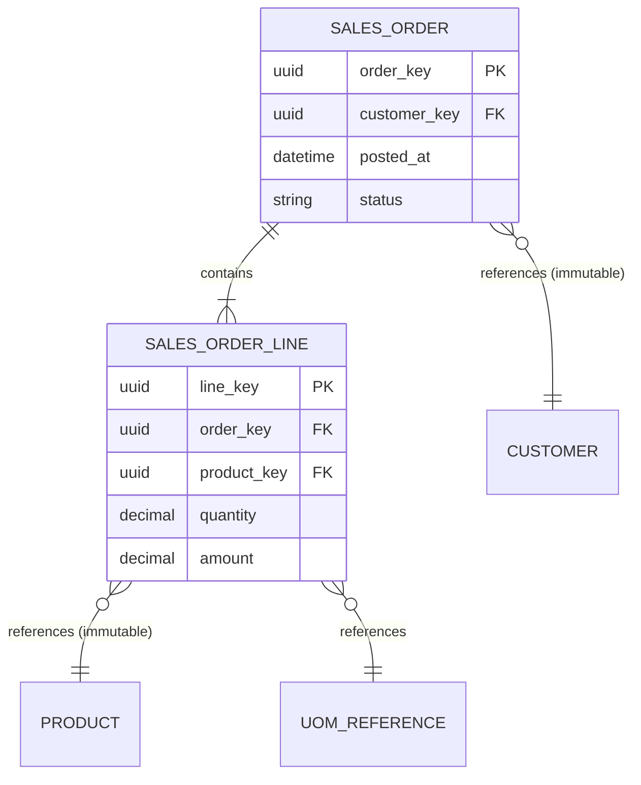

# Volume 09 - Transactional Data

| Field | Value |
|---|---|
| Document ID | WORLD-VOL09-006 |
| Title | Transactional Data |
| Version | 1.0 |
| Status | Approved |
| Classification | Internal |
| Founder | Mahesh Choudhary |

## Purpose

This chapter defines how transactional data is stored, protected, and scaled in the WORLD database tier. Transactional data is the record of business events, the high-volume, append-heavy heart of the operational layer. Its integrity, immutability once posted, and referential fidelity to master and reference data determine whether WORLD can be trusted as a system of record.

## Scope

This document covers the database treatment of transactional data: event modeling, header-and-line structure, referential integrity to master and reference data, immutability of posted records, temporal attributes, and volume management. It does not cover analytical aggregation of transactions, addressed in Chapter 08, nor the process semantics of documents, defined in Volume 05.

## Concept

Transactional data captures discrete business events that occur at a point in time: sales orders, invoices, payments, goods movements, journal entries, and shipments. From first principles it is the opposite of master data. It is high in volume, created constantly, and, once posted, effectively immutable. Where master data answers what exists, transactional data answers what happened.

The defining physical property is that a posted transaction is an assertion about a moment that has passed and therefore must not be silently altered. Corrections are made by additional entries, such as reversals or adjustments, that preserve the original record. This append-oriented, correction-by-addition model is what makes an enterprise ledger auditable. Transactional rows carry immutable foreign-key references to the surrogate keys of the master and reference data they depended on at the time of the event, so historical documents remain interpretable even as master records later change or deactivate.

## Application in WORLD

WORLD models most transactions as a header carrying event-level context and one or more lines carrying the detail. Posted transactions are protected against in-place mutation; the write path enforces status transitions such as `Draft` to `Posted` to `Reversed`. Because transactional tables dominate volume and growth, they are the primary subject of the partitioning, indexing, and sharding strategies in Section D, typically partitioned by time and tenant.

## Key Components

| Component | Database Responsibility | Example |
|---|---|---|
| Transaction header | Event-level context and status | Sales order, invoice |
| Transaction line | Detail rows tied to the header | Order line item |
| Immutable references | Frozen FKs to master/reference keys | `customer_key`, `product_key` |
| Temporal attributes | Event, posting, and effective timestamps | `posted_at`, `effective_date` |
| Posting state machine | Guards mutation after posting | Draft to Posted to Reversed |
| Correction linkage | Reversals and adjustments link to originals | Credit note referencing invoice |

## Trade-offs & Considerations

The key trade-off is write throughput against read richness. Highly normalized transactional schemas minimize redundancy and keep writes cheap, but reporting-style reads require expensive joins; WORLD keeps the operational store lean and pushes rich, wide reads into the analytical layer (Chapter 08). Strict immutability increases storage because corrections add rows rather than overwrite, but it is the foundation of auditability. Time-based partitioning improves query pruning and archival but requires disciplined partition-key selection. Enforcing referential integrity at write time protects correctness at some ingestion cost, a cost WORLD accepts for a system of record.

## Relationship to Other Layers

Transactional data references master data (Chapter 04) and reference data (Chapter 05) and is the raw feedstock that operational data (Chapter 07) monitors in real time and that analytical data (Chapter 08) aggregates. Metadata management (Chapter 10) tracks its lineage. This chapter realizes the transaction-data classification of Volume 05 Section F and supplies the event record that Volume 06 modules produce and consume.

### Enterprise Example

A retailer posts ten thousand invoices on a peak trading day in WORLD. Each invoice header and its lines are written with frozen references to the customer and product surrogate keys valid at that instant. A customer later disputes one invoice; rather than editing it, WORLD posts a linked credit note. The original invoice, its immutable references, and the credit note together form a complete, auditable trail, and time-partitioned storage keeps that peak day queryable without degrading current-period performance.

## Cross-References

- [Master Data](/docs/blueprint/volume-09-database/section-b-data-categories/04-master-data.md)
- [Operational Data](/docs/blueprint/volume-09-database/section-b-data-categories/07-operational-data.md)
- [Analytical Data](/docs/blueprint/volume-09-database/section-b-data-categories/08-analytical-data.md)
- [Volume 05 - ERP Foundation, Transaction Data](/docs/blueprint/volume-05-erp-foundation/section-f-data-foundation/46-transaction-data.md)

## References

- [Volume 01 - Vision and Philosophy](/docs/blueprint/volume-01-vision-and-philosophy/README.md)
- [Document Standards](/docs/governance/document-standards.md)

## Change Log

| Version | Date | Author | Notes |
|---|---|---|---|
| 1.0 | 2026-07-12 | Lead Software Engineer | Initial approved version. |
