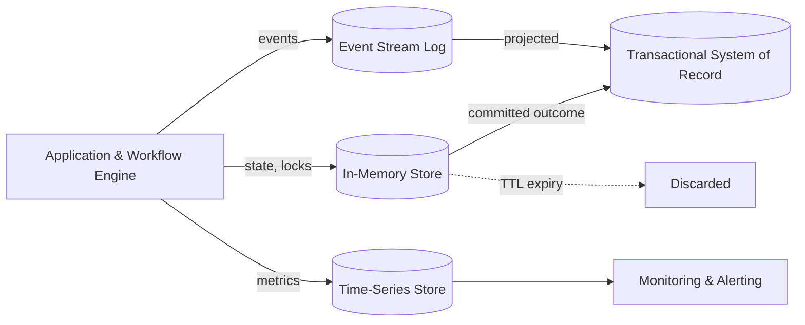

# Volume 09 - Operational Data

| Field | Value |
|---|---|
| Document ID | WORLD-VOL09-007 |
| Title | Operational Data |
| Version | 1.0 |
| Status | Approved |
| Classification | Internal |
| Founder | Mahesh Choudhary |

## Purpose

This chapter defines operational data in the WORLD database tier: the short-lived, high-velocity data that keeps the running system observable and responsive. It covers state, session, queue, cache, event-stream, and telemetry data that supports live operation but is not itself the durable business record.

## Scope

This document covers the database and store treatment of operational data: its transient lifecycle, appropriate storage engines, retention discipline, and separation from the system of record. It does not cover the durable business events of transactional data (Chapter 06), nor infrastructure provisioning, which is defined in Volume 11.

## Concept

Operational data is the data a system generates about itself while it runs: workflow state, job queues, distributed locks, session context, cached projections, event streams, and health telemetry. From first principles it is defined by velocity and transience. It is written and read at very high frequency, it is meaningful for seconds, minutes, or hours, and most of it can be regenerated or safely discarded. This is the opposite of transactional data, which is low-mutability and permanent.

Because operational data is transient, its guiding physical principle is that it must never be confused with the system of record. A cache may be dropped and rebuilt; a queue drains and empties; telemetry ages out. WORLD therefore isolates operational data into stores tuned for throughput and expiry rather than durability, so that failures in the operational tier cannot corrupt the ledger. Time-to-live expiry, not manual deletion, is the normal end of an operational record's life.

## Application in WORLD

WORLD places operational data in stores matched to its access pattern: in-memory key-value stores for caches, sessions, and locks; durable log-structured streams for events; and time-series stores for metrics. Each carries an explicit retention or TTL policy. The AI Business Partner and workflow engine rely on this tier for live orchestration state, but every durable outcome is committed back into the transactional store, keeping a clean boundary between what is running and what is recorded.

## Key Components

| Component | Database Responsibility | Example |
|---|---|---|
| Cache / projection | Fast read of derived state, rebuildable | Cached price list |
| Session & context | Short-lived user or agent state | Active user session |
| Distributed lock | Coordinates concurrent processing | Posting-run lock |
| Work queue | Buffers asynchronous jobs | Invoice-generation queue |
| Event stream | Ordered log of state changes | Domain event topic |
| Telemetry / metrics | Time-series health and performance | Query latency series |

## Trade-offs & Considerations

The defining trade-off is speed and volume against durability. Operational stores favor low latency and high throughput, deliberately relaxing the durability guarantees the ledger demands; the mitigation is a strict rule that no operational store is ever the sole home of a business fact. Aggressive TTLs control cost and cardinality but risk evicting still-useful state, so retention windows are set per data type. Caches introduce staleness, which WORLD bounds with invalidation on source change and short refresh intervals. Event streams add operational complexity but decouple producers from consumers and enable replay, a worthwhile exchange at enterprise scale.

## Relationship to Other Layers

Operational data is derived from and commits back into transactional data (Chapter 06), and it feeds monitoring, alerting, and near-real-time analytical pipelines (Chapter 08). It caches master (Chapter 04) and reference (Chapter 05) data for fast access. Metadata management (Chapter 10) records retention policies and stream schemas. This tier operationalizes the runtime behavior described in Volume 08 architecture and runs on the platforms defined in Volume 11.

### Enterprise Example

During a nightly billing run, WORLD acquires a distributed lock to serialize posting, streams each generated-invoice event to a durable log, and caches customer and price references in memory to avoid repeated lookups. Metrics on run duration flow to the time-series store and trigger an alert when latency spikes. When the run finishes, the invoices are durably committed to the transactional store, the lock releases, the cache entries expire by TTL, and only the ledger remains as the permanent record.

## Cross-References

- [Transactional Data](/docs/blueprint/volume-09-database/section-b-data-categories/06-transactional-data.md)
- [Analytical Data](/docs/blueprint/volume-09-database/section-b-data-categories/08-analytical-data.md)
- [Metadata Management](/docs/blueprint/volume-09-database/section-b-data-categories/10-metadata-management.md)
- [Volume 08 - Architecture](/docs/blueprint/volume-08-architecture/README.md)

## References

- [Volume 01 - Vision and Philosophy](/docs/blueprint/volume-01-vision-and-philosophy/README.md)
- [Document Standards](/docs/governance/document-standards.md)

## Change Log

| Version | Date | Author | Notes |
|---|---|---|---|
| 1.0 | 2026-07-12 | Lead Software Engineer | Initial approved version. |
