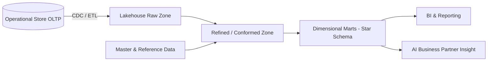

# Volume 09 - Analytical Data

| Field | Value |
|---|---|
| Document ID | WORLD-VOL09-008 |
| Title | Analytical Data |
| Version | 1.0 |
| Status | Approved |
| Classification | Internal |
| Founder | Mahesh Choudhary |

## Purpose

This chapter defines analytical data in the WORLD database tier: the modeled, aggregated, read-optimized data that powers reporting, business intelligence, and the AI Business Partner's insight. It establishes how WORLD separates analytical workloads from the operational system of record and how it structures data for large-scale query.

## Scope

This document covers the analytical storage architecture: OLAP modeling, the data warehouse and lakehouse patterns, dimensional design, materialization, and the pipelines that move operational data into analytical form. It does not cover the operational transactional store (Chapter 06) nor the business-intelligence semantics defined in Volume 04.

## Concept

Analytical data answers questions across many events rather than recording a single event. From first principles, operational and analytical workloads pull schema design in opposite directions. Operational systems favor normalized, write-optimized structures for OLTP; analytical systems favor denormalized, read-optimized structures for OLAP, where a query may scan millions of rows to compute an aggregate. Trying to serve both from one schema degrades both, so WORLD physically separates them.

Analytical data is organized dimensionally. Facts capture measurable events, such as revenue or quantity, at a defined grain; dimensions provide the conformed context, such as customer, product, time, and geography, by which facts are sliced. Conformed dimensions, sourced from master and reference data, are what let a metric mean the same thing across every subject area. Analytical data is typically append-oriented and time-partitioned, reflecting history as a series of snapshots rather than a mutable current state.

## Application in WORLD

WORLD adopts a layered analytical architecture. A lakehouse foundation lands raw and refined data in open columnar storage, combining the low cost and flexibility of a data lake with the transactional consistency and schema management of a warehouse. On top, curated dimensional models and pre-aggregated marts serve governed reporting. Change-data-capture pipelines stream committed transactions from the operational store into the analytical layer, where they are conformed against master and reference dimensions.

## Key Components

| Component | Database Responsibility | Example |
|---|---|---|
| Fact table | Measures at a defined grain | Daily sales fact |
| Dimension table | Conformed descriptive context | Customer, product, date |
| Lakehouse zones | Raw, refined, curated storage tiers | Bronze / silver / gold |
| Columnar storage | Scan-efficient physical format | Parquet-backed tables |
| Materialized aggregate | Pre-computed rollups for speed | Monthly revenue by region |
| CDC pipeline | Moves committed changes to analytics | Streamed invoice events |

## Trade-offs & Considerations

The central trade-off is freshness against query performance and cost. Pre-aggregated, materialized marts answer queries in milliseconds but lag the operational store by the pipeline interval; WORLD tunes latency per subject area, from near-real-time streams to daily batch. Denormalized dimensional models accelerate reads at the cost of storage and pipeline complexity to keep them conformed. The lakehouse reduces cost and unifies structured and semi-structured data but demands disciplined schema and partition governance. Separating analytical from operational storage adds movement latency, accepted because it protects OLTP performance and enables scans no operational store should bear.

## Relationship to Other Layers

Analytical data is derived from transactional data (Chapter 06) and operational streams (Chapter 07), conformed against master (Chapter 04) and reference (Chapter 05) data as dimensions. It feeds the knowledge layer (Chapter 09) and the AI Business Partner, and is cataloged by metadata management (Chapter 10). This chapter is the data-tier foundation beneath Volume 04 Business Intelligence and aligns with the architecture of Volume 08.

### Enterprise Example

A distributor asks WORLD for gross margin by product category and region over the last eight quarters. The query resolves against a curated star-schema mart in the lakehouse: a sales fact at daily grain joined to conformed product, geography, and date dimensions, with monthly aggregates pre-materialized. Results return in under a second without touching the operational store, and because the dimensions are conformed from the same master data the OLTP system uses, the analytical margin reconciles exactly to the operational ledger.

## Cross-References

- [Transactional Data](/docs/blueprint/volume-09-database/section-b-data-categories/06-transactional-data.md)
- [Knowledge Data](/docs/blueprint/volume-09-database/section-b-data-categories/09-knowledge-data.md)
- [Metadata Management](/docs/blueprint/volume-09-database/section-b-data-categories/10-metadata-management.md)
- [Volume 08 - Architecture](/docs/blueprint/volume-08-architecture/README.md)

## References

- [Volume 01 - Vision and Philosophy](/docs/blueprint/volume-01-vision-and-philosophy/README.md)
- [Document Standards](/docs/governance/document-standards.md)

## Change Log

| Version | Date | Author | Notes |
|---|---|---|---|
| 1.0 | 2026-07-12 | Lead Software Engineer | Initial approved version. |
