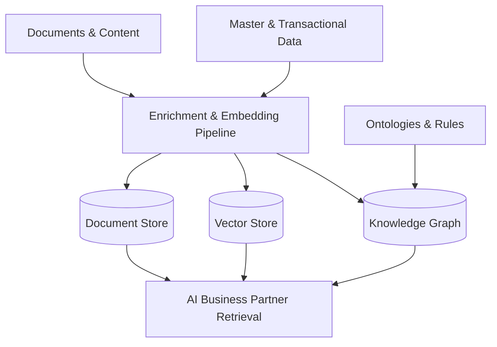

# Volume 09 - Knowledge Data

| Field | Value |
|---|---|
| Document ID | WORLD-VOL09-009 |
| Title | Knowledge Data |
| Version | 1.0 |
| Status | Approved |
| Classification | Internal |
| Founder | Mahesh Choudhary |

## Purpose

This chapter defines knowledge data in the WORLD database tier: the structured and semantic representations that let the platform reason, retrieve meaning, and ground the AI Business Partner in the enterprise's own context. It specifies how WORLD stores relationships, embeddings, documents, and rules alongside its transactional and analytical data.

## Scope

This document covers the storage architecture for knowledge data: graph structures, vector embeddings, document and content stores, and rule and ontology representations. It builds on the knowledge foundations of Volume 03 and the Knowledge Engine of Volume 08, focusing strictly on the persistence tier. It does not define retrieval algorithms or model behavior, which live in those volumes.

## Concept

Knowledge data represents meaning and relationships rather than discrete events or durable objects. From first principles it exists to answer questions that require understanding connections, similarity, and context: how entities relate, which documents are relevant to a question, what rules govern a decision. Where transactional data records what happened and analytical data aggregates it, knowledge data captures what things mean and how they connect.

This demands storage shapes beyond the relational table. Graphs express entities and their typed relationships, enabling traversal and inference. Vector embeddings encode semantic meaning as high-dimensional coordinates, so similarity becomes a distance computation and unstructured content becomes searchable by meaning. Document stores hold the source content itself. Ontologies and rule sets encode the definitions and logic that make reasoning consistent. A defining property is that knowledge data is often derived and regenerable: embeddings can be recomputed and graphs rebuilt from the ground-truth operational data they describe.

## Application in WORLD

WORLD persists knowledge data in stores matched to each shape: a knowledge graph for entities and relationships, a vector store for embeddings that power semantic retrieval, and content stores for documents and their extracted structure. These are populated from the system of record and enrichment pipelines, so the knowledge layer stays grounded in real enterprise data rather than free-floating. The AI Business Partner queries this tier to retrieve relevant, permission-aware context, the mechanism by which WORLD's intelligence is specific to the tenant it serves.

## Key Components

| Component | Database Responsibility | Example |
|---|---|---|
| Knowledge graph | Entities and typed relationships | Customer-to-contract links |
| Vector store | Semantic embeddings for similarity search | Policy-document embeddings |
| Document store | Source content and extracted structure | Contract PDF and clauses |
| Ontology / taxonomy | Shared definitions and hierarchy | Product classification tree |
| Rule set | Encoded decision logic | Approval and eligibility rules |
| Provenance links | Ties knowledge back to source data | Embedding to source record |

## Trade-offs & Considerations

The key trade-off is expressive power against consistency and cost. Graphs and vectors unlock reasoning and semantic retrieval that relational stores cannot, but they add specialized engines to operate and must be kept synchronized with the ground-truth data they derive from; WORLD treats them as derived and rebuildable to bound drift. Embeddings are model-dependent, so a model change may require re-embedding at scale, a planned cost. Provenance is mandatory: every knowledge artifact links back to its source so retrieval is explainable and permission-aware, preventing the AI layer from surfacing content a user may not see. Freshness of the knowledge tier lags source changes and is tuned per pipeline.

## Relationship to Other Layers

Knowledge data is derived from master (Chapter 04), transactional (Chapter 06), and analytical (Chapter 08) data and is cataloged by metadata management (Chapter 10). It is the persistence foundation for the knowledge concepts of Volume 03 and the Knowledge Engine of Volume 08, and it is the context source the AI Business Partner retrieves from across the platform.

### Enterprise Example

An operations lead asks WORLD, in natural language, which active contracts are exposed to a supplier under review. The Knowledge Engine embeds the question, retrieves semantically relevant contract clauses from the vector store, and traverses the knowledge graph from the supplier entity to its linked contracts and obligations, each edge grounded in master and transactional records with provenance. The AI Business Partner returns a permission-aware, cited answer, grounded entirely in the tenant's own knowledge data rather than generic model recall.

## Cross-References

- [Analytical Data](/docs/blueprint/volume-09-database/section-b-data-categories/08-analytical-data.md)
- [Master Data](/docs/blueprint/volume-09-database/section-b-data-categories/04-master-data.md)
- [Metadata Management](/docs/blueprint/volume-09-database/section-b-data-categories/10-metadata-management.md)
- [Volume 08 - Architecture](/docs/blueprint/volume-08-architecture/README.md)

## References

- [Volume 01 - Vision and Philosophy](/docs/blueprint/volume-01-vision-and-philosophy/README.md)
- [Document Standards](/docs/governance/document-standards.md)

## Change Log

| Version | Date | Author | Notes |
|---|---|---|---|
| 1.0 | 2026-07-12 | Lead Software Engineer | Initial approved version. |
