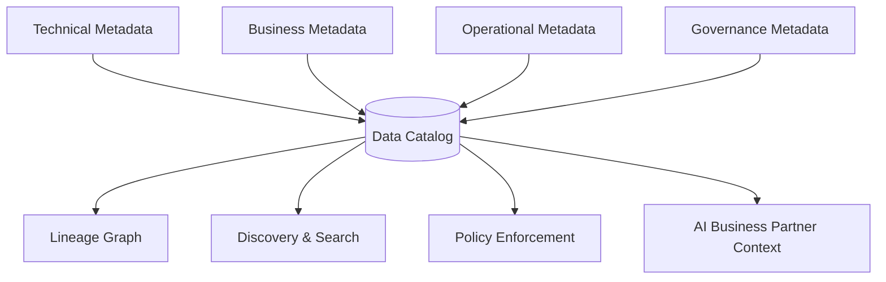

# Volume 09 - Metadata Management

| Field | Value |
|---|---|
| Document ID | WORLD-VOL09-010 |
| Title | Metadata Management |
| Version | 1.0 |
| Status | Approved |
| Classification | Internal |
| Founder | Mahesh Choudhary |

## Purpose

This chapter defines metadata management in the WORLD database tier: the data about data that describes, governs, and connects every other category. Metadata is what makes the data estate discoverable, trustworthy, and auditable at enterprise scale, and it is the substrate that both human stewards and the AI Business Partner rely on to understand what data exists and what it means.

## Scope

This document covers the classes of metadata WORLD manages, how they are stored and served, and how they bind the other data categories together: technical, business, operational, and governance metadata, plus the data catalog and lineage. It does not restate schema-modeling techniques (Section C) nor the governance processes of Section G, which consume this metadata.

## Concept

Metadata is descriptive data whose subject is other data. From first principles, a data estate is only as usable as it is understandable: a column of numbers is meaningless without its name, type, definition, owner, and lineage. Metadata supplies that understanding. It is what turns storage into an asset, allowing anyone, or any agent, to answer what data exists, what it means, where it came from, who owns it, and whether it can be trusted.

WORLD distinguishes four classes. Technical metadata describes structure: schemas, types, keys, and constraints. Business metadata describes meaning: definitions, glossary terms, and ownership. Operational metadata describes behavior: load times, volumes, freshness, and quality scores. Governance metadata describes control: classification, retention, and access policy. Bound together in a catalog and connected by lineage, these classes make the estate navigable. Metadata is authoritative and actively managed, not an afterthought, because automated systems act on it directly.

## Application in WORLD

WORLD maintains a central data catalog that harvests metadata from every store, master, reference, transactional, operational, analytical, and knowledge, and links each asset to its owner, definition, classification, and lineage. This catalog is machine-readable so the platform can enforce policy automatically: retention and classification metadata drive lifecycle and security actions, and lineage lets any figure be traced from a report back to its source transactions. The AI Business Partner queries the catalog to interpret data correctly and to respect access and sensitivity rules.

## Key Components

| Component | Database Responsibility | Example |
|---|---|---|
| Technical metadata | Structure of stored data | Schema, data type, keys |
| Business metadata | Meaning and ownership | Glossary term, data steward |
| Operational metadata | Runtime behavior and health | Load time, freshness, quality score |
| Governance metadata | Control and compliance | Classification, retention, access policy |
| Data catalog | Central registry of all assets | Searchable asset inventory |
| Lineage graph | End-to-end data provenance | Report to source-transaction trace |

## Trade-offs & Considerations

The primary trade-off is completeness against maintenance cost. Rich, hand-curated metadata is invaluable but expensive to keep current; WORLD mitigates this by harvesting technical and operational metadata automatically and reserving human effort for business definitions and stewardship. Stale metadata is worse than none because automated policy acts on it, so freshness itself is monitored. Centralizing the catalog improves discovery but must not become a bottleneck, so it is served from read-optimized, cached stores. Capturing full lineage adds pipeline instrumentation overhead, accepted because auditability and trust in reported figures depend on it.

## Relationship to Other Layers

Metadata management describes and governs every other category: master (Chapter 04), reference (Chapter 05), transactional (Chapter 06), operational (Chapter 07), analytical (Chapter 08), and knowledge (Chapter 09) data. It supplies the catalog and lineage that Section G governance and Section E security act upon, and it aligns with the metadata classification of Volume 05 Section F. Across the platform it is the shared understanding layer that both stewards and the AI Business Partner depend on.

### Enterprise Example

An auditor questions a figure on a consolidated revenue report in WORLD. Using the lineage graph in the data catalog, a steward traces the number from the report, through the analytical mart and its conformed dimensions, back to the specific posted transactions and the master records they reference, every hop annotated with definitions, owners, and classification. What would otherwise be a multi-day reconciliation becomes a traceable path, because the metadata binding the estate together was managed as a first-class asset.

## Cross-References

- [Master Data](/docs/blueprint/volume-09-database/section-b-data-categories/04-master-data.md)
- [Analytical Data](/docs/blueprint/volume-09-database/section-b-data-categories/08-analytical-data.md)
- [Knowledge Data](/docs/blueprint/volume-09-database/section-b-data-categories/09-knowledge-data.md)
- [Volume 05 - ERP Foundation, Metadata](/docs/blueprint/volume-05-erp-foundation/section-f-data-foundation/49-metadata.md)

## References

- [Volume 01 - Vision and Philosophy](/docs/blueprint/volume-01-vision-and-philosophy/README.md)
- [Document Standards](/docs/governance/document-standards.md)

## Change Log

| Version | Date | Author | Notes |
|---|---|---|---|
| 1.0 | 2026-07-12 | Lead Software Engineer | Initial approved version. |
