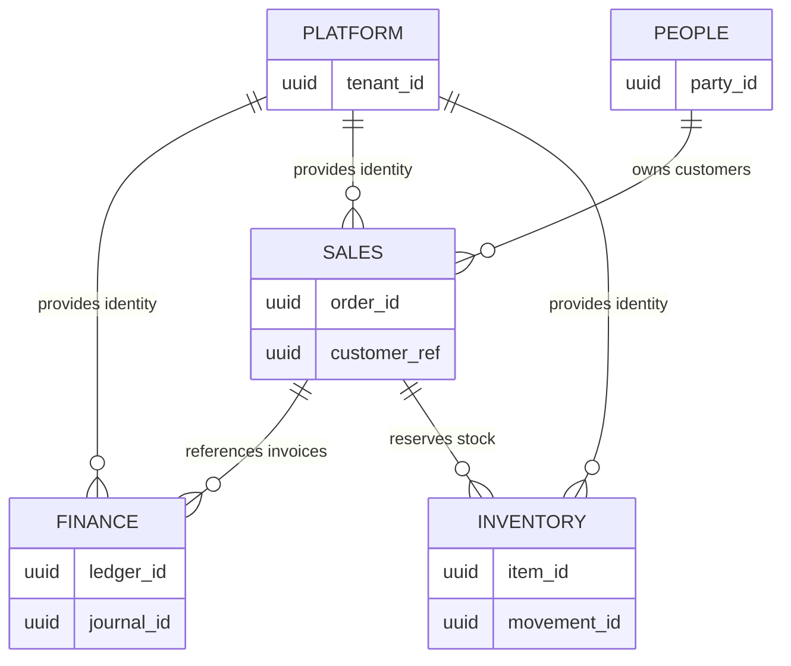

# Volume 09 - Database Domains

| Field | Value |
|---|---|
| Document ID | WORLD-VOL09-011 |
| Title | Database Domains |
| Version | 1.0 |
| Status | Approved |
| Classification | Internal |
| Founder | Mahesh Choudhary |

## Purpose

This chapter defines how WORLD partitions its enterprise data estate into database domains: cohesive, ownership-bounded regions of the schema that correspond directly to the DDD bounded contexts of Volume 08 and the organizational and domain entities of Volume 05. Its purpose is to give every table, relationship, and constraint a single, unambiguous home, so that data ownership, consistency boundaries, and evolution are governed rather than accidental.

## Scope

Covered: the concept of a database domain, the domain map WORLD uses, ownership and boundary rules, and the components that make a domain a first-class unit of the data tier. Excluded: physical placement, sharding, and tenancy isolation (Sections D and H), and the entity-level relationship mechanics detailed in Chapter 12. This chapter defines the logical decomposition of WORLD's data, not its physical distribution.

## Concept

From first principles, a monolithic schema in which any table may reference any other has no natural seams. Every join is permitted, every dependency is invisible, and the model becomes impossible to reason about or change safely at enterprise scale. A database domain imposes a seam. It is a set of entities that share a lifecycle, a consistency boundary, and a single owning bounded context. Within a domain, entities may relate freely and enforce referential integrity directly; across domains, references are deliberate, explicit, and typically by stable identifier rather than by foreign key. This mirrors the DDD principle that each bounded context owns its model - the database domain is that context made durable.

## Application in WORLD

WORLD maps one database domain to each major bounded context of the ERP Foundation and Business Modules. The Finance domain owns ledgers, journals, and payments; the Sales domain owns quotes, orders, and pricing; the Inventory domain owns items, stock, and movements; the People domain owns parties, employees, and roles; and the Platform domain owns tenancy, identity, and metadata shared across the estate. Each domain is owned by exactly one context and exposes its data to others through defined contracts, never through unmanaged cross-domain joins.

### Enterprise Example

When a sales order is confirmed, the Sales domain owns the order record and stores a `customer_ref` pointing to a party owned by the People domain and a set of item references owned by Inventory. It does not embed a foreign key into the Finance ledger. Instead, on confirmation it emits an event; the Finance domain reacts by creating its own invoice under its own consistency boundary. Each domain remains the sole authority over its tables, and cross-domain relationships are carried by stable identifiers and events rather than by rigid physical joins that would couple two contexts into one.

## Key Components

| Component | Responsibility | Owning Context |
|---|---|---|
| Domain Boundary | Defines which entities belong to the domain | Bounded Context (Vol 08) |
| Aggregate Root | Anchors a consistency boundary within the domain | Domain Model |
| Local Reference | Foreign key within a single domain | Data Tier |
| Cross-Domain Reference | Stable identifier to another domain's root | Data Tier |
| Domain Contract | Published read/event interface for the domain | Integration Layer |

## Trade-offs & Considerations

Strong domain boundaries improve autonomy, testability, and safe evolution, but they trade away the convenience of arbitrary cross-domain joins. Reporting that spans domains must be served by composition, read models, or the analytical layer rather than by ad hoc joins across boundaries. Referential integrity across domains cannot be enforced by the database engine alone; WORLD compensates with event-driven reconciliation and integrity checks. The boundaries must be drawn to match true business cohesion - a boundary in the wrong place creates chatty cross-domain traffic, while too coarse a boundary recreates the monolith the model was meant to avoid.

## Relationship to Other Layers

Database domains are the data-tier expression of the bounded contexts defined in Volume 08 and the organizational and domain entities defined in Volume 05. They set the frame within which Chapter 12 defines entity relationships, Chapter 13 applies normalization, and Chapter 14 introduces controlled denormalization for read models. Section D partitions and distributes these domains physically, and Section H isolates them per tenant and company.

## Cross-References

- [Entity Relationship Strategy](/docs/blueprint/volume-09-database/section-c-data-modeling/12-entity-relationship-strategy.md)
- [Denormalization](/docs/blueprint/volume-09-database/section-c-data-modeling/14-denormalization.md)
- [Volume 08 - Architecture](/docs/blueprint/volume-08-architecture/README.md)
- [Volume 05 - ERP Foundation](/docs/blueprint/volume-05-erp-foundation/README.md)

## References

- [Volume 01 - Vision and Philosophy](/docs/blueprint/volume-01-vision-and-philosophy/README.md)
- [Document Standards](/docs/governance/document-standards.md)

## Change Log

| Version | Date | Author | Notes |
|---|---|---|---|
| 1.0 | 2026-07-12 | Lead Software Engineer | Initial approved version. |
