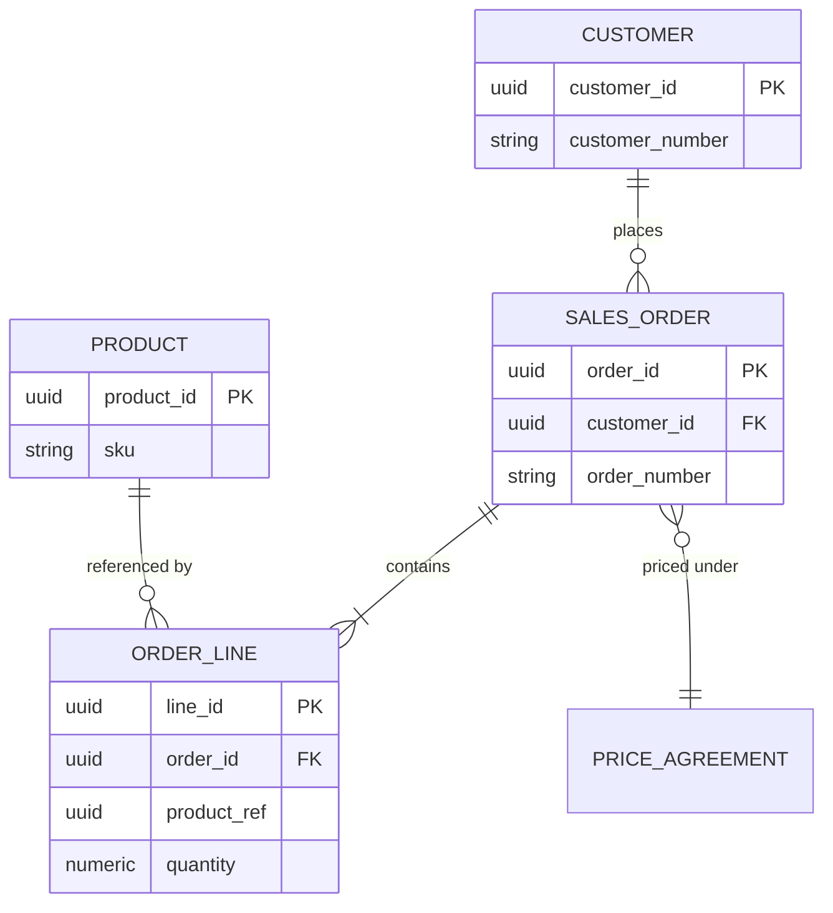

# Volume 09 - Entity Relationship Strategy

| Field | Value |
|---|---|
| Document ID | WORLD-VOL09-012 |
| Title | Entity Relationship Strategy |
| Version | 1.0 |
| Status | Approved |
| Classification | Internal |
| Founder | Mahesh Choudhary |

## Purpose

This chapter defines how WORLD models relationships between entities: the cardinalities, key strategy, referential integrity rules, and cross-domain reference conventions that turn the database domains of Chapter 11 into a coherent, queryable model. Its purpose is to ensure that relationships express real business rules faithfully, enforce integrity where it belongs, and remain stable as the estate evolves.

## Scope

Covered: the entity relationship concept, identity and key strategy, cardinality and optionality rules, associative modeling, and cross-domain references. Excluded: normal-form theory (Chapter 13), read-model shaping (Chapter 14), and index design (Section D). This chapter governs the logical relationships within and between domains.

## Concept

An entity relationship expresses a truth about the business: an order belongs to one customer, an invoice contains many lines, an employee reports to at most one manager. From first principles, the model must capture cardinality (how many), optionality (whether required), and identity (how each entity is uniquely named) precisely, because these constraints are the database's contribution to correctness. WORLD uses surrogate primary keys - immutable UUIDs - as the stable identity of every entity, while natural business keys (order numbers, item codes) are modeled as unique constraints. Relationships within a domain are enforced by foreign keys; relationships across domains are carried by identifier references and reconciled through events.

## Application in WORLD

Within a domain, WORLD models relationships with explicit foreign keys and enforced referential integrity. Many-to-many relationships are always resolved through an explicit associative entity that can carry its own attributes - a design that anticipates the reality that associations usually have data of their own, such as a price or an effective date. Across domains, an entity holds a typed reference (for example `customer_ref`) to another domain's aggregate root, but the physical foreign key stops at the domain boundary, preserving the autonomy established in Chapter 11.

### Enterprise Example

A sales order has one customer and one or more order lines; each line references a product and carries its own quantity and captured price. The relationship between orders and products is many-to-many in the abstract, but WORLD never models it directly - it resolves it through the `ORDER_LINE` associative entity, which holds the quantity, unit price, and discount that belong to the association itself. The `customer_id` foreign key is enforced because both entities live in the Sales domain, while `product_ref` on a cross-domain line would instead be a plain identifier reconciled by event when Inventory and Sales are separate domains.

## Key Components

| Component | Responsibility | Example |
|---|---|---|
| Surrogate Key | Immutable primary identity | `order_id` (UUID) |
| Natural Key | Business-facing unique identifier | `order_number` |
| Foreign Key | Enforces intra-domain relationship | `order_id` on `ORDER_LINE` |
| Associative Entity | Resolves many-to-many with attributes | `ORDER_LINE` |
| Cross-Domain Reference | Identifier to another domain's root | `customer_ref` |

## Trade-offs & Considerations

Surrogate keys give stability and uniform joins but require unique constraints to protect business identity, since the surrogate hides real-world uniqueness. Enforcing foreign keys guarantees integrity but couples the referencing and referenced tables, which is precisely why WORLD confines enforced keys to a single domain. Associative entities add a table but pay for themselves by making association attributes and history natural to model. Cross-domain references trade database-enforced integrity for autonomy, so WORLD invests in event-driven reconciliation and periodic integrity audits to detect orphaned references before they affect users.

## Relationship to Other Layers

The relationship strategy operates within the database domains of Chapter 11 and provides the structural input that Chapter 13 refines through normalization and Chapter 14 selectively flattens for read models. The identity and reference conventions here align with the aggregate design of Volume 08 and the entity definitions of Volume 05, and they are the basis for the index and join strategies in Section D.

## Cross-References

- [Database Domains](/docs/blueprint/volume-09-database/section-c-data-modeling/11-database-domains.md)
- [Normalization](/docs/blueprint/volume-09-database/section-c-data-modeling/13-normalization.md)
- [Volume 08 - Architecture](/docs/blueprint/volume-08-architecture/README.md)
- [Volume 05 - ERP Foundation](/docs/blueprint/volume-05-erp-foundation/README.md)

## References

- [Volume 01 - Vision and Philosophy](/docs/blueprint/volume-01-vision-and-philosophy/README.md)
- [Document Standards](/docs/governance/document-standards.md)

## Change Log

| Version | Date | Author | Notes |
|---|---|---|---|
| 1.0 | 2026-07-12 | Lead Software Engineer | Initial approved version. |
