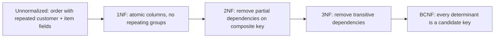

# Volume 09 - Normalization

| Field | Value |
|---|---|
| Document ID | WORLD-VOL09-013 |
| Title | Normalization |
| Version | 1.0 |
| Status | Approved |
| Classification | Internal |
| Founder | Mahesh Choudhary |

## Purpose

This chapter defines the normalization discipline WORLD applies to its transactional write models: the systematic removal of redundancy and update anomalies so that every fact is stored exactly once, in the place that owns it. Its purpose is to guarantee that the authoritative side of the data tier - the write model behind every command in the CQRS pattern of Volume 08 - remains internally consistent by construction.

## Scope

Covered: the normalization concept, the normal forms from first through Boyce-Codd, and how WORLD applies them to transactional schemas. Excluded: the deliberate relaxation of these rules for read and reporting models, which is the subject of Chapter 14. Normalization here governs the write side; denormalization governs the read side.

## Concept

Normalization is the process of organizing attributes so that each depends only on the key of its table. From first principles, redundancy is the root of inconsistency: if a customer's credit limit is stored in three rows, three updates are needed and any missed update corrupts the truth. The normal forms are a progression that eliminates classes of anomaly. First Normal Form (1NF) requires atomic, single-valued attributes - no repeating groups or embedded lists. Second Normal Form (2NF) removes partial dependencies, so every non-key attribute depends on the whole key, not part of a composite key. Third Normal Form (3NF) removes transitive dependencies, so non-key attributes depend on the key and nothing but the key. Boyce-Codd Normal Form (BCNF) tightens 3NF so that every determinant is a candidate key, closing edge cases with overlapping keys.

## Application in WORLD

WORLD normalizes transactional write models to 3NF as the default standard, advancing to BCNF where overlapping candidate keys would otherwise permit anomalies. Master and reference data (Section B) are held in their canonical, normalized form so a fact such as a tax rate or a party name exists once. Because the write model's job is to enforce invariants, normalization is treated as a correctness requirement there, not a stylistic preference. Any departure is a conscious denormalization decision recorded and justified under Chapter 14.

### Enterprise Example

Consider a naive order table that stores, per line, the order number, item code, item description, customer name, and customer credit limit. This violates several forms at once. Splitting repeating line data into an `ORDER_LINE` table achieves 1NF. Moving `item_description`, which depends only on `item_code` rather than the full line key, into an `ITEM` table achieves 2NF. Moving `customer_name` and `customer_credit_limit`, which depend transitively on the customer rather than the order, into a `CUSTOMER` table achieves 3NF. Now the credit limit is stored once; a change updates a single row and can never disagree with itself.

## Key Components

| Normal Form | Rule Enforced | Anomaly Removed | WORLD Usage |
|---|---|---|---|
| 1NF | Atomic, single-valued attributes | Repeating groups | Mandatory for all tables |
| 2NF | No partial key dependency | Insert/update anomalies on composites | Mandatory |
| 3NF | No transitive dependency | Redundant derived facts | Default standard |
| BCNF | Every determinant is a candidate key | Overlapping-key anomalies | Applied where needed |

## Trade-offs & Considerations

Normalization optimizes for write integrity and storage efficiency, but it distributes a single business view across many tables, so reads must join. At enterprise query volumes those joins can become expensive, and highly normalized schemas can be harder to query ad hoc. WORLD accepts this trade because the write model's correctness is non-negotiable, and it resolves the read-side cost not by degrading the write model but by projecting purpose-built read models (Chapter 14). Over-normalization - splitting for its own sake beyond what dependencies require - is avoided, as it adds joins without removing any real anomaly.

## Relationship to Other Layers

Normalization applies the relationship strategy of Chapter 12 within the domains of Chapter 11 to produce clean, anomaly-free write models. It is the counterpart to Chapter 14: normalization governs the command side, denormalization the query side, and together they realize the CQRS separation defined in Volume 08. The normalized master and reference data of Section B are the canonical sources these read models project from.

## Cross-References

- [Entity Relationship Strategy](/docs/blueprint/volume-09-database/section-c-data-modeling/12-entity-relationship-strategy.md)
- [Denormalization](/docs/blueprint/volume-09-database/section-c-data-modeling/14-denormalization.md)
- [Volume 08 - CQRS](/docs/blueprint/volume-08-architecture/section-c-application-architecture/12-cqrs.md)
- [Volume 05 - ERP Foundation](/docs/blueprint/volume-05-erp-foundation/README.md)

## References

- [Volume 01 - Vision and Philosophy](/docs/blueprint/volume-01-vision-and-philosophy/README.md)
- [Document Standards](/docs/governance/document-standards.md)

## Change Log

| Version | Date | Author | Notes |
|---|---|---|---|
| 1.0 | 2026-07-12 | Lead Software Engineer | Initial approved version. |
