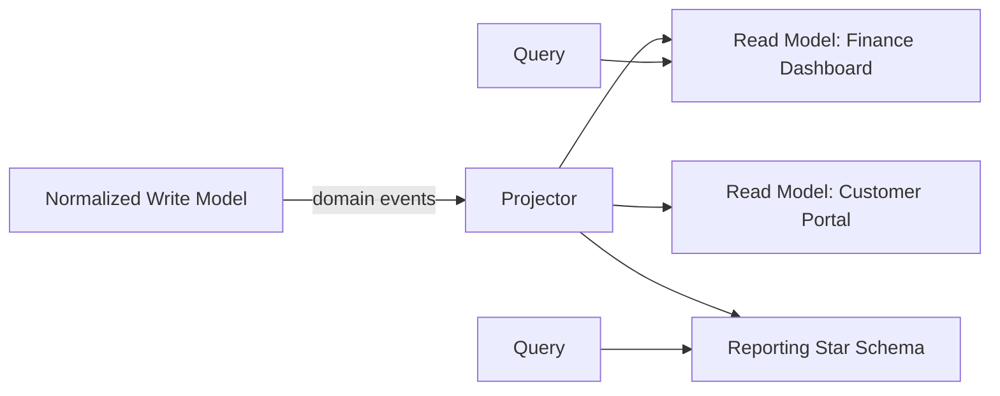

# Volume 09 - Denormalization

| Field | Value |
|---|---|
| Document ID | WORLD-VOL09-014 |
| Title | Denormalization |
| Version | 1.0 |
| Status | Approved |
| Classification | Internal |
| Founder | Mahesh Choudhary |

## Purpose

This chapter defines when and why WORLD deliberately relaxes normalization to build fast, purpose-shaped read models. Its purpose is to give the many read surfaces of the Business Modules (Vol 06), reporting, and the AI Business Partner (Vol 03) the performance they need without ever compromising the normalized write models that guard transactional truth.

## Scope

Covered: the denormalization concept, its role in CQRS read models and reporting, the patterns WORLD uses, and the governance that keeps denormalized data trustworthy. Excluded: the normalized write-side design of Chapter 13 and physical distribution in Section D. Denormalization here is always a read-side, projection-side decision - never a shortcut on the authoritative write model.

## Concept

Denormalization stores derived or duplicated data so that a read can be satisfied without expensive joins or recomputation. From first principles it trades write cost and storage for read speed and simplicity: the same fact may now live in several projections, so keeping them consistent becomes an explicit responsibility. This is acceptable - even ideal - when the duplicated data is a projection of an authoritative source rather than the source itself. WORLD therefore denormalizes only downstream of a normalized write model, so that the truth is still stored once and every denormalized copy is a rebuildable view of it.

## Application in WORLD

WORLD applies denormalization through the read models of the CQRS pattern (Vol 08). When a command mutates a normalized aggregate, the aggregate emits a domain event; projections subscribe and maintain denormalized tables shaped for a specific consumer - a dashboard, a portal, an export, or an AI perception surface. These read models pre-join, pre-aggregate, and flatten data so a query touches one wide row instead of a dozen tables. Reporting and analytical stores (Section B) are the most heavily denormalized, often organized as star schemas. Crucially, every such structure is disposable: it can be dropped and rebuilt by replaying events from the normalized source.

### Enterprise Example

A Finance ageing dashboard must show, per customer, the total outstanding balance bucketed by age. Computing this from the normalized ledger would join invoices, allocations, and payments across millions of rows on every page load. Instead, WORLD maintains a denormalized `customer_ageing` read model with one row per customer holding pre-aggregated bucket totals. When a `PaymentApplied` event fires, the projector updates the affected customer's row. The dashboard query becomes a single indexed lookup, while the authoritative ledger remains fully normalized and the ageing table can be rebuilt at any time by replaying payment events.

## Key Components

| Pattern | Purpose | When Used |
|---|---|---|
| Precomputed Aggregate | Store rolled-up totals | Dashboards, KPIs |
| Flattened Read Model | Pre-joined wide rows | Portals, list views |
| Star Schema | Fact and dimension tables | Reporting, analytics |
| Materialized View | Cached query result | Stable, frequent queries |
| Duplicated Attribute | Copy a hot field to avoid a join | High-traffic lookups |

## Trade-offs & Considerations

Denormalization buys read performance at the cost of write amplification, extra storage, and eventual consistency between the write model and its projections. A consumer may briefly see a read model that has not yet caught up to the latest command, so WORLD sets and publishes explicit freshness expectations per read model. The discipline that makes this safe is directional: denormalized data is always downstream of a normalized authority and never treated as a system of record. Because projections are rebuildable from events, a projection bug is a recoverable condition rather than data loss. Denormalizing the write model itself, by contrast, is prohibited - it would reintroduce exactly the anomalies Chapter 13 exists to prevent.

## Relationship to Other Layers

Denormalization is the read-side complement to the normalization of Chapter 13, and the two together implement the CQRS separation of Volume 08 within WORLD's data tier. Read models are populated by the event fabric described in Volume 08 and serve the Business Modules (Vol 06) and the AI Business Partner (Vol 03). The analytical and reporting stores of Section B are its largest expression, and Section D provides the indexing and partitioning that make these denormalized structures fast at scale.

## Cross-References

- [Normalization](/docs/blueprint/volume-09-database/section-c-data-modeling/13-normalization.md)
- [Database Domains](/docs/blueprint/volume-09-database/section-c-data-modeling/11-database-domains.md)
- [Volume 08 - CQRS](/docs/blueprint/volume-08-architecture/section-c-application-architecture/12-cqrs.md)
- [Volume 06 - Business Modules](/docs/blueprint/volume-06-business-modules/README.md)

## References

- [Volume 01 - Vision and Philosophy](/docs/blueprint/volume-01-vision-and-philosophy/README.md)
- [Document Standards](/docs/governance/document-standards.md)

## Change Log

| Version | Date | Author | Notes |
|---|---|---|---|
| 1.0 | 2026-07-12 | Lead Software Engineer | Initial approved version. |
