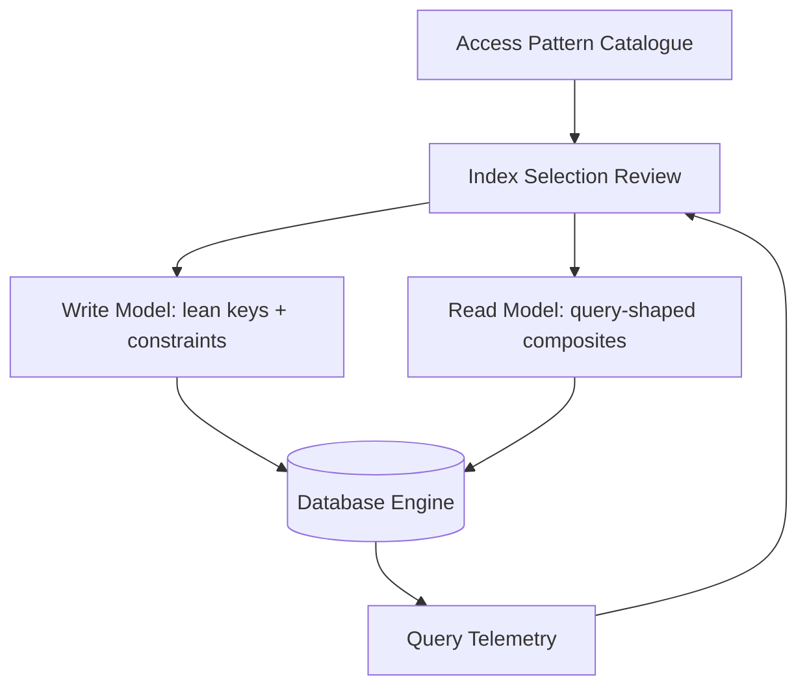

# Volume 09 - Index Strategy

| Field | Value |
|---|---|
| Document ID | WORLD-VOL09-015 |
| Title | Index Strategy |
| Version | 1.0 |
| Status | Approved |
| Classification | Internal |
| Founder | Mahesh Choudhary |

## Purpose

This chapter defines how WORLD designs, governs, and maintains database indexes so that the platform's read surfaces stay fast as data volume grows. Its purpose is to make indexing a deliberate, evidence-driven engineering decision rather than an incidental side effect, ensuring that every query pattern raised by the Business Modules (Vol 06), the AI Business Partner (Vol 03), and reporting is served within its stated latency budget without silently inflating write cost.

## Scope

Covered: the index concept, the index types WORLD standardizes on, how indexes are chosen from real access patterns, tenant-aware indexing, and the governance that prevents index sprawl. Excluded: physical data placement, which belongs to the Partition Strategy (Chapter 16) and Sharding Strategy (Chapter 17), and query tuning beyond index selection, which is treated in Database Performance (Chapter 18). Indexing here is always driven by observed access patterns, never by speculation.

## Concept

An index is a secondary data structure that lets the engine locate rows without scanning an entire table, trading additional storage and write overhead for dramatically faster reads. From first principles, an index is a precomputed ordering of one or more columns that converts an O(n) scan into an O(log n) seek. Every index must therefore justify itself: it accelerates specific queries but must be maintained on every insert, update, and delete that touches its columns. WORLD treats each index as a contract between a known query pattern and the engine, so an index exists only when a real, recurring access path demands it.

## Application in WORLD

WORLD derives indexes from the access patterns catalogued for each aggregate rather than from table shape alone. Write models (Chapter 13) carry a lean set of indexes covering primary keys, foreign keys, and uniqueness constraints, because their job is correct mutation, not query breadth. Read models (Chapter 14) carry richer, query-shaped indexes because they exist to serve specific consumers. Because WORLD is multi-tenant (Vol 05), the tenant identifier is the leading column of virtually every composite index, so the engine narrows to a single tenant's slice before evaluating any further predicate. Index definitions are declared alongside the schema, version-controlled, and reviewed like any other code artifact.

### Enterprise Example

A collections analyst filters overdue invoices by tenant, status, and due date, sorted by amount descending. A naive design indexes each column separately, forcing the engine to intersect three indexes and re-sort the result. WORLD instead defines a single composite index on `(tenant_id, status, due_date)` with `amount` included as a covering column. The query resolves as one range scan inside the tenant partition, returns rows already ordered enough to satisfy the sort, and never touches the base table for the projected columns. The overdue-invoice list, previously a multi-second scan on a large ledger, becomes a bounded indexed lookup that stays fast as invoice volume grows.

## Key Components

| Index Type | Purpose | When Used |
|---|---|---|
| B-Tree Composite | Multi-column equality and range filters | Primary access paths on read and write models |
| Covering Index | Serve a query entirely from the index | Hot list and dashboard queries |
| Unique Index | Enforce identity and business keys | Natural keys, idempotency guards |
| Partial Index | Index only qualifying rows | Sparse states such as active or overdue |
| GIN / Inverted Index | Search within JSON, arrays, and text | Flexible attributes, tag and document search |
| Hash Index | Fast single-value equality | High-cardinality point lookups |

## Trade-offs & Considerations

Every index accelerates reads while taxing writes, consuming storage, and adding a structure the planner must consider, so an unused index is pure liability. WORLD manages this by measuring: index usage telemetry feeds periodic reviews, and indexes with no qualifying reads are retired. Over-indexing a write-heavy aggregate is treated as a defect because it slows the transactional path the platform depends on. Composite index column order is significant and is chosen to match predicate selectivity, with the tenant identifier always leading to preserve isolation. Indexes are created and dropped online to avoid locking, and large index builds are scheduled to respect production load.

## Relationship to Other Layers

Index strategy is the first lever WORLD reaches for in the Performance and Distribution section and is applied before partitioning or sharding, because a well-indexed single node often removes the need to distribute at all. It complements the normalized write models of Chapter 13 and the denormalized read models of Chapter 14 by making both fast to query. It works together with Partition Strategy (Chapter 16), where local indexes are defined per partition, and it feeds the tuning discipline of Database Performance (Chapter 18). The access patterns it serves originate in the Business Modules (Vol 06) and the perception surfaces of the AI Business Partner (Vol 03).

## Cross-References

- [Partition Strategy](/docs/blueprint/volume-09-database/section-d-performance-and-distribution/16-partition-strategy.md)
- [Database Performance](/docs/blueprint/volume-09-database/section-d-performance-and-distribution/18-database-performance.md)
- [Denormalization](/docs/blueprint/volume-09-database/section-c-data-modeling/14-denormalization.md)
- [Volume 08 - Scalability](/docs/blueprint/volume-08-architecture/section-f-operations-and-scale/24-scalability.md)

## References

- [Volume 01 - Vision and Philosophy](/docs/blueprint/volume-01-vision-and-philosophy/README.md)
- [Document Standards](/docs/governance/document-standards.md)

## Change Log

| Version | Date | Author | Notes |
|---|---|---|---|
| 1.0 | 2026-07-12 | Lead Software Engineer | Initial approved version. |
