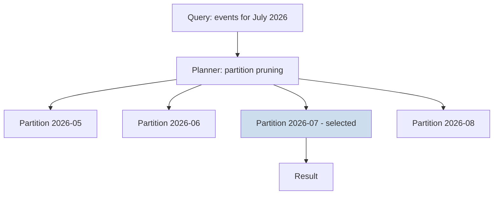

# Volume 09 - Partition Strategy

| Field | Value |
|---|---|
| Document ID | WORLD-VOL09-016 |
| Title | Partition Strategy |
| Version | 1.0 |
| Status | Approved |
| Classification | Internal |
| Founder | Mahesh Choudhary |

## Purpose

This chapter defines how WORLD divides large tables into partitions within a single database so that queries touch only the data they need, maintenance operates on bounded slices, and old data ages out cleanly. Its purpose is to keep the largest tables in the platform - ledgers, events, audit trails, and time-series data - performant and manageable long after they have grown beyond what a single monolithic table can serve efficiently.

## Scope

Covered: the partitioning concept, the partition schemes WORLD standardizes on, how partition keys are chosen, and lifecycle operations such as pruning and rolling windows. Excluded: distribution across separate database instances, which is the Sharding Strategy (Chapter 17), and index design, which is Chapter 15. Partitioning here is a within-node concern: the same engine still owns every partition, so transactions and joins across partitions remain straightforward.

## Concept

Partitioning splits one logical table into multiple physical segments according to a partition key, so the engine can eliminate irrelevant segments before executing a query. From first principles, it exploits locality: if most queries constrain a column such as time or tenant, then physically grouping rows by that column lets the planner skip everything outside the requested range. This is called partition pruning, and it turns a full-table scan into a scan of a single segment. Partitioning also makes maintenance divisible - a segment can be indexed, vacuumed, archived, or dropped independently of the rest of the table.

## Application in WORLD

WORLD partitions its highest-volume tables by the dimension that dominates their access. Time-ordered data - domain events, financial postings, and audit logs - is range-partitioned by period, so recent partitions stay hot and small while older ones are compressed or archived. Reference and transactional tables that are always queried within a tenant are list- or hash-partitioned by tenant identifier, reinforcing the multi-tenant isolation of Volume 05. Partition definitions are declared with the schema, and new time partitions are provisioned ahead of need by an automated maintenance job so writes never arrive at a missing segment.

### Enterprise Example

WORLD's domain event store accumulates hundreds of millions of rows per year. Reporting almost always asks for a bounded window - a month or a quarter - yet an unpartitioned table forces every such query to scan across all years. WORLD range-partitions the event store by month. A query for July's activity prunes to a single monthly partition, so the engine examines a fraction of the data. When events pass their operational retention window, the whole month partition is detached and moved to cold storage in one metadata operation, with no expensive row-by-row delete and no long-running lock. Retention becomes a cheap, predictable lifecycle step rather than a maintenance hazard.

## Key Components

| Partition Scheme | Partition Key | Best For |
|---|---|---|
| Range | Date, sequence, or numeric range | Time-series, ledgers, event and audit logs |
| List | Discrete enumerated values | Region, tenant tier, category |
| Hash | Hashed key value | Even spread when no natural range exists |
| Composite | Two dimensions combined | Tenant then time, for isolation plus pruning |

## Trade-offs & Considerations

Partitioning helps only when queries carry the partition key; a query that omits it must scan every partition and gains nothing, so the key must match the dominant access pattern. Too many small partitions add planning overhead, while too few defeat the purpose, so partition granularity is sized to real data volume. Cross-partition uniqueness requires the partition key to participate in unique constraints, which shapes primary key design. Partitioning changes physical layout but keeps a single transactional boundary, so it is strictly simpler than sharding and is always the preferred first step when a table outgrows comfortable single-segment operation.

## Relationship to Other Layers

Partition strategy sits between indexing and sharding in WORLD's scaling ladder: it is applied after indexing (Chapter 15) can no longer keep a table's maintenance and pruning efficient, and before sharding (Chapter 17) introduces the greater complexity of multiple database instances. It reinforces the tenant isolation established in Volume 05 and provides the natural boundaries along which sharding later divides data. The denormalized reporting stores of Chapter 14 are among its heaviest beneficiaries, and its pruning behaviour is a key input to the tuning practices of Database Performance (Chapter 18).

## Cross-References

- [Index Strategy](/docs/blueprint/volume-09-database/section-d-performance-and-distribution/15-index-strategy.md)
- [Sharding Strategy](/docs/blueprint/volume-09-database/section-d-performance-and-distribution/17-sharding-strategy.md)
- [Volume 05 - ERP Foundation](/docs/blueprint/volume-05-erp-foundation/README.md)
- [Volume 08 - Scalability](/docs/blueprint/volume-08-architecture/section-f-operations-and-scale/24-scalability.md)

## References

- [Volume 01 - Vision and Philosophy](/docs/blueprint/volume-01-vision-and-philosophy/README.md)
- [Document Standards](/docs/governance/document-standards.md)

## Change Log

| Version | Date | Author | Notes |
|---|---|---|---|
| 1.0 | 2026-07-12 | Lead Software Engineer | Initial approved version. |
