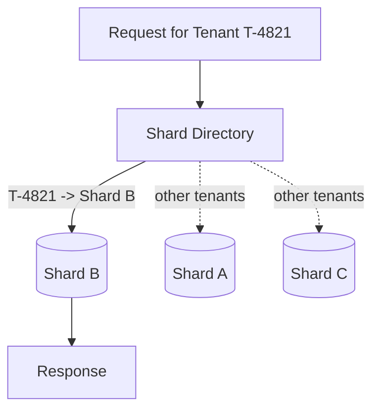

# Volume 09 - Sharding Strategy

| Field | Value |
|---|---|
| Document ID | WORLD-VOL09-017 |
| Title | Sharding Strategy |
| Version | 1.0 |
| Status | Approved |
| Classification | Internal |
| Founder | Mahesh Choudhary |

## Purpose

This chapter defines how WORLD distributes data across multiple independent database instances - shards - when a single instance can no longer hold or serve the platform's data within its capacity and latency budgets. Its purpose is to give WORLD effectively unbounded horizontal data capacity while preserving strict multi-tenant isolation (Vol 05) and keeping the routing logic that finds a tenant's data simple, deterministic, and operable.

## Scope

Covered: the sharding concept, WORLD's tenant-aligned sharding model, the shard key and routing, rebalancing, and cross-shard operations. Excluded: within-node partitioning, which is Chapter 16, and read replication for load, which belongs to Scaling Strategy (Chapter 19). Sharding here means splitting the authoritative dataset across separate primaries; it is the heaviest distribution tool WORLD uses and is applied only when indexing and partitioning have been exhausted.

## Concept

Sharding divides a dataset horizontally across multiple database instances, each owning a disjoint subset of the data and operating as an independent primary. From first principles, it scales writes and storage by removing the single-instance ceiling: no one node holds everything, so aggregate capacity grows with the number of shards. The cost is that data is no longer in one place, so the application must know which shard holds any given row, and operations spanning shards lose the guarantees a single transactional boundary provides. The discipline that makes sharding tractable is choosing a shard key that keeps related data together and routes almost every request to exactly one shard.

## Application in WORLD

WORLD shards by tenant. The tenant identifier is the shard key, so every row belonging to a tenant lives on the same shard and the overwhelming majority of requests - which are already scoped to a single tenant - resolve to one shard with a single routing lookup. A directory service maps each tenant to its shard, allowing tenants to be placed, co-located, or relocated without changing application code. Large tenants can be isolated onto dedicated shards, while many small tenants share a shard, letting WORLD balance load and cost. Because sharding follows the same tenant boundary that Volume 05 already enforces logically, it strengthens isolation rather than complicating it.

### Enterprise Example

WORLD onboards a very large enterprise tenant whose transaction volume alone rivals that of hundreds of smaller tenants combined. Left on a shared shard, its write load would degrade every neighbour. The shard directory instead assigns this tenant to a dedicated shard provisioned with more capacity, while the smaller tenants remain grouped on shared shards. Routing is unchanged from the application's perspective - it still resolves the tenant to a shard and issues a single-shard query - but the noisy neighbour is now physically isolated. When a shared shard later approaches its ceiling, a group of tenants is migrated to a new shard and the directory is updated, spreading load without downtime for the untouched tenants.

## Key Components

| Component | Role | Notes |
|---|---|---|
| Shard Key | Determines data placement | Tenant identifier across all sharded tables |
| Shard Directory | Maps tenant to shard | Authoritative routing, supports relocation |
| Router | Directs each request to its shard | Single-shard resolution for tenant-scoped work |
| Rebalancer | Moves tenants between shards | Online migration to relieve hot shards |
| Cross-Shard Aggregator | Fans out and merges results | Reserved for platform-wide analytics only |

## Trade-offs & Considerations

Sharding grants horizontal scale at the price of operational and query complexity, so WORLD adopts it only after indexing and partitioning can no longer meet targets on a single instance. Cross-shard queries and transactions are expensive and lose single-node atomicity, so WORLD confines them to rare platform-wide analytics and never places a tenant's own workflow across shards. Choosing tenant as the shard key sidesteps the classic hot-key and cross-shard-join problems because tenant workloads are naturally self-contained. Rebalancing must be online and incremental, and the shard directory becomes a critical component that is itself replicated and cached. Global uniqueness and reporting across all tenants require deliberate cross-shard handling rather than relying on a single index.

## Relationship to Other Layers

Sharding is the top rung of WORLD's data-tier scaling ladder, reached only after Index Strategy (Chapter 15) and Partition Strategy (Chapter 16) are fully exploited. It operationalizes at the data tier the horizontal scaling principle set out in Volume 08, and it aligns exactly with the tenant boundary defined in Volume 05, so isolation and distribution share one axis. It works alongside Scaling Strategy (Chapter 19), which adds read replicas and elasticity on top of the sharded topology, and it depends on the observability practices of Database Performance (Chapter 18) to detect the hot shards that trigger rebalancing.

## Cross-References

- [Partition Strategy](/docs/blueprint/volume-09-database/section-d-performance-and-distribution/16-partition-strategy.md)
- [Scaling Strategy](/docs/blueprint/volume-09-database/section-d-performance-and-distribution/19-scaling-strategy.md)
- [Volume 05 - ERP Foundation](/docs/blueprint/volume-05-erp-foundation/README.md)
- [Volume 08 - Scalability](/docs/blueprint/volume-08-architecture/section-f-operations-and-scale/24-scalability.md)

## References

- [Volume 01 - Vision and Philosophy](/docs/blueprint/volume-01-vision-and-philosophy/README.md)
- [Document Standards](/docs/governance/document-standards.md)

## Change Log

| Version | Date | Author | Notes |
|---|---|---|---|
| 1.0 | 2026-07-12 | Lead Software Engineer | Initial approved version. |
