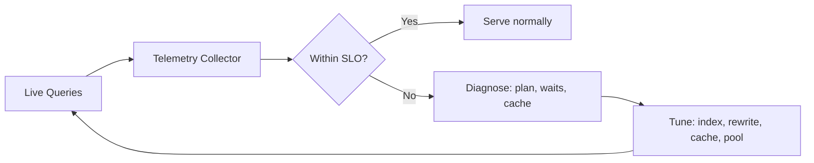

# Volume 09 - Database Performance

| Field | Value |
|---|---|
| Document ID | WORLD-VOL09-018 |
| Title | Database Performance |
| Version | 1.0 |
| Status | Approved |
| Classification | Internal |
| Founder | Mahesh Choudhary |

## Purpose

This chapter defines how WORLD measures, protects, and continuously improves the runtime performance of its data tier. Its purpose is to make database performance an observable, budgeted, and defended property - not an afterthought - so that every consumer, from an interactive Business Module screen (Vol 06) to a background reasoning task of the AI Business Partner (Vol 03), receives predictable latency and throughput under real production load.

## Scope

Covered: the performance concept, service-level objectives, the levers WORLD tunes, connection and resource management, and the observability that drives all of it. Excluded: the structural techniques of indexing, partitioning, and sharding, which are treated in Chapters 15 to 17, and horizontal capacity growth, which is Scaling Strategy (Chapter 19). Performance here is the discipline that ties those structural techniques to measured outcomes and keeps them honest over time.

## Concept

Database performance is the relationship between the work a query demands and the resources - CPU, memory, storage I/O, and connections - available to serve it, expressed as latency and throughput. From first principles, a query is slow because it reads too much data, waits on a contended resource, or repeats work it could have cached. Improving performance therefore means reducing rows examined, removing contention, and reusing results. WORLD approaches this empirically: performance is defined by explicit objectives, measured continuously, and improved by acting on evidence rather than intuition, so tuning targets the queries that actually matter.

## Application in WORLD

Each read surface in WORLD carries a latency budget expressed as a service-level objective, and the data tier is instrumented to report against it. The query planner's execution plans are captured for the most frequent and most expensive statements, and slow-query telemetry surfaces regressions automatically. Connections are pooled so that transient spikes do not exhaust the engine, and long analytical work is routed away from the interactive path. Because WORLD is multi-tenant (Vol 05), performance is measured per tenant as well as in aggregate, so a single heavy tenant cannot quietly consume the shared budget of others. Every performance change is validated against representative production-shaped data before rollout.

### Enterprise Example

A product-catalogue search that normally returns in a fraction of its budget begins breaching its latency objective after a large tenant loads a substantial catalogue expansion. Slow-query telemetry flags the regression and captures the execution plan, which now shows a sequential scan where an index seek previously occurred, because the data distribution shifted and stale planner statistics misled the optimizer. WORLD refreshes the statistics, confirms the plan reverts to an index seek, and adds a targeted covering index for the newly dominant filter. The search returns to within budget, and because the diagnosis was driven by captured plans and per-tenant metrics rather than guesswork, the fix is precise and verifiable.

## Key Components

| Lever | What It Addresses | Typical Action |
|---|---|---|
| Query Plan Analysis | Inefficient execution paths | Rewrite query, refresh statistics, add index |
| Caching | Repeated identical reads | Result and buffer cache, materialized views |
| Connection Pooling | Connection exhaustion under load | Bounded pools, queueing, timeouts |
| Statistics Maintenance | Poor planner decisions | Scheduled and triggered statistics refresh |
| Workload Isolation | Contention between query classes | Separate interactive and analytical paths |
| SLO Telemetry | Undetected regressions | Alert and diagnose on budget breach |

## Trade-offs & Considerations

Every performance lever has a cost boundary: caches serve stale data if their invalidation is wrong, aggressive connection pools mask a genuine capacity shortfall, and over-eager index additions slow writes. WORLD resolves these by budgeting first and tuning to the budget, so effort concentrates on queries that breach their objective rather than on micro-optimizing ones that already pass. Tuning is always validated against production-representative data, because a plan that is optimal on small data can be pathological at scale. Performance work is treated as ongoing operations, not a one-time exercise, since data distributions, access patterns, and tenant mix all drift over time.

## Relationship to Other Layers

Database performance is the measurement and feedback layer that governs the structural techniques of this section: it tells WORLD when an index is missing (Chapter 15), when a table should be partitioned (Chapter 16), or when a shard has grown hot (Chapter 17). It feeds Scaling Strategy (Chapter 19) by distinguishing problems that tuning can solve from those that require added capacity. Its objectives are consumed by the Business Modules (Vol 06) and the AI Business Partner (Vol 03), and its per-tenant discipline upholds the fairness guarantees of Volume 05 while realizing the performance-under-load goals of Volume 08.

## Cross-References

- [Index Strategy](/docs/blueprint/volume-09-database/section-d-performance-and-distribution/15-index-strategy.md)
- [Scaling Strategy](/docs/blueprint/volume-09-database/section-d-performance-and-distribution/19-scaling-strategy.md)
- [Volume 08 - Scalability](/docs/blueprint/volume-08-architecture/section-f-operations-and-scale/24-scalability.md)
- [Volume 08 - CQRS](/docs/blueprint/volume-08-architecture/section-c-application-architecture/12-cqrs.md)

## References

- [Volume 01 - Vision and Philosophy](/docs/blueprint/volume-01-vision-and-philosophy/README.md)
- [Document Standards](/docs/governance/document-standards.md)

## Change Log

| Version | Date | Author | Notes |
|---|---|---|---|
| 1.0 | 2026-07-12 | Lead Software Engineer | Initial approved version. |
