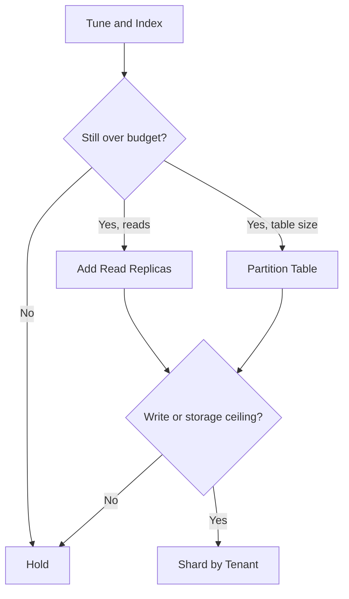

# Volume 09 - Scaling Strategy

| Field | Value |
|---|---|
| Document ID | WORLD-VOL09-019 |
| Title | Scaling Strategy |
| Version | 1.0 |
| Status | Approved |
| Classification | Internal |
| Founder | Mahesh Choudhary |

## Purpose

This chapter defines the overall strategy by which WORLD's data tier grows to meet demand, unifying the individual techniques of indexing, partitioning, sharding, and performance tuning into a single ordered ladder. Its purpose is to give the platform a disciplined, repeatable answer to the question of what to do when load rises, so capacity is added deliberately and cost-effectively rather than reactively, and so the data tier keeps pace with the elastic application tier described in Volume 08.

## Scope

Covered: the scaling concept, the distinction between vertical and horizontal scaling, read scaling through replication, elasticity, and the decision ladder that sequences every scaling move. Excluded: the internal mechanics of the individual techniques, which are detailed in Chapters 15 to 18. Scaling strategy here is the connective policy that decides which technique to apply, in what order, and on what trigger; it is the governance layer over the tools this section provides.

## Concept

Scaling is the act of increasing a system's capacity to handle load, achieved either by making a node bigger (vertical) or by adding more nodes (horizontal). From first principles, vertical scaling is simplest but bounded by the largest available machine, while horizontal scaling is effectively unbounded but introduces distribution complexity. A sound strategy therefore climbs a ladder: exhaust the cheap, simple levers before adopting the expensive, complex ones, and always match the scaling technique to the actual bottleneck - reads, writes, or storage. WORLD applies scaling as a sequence of least-regret decisions, each justified by measurement, never by anticipation alone.

## Application in WORLD

WORLD follows an explicit scaling ladder. First, tuning and indexing (Chapters 15, 18) extract more from existing capacity. Next, read load is offloaded to replicas, which serve the denormalized read models of the CQRS separation (Vol 08) while writes stay on the primary. When single-table size becomes the constraint, partitioning (Chapter 16) keeps it manageable. Only when a single primary can no longer absorb write and storage volume does WORLD shard by tenant (Chapter 17) to scale horizontally. Throughout, capacity is elastic where the platform runs on cloud infrastructure, so replica count and instance size flex with demand. Each rung is entered on a measured trigger and can be exited if load recedes.

### Enterprise Example

WORLD experiences sustained growth as many mid-sized tenants adopt the platform in the same quarter. Dashboards and reports - overwhelmingly read traffic - begin to load the primary. Rather than immediately sharding, WORLD applies the ladder: it first confirms indexing and tuning are healthy, then adds read replicas so all reporting and read-model traffic is served away from the primary, which now handles only writes. Months later, as write volume from the largest tenants approaches the primary's ceiling, WORLD moves to the next rung and shards those heavy tenants onto dedicated primaries. Each step is triggered by a measured limit and sized to actual demand, so capacity is added just ahead of need and no complexity is adopted before it earns its place.

## Key Components

| Scaling Move | Dimension Addressed | When Applied |
|---|---|---|
| Vertical Scale-Up | CPU, memory, I/O headroom | Quick relief before structural change |
| Read Replicas | Read throughput | Read-heavy load, read-model serving |
| Partitioning | Table size, maintenance | Single table outgrows a segment |
| Sharding | Write and storage capacity | Single primary reaches its ceiling |
| Elastic Autoscaling | Variable demand over time | Predictable peaks and troughs |

## Trade-offs & Considerations

Each rung of the ladder adds capability but also cost and complexity, so climbing prematurely wastes effort and money while climbing too late risks breaching objectives, making the timing of each move a measured decision. Vertical scaling buys time but hits a hard ceiling; read replicas scale reads but not writes and introduce replication lag that consumers must tolerate; sharding scales everything but is operationally the heaviest and hardest to reverse. WORLD therefore treats sharding as a last resort and read replication plus partitioning as the workhorses that carry most growth. Elasticity is used to absorb temporal peaks without permanently over-provisioning, and every scaling decision is reversible where practical so capacity can contract when demand falls.

## Relationship to Other Layers

Scaling strategy is the capstone of the Performance and Distribution section: it sequences Index Strategy (Chapter 15), Partition Strategy (Chapter 16), Sharding Strategy (Chapter 17), and Database Performance (Chapter 18) into one coherent growth path. It is the data-tier counterpart to the platform scalability model of Volume 08, ensuring the database keeps pace with an elastic application tier, and it honours the tenant boundary of Volume 05 by scaling along the same axis that defines isolation. Its read-replica rung directly serves the CQRS read models of Chapter 14, and its triggers are supplied by the observability discipline of Chapter 18.

## Cross-References

- [Sharding Strategy](/docs/blueprint/volume-09-database/section-d-performance-and-distribution/17-sharding-strategy.md)
- [Database Performance](/docs/blueprint/volume-09-database/section-d-performance-and-distribution/18-database-performance.md)
- [Volume 08 - Scalability](/docs/blueprint/volume-08-architecture/section-f-operations-and-scale/24-scalability.md)
- [Volume 08 - CQRS](/docs/blueprint/volume-08-architecture/section-c-application-architecture/12-cqrs.md)

## References

- [Volume 01 - Vision and Philosophy](/docs/blueprint/volume-01-vision-and-philosophy/README.md)
- [Document Standards](/docs/governance/document-standards.md)

## Change Log

| Version | Date | Author | Notes |
|---|---|---|---|
| 1.0 | 2026-07-12 | Lead Software Engineer | Initial approved version. |
