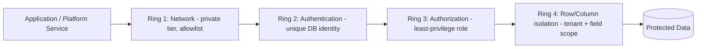

# Volume 09 - Database Security

| Field | Value |
|---|---|
| Document ID | WORLD-VOL09-020 |
| Title | Database Security |
| Version | 1.0 |
| Status | Approved |
| Classification | Internal |
| Founder | Mahesh Choudhary |

## Purpose

This chapter defines how WORLD secures the data tier itself: the controls that protect the databases behind every module against unauthorized access, privilege abuse, and data exfiltration. Application-level authentication and authorization (Volume 08, Chapters 19-20) decide who may issue a command; database security is the independent, last-line control that assumes the application layer may be bypassed or compromised and still keeps the stored truth safe. Its purpose is to make the data tier defensible on its own terms.

## Scope

Covered: the defence-in-depth model applied to WORLD databases, network and connection controls, database-level identity and least privilege, row- and tenant-level isolation, and the operational hardening baseline. Excluded: encryption of data at rest, in transit, and at column level, which is the subject of Chapter 21, and the audit trail that records access, which is Chapter 22. Those chapters complete the Section E triad of protect, encrypt, and prove.

## Concept

From first principles, security at the data tier follows one rule: never trust a single boundary. Every other layer can fail - a credential can leak, an application can carry a flawed query, an operator can act in error - so the database must enforce its own perimeter regardless of what reaches it. WORLD builds this as concentric rings of control. The outermost ring restricts network reachability, so only sanctioned services can open a connection at all. The next ring authenticates the connecting principal, so every session is a known, non-shared identity. The next applies least privilege, so a principal can touch only the objects and operations its role genuinely requires. The innermost ring filters rows and columns, so even an authorized session sees only the tenant and the fields it is entitled to. A request must pass every ring; failure at any ring stops it. This is defence in depth expressed in database terms, and it is the same posture the Volume 05 Security Model prescribes for the platform as a whole.

## Application in WORLD

WORLD databases are never directly reachable from the public network; they sit in a private tier accessible only through the application and platform services. Each service authenticates with its own database identity - no shared superuser, no embedded human credentials - and every identity is granted a narrow role. The application connects through least-privilege roles that can execute the specific operations a module needs and nothing more; administrative rights are separated, time-bound, and never used by running services. Because WORLD is multi-tenant (Chapters 30-31), row-level isolation binds every query to the caller's company context, so tenant data cannot leak across a shared table even if an application query omits the filter. Privileged access is broken by role so that the person who administers the schema is not the person who reads business data, and no single identity holds end-to-end control.

## Key Components

| Component | Control | First-Principles Rationale |
|---|---|---|
| Network isolation | Private data tier, connection allowlist | Reduce attack surface to sanctioned callers only |
| Database identity | Unique, non-shared service accounts | Every session is attributable and revocable |
| Least privilege | Narrow roles per module, separated admin rights | Limit blast radius of any single compromise |
| Row-level isolation | Tenant-scoped access policies | Prevent cross-tenant leakage in shared tables |
| Privileged access management | Time-bound, broken-role admin grants | No standing end-to-end control by one identity |
| Hardening baseline | Disabled defaults, patched engine, minimal extensions | Remove exploitable configuration by default |

## Trade-offs & Considerations

Strong data-tier security adds friction: least-privilege roles must be defined and maintained per module, row-level policies add a predicate to every query, and separated administration slows ad hoc operational fixes. WORLD accepts this cost because the alternative - a convenient shared superuser and open network - converts any single leaked credential into total compromise. The design deliberately avoids two anti-patterns: relying on the application as the only gatekeeper, and granting broad privileges "temporarily" that quietly become permanent. Where emergency access is genuinely needed, it is granted through a time-bound, audited break-glass path rather than a standing account.

### Enterprise Example

An attacker obtains the credentials of the Sales module's service account. Because that identity holds only the least-privilege role for sales objects, the attacker cannot read payroll or ledger tables - a different, unavailable role owns those. Row-level isolation confines any sales query to the tenant context the session carries, so other companies' pipelines stay invisible. The network tier rejects connection attempts from outside the sanctioned service range. The intrusion is contained to one module's data and, per Chapter 22, every access is recorded for investigation. No single stolen credential yields the enterprise.

## Relationship to Other Layers

Database security is the enforcing counterpart to the identity decisions made in Volume 08: authentication and authorization decide intent at the application edge, while this layer enforces least privilege and isolation independently at the store. It presupposes the encryption controls of Chapter 21 - access control and encryption together mean that even bypassing one does not defeat the other - and it feeds Chapter 22, since every enforced or denied access becomes an audit event. Together these realize the platform Security Model of Volume 05 at the data tier.

## Cross-References

- [Data Encryption](/docs/blueprint/volume-09-database/section-e-security-and-audit/21-data-encryption.md)
- [Audit Data](/docs/blueprint/volume-09-database/section-e-security-and-audit/22-audit-data.md)
- [Volume 08 - Authentication](/docs/blueprint/volume-08-architecture/section-e-cross-cutting-concerns/19-authentication.md)
- [Volume 08 - Authorization](/docs/blueprint/volume-08-architecture/section-e-cross-cutting-concerns/20-authorization.md)
- [Volume 05 - ERP Foundation (Security Model)](/docs/blueprint/volume-05-erp-foundation/README.md)

## References

- [Volume 01 - Vision and Philosophy](/docs/blueprint/volume-01-vision-and-philosophy/README.md)
- [Document Standards](/docs/governance/document-standards.md)

## Change Log

| Version | Date | Author | Notes |
|---|---|---|---|
| 1.0 | 2026-07-12 | Lead Software Engineer | Initial approved version. |
