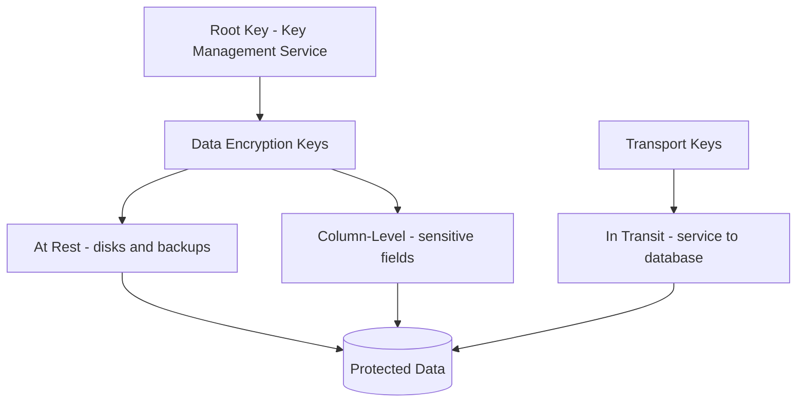

# Volume 09 - Data Encryption

| Field | Value |
|---|---|
| Document ID | WORLD-VOL09-021 |
| Title | Data Encryption |
| Version | 1.0 |
| Status | Approved |
| Classification | Internal |
| Founder | Mahesh Choudhary |

## Purpose

This chapter defines how WORLD renders stored and moving data unintelligible to anyone without the right key. Access control (Chapter 20) keeps unauthorized principals out; encryption ensures that if they nonetheless reach the bytes - a stolen disk, an intercepted connection, a mishandled backup - those bytes reveal nothing. Its purpose is to make confidentiality a mathematical property of the data itself, not merely a consequence of a working access boundary.

## Scope

Covered: encryption at rest, encryption in transit, column-level encryption for the most sensitive fields, and the key management discipline that underpins all three, described conceptually. Excluded: the access-control rings of Chapter 20 and the audit trail of Chapter 22. Encryption is treated here as an independent layer that assumes the access boundary may fail.

## Concept

From first principles, encryption converts plaintext into ciphertext under a key, so that confidentiality depends only on control of the key rather than control of the medium. WORLD applies this at three depths. Encryption at rest protects data as it sits on disk and in backups, defeating physical theft and improper media disposal. Encryption in transit protects data as it moves between service and database and between nodes, defeating interception on the network. Column-level encryption protects individual high-sensitivity fields - such as identifiers, financial account numbers, or secrets - so that even a fully authorized reader of a table sees ciphertext unless separately entitled to decrypt. These are complementary, not redundant: at-rest defeats a stolen volume, in-transit defeats a tapped wire, and column-level defeats an over-broad but legitimate query. The strength of the whole scheme reduces to one question - who can obtain the keys - which is why key management is the true centre of gravity.

## Application in WORLD

WORLD encrypts all data at rest by default across primary stores and their backups; there is no unencrypted tier. All connections to and between databases are encrypted in transit, and unencrypted connections are refused rather than downgraded. For a defined set of the most sensitive fields, WORLD adds column-level encryption so that sensitivity does not depend solely on table-level access. Keys are never stored beside the data they protect. WORLD uses a key hierarchy: a root key held in a dedicated key management service protects data-encryption keys, which in turn protect the data. Keys are rotated on a schedule, rotation re-wraps without mass re-encryption of plaintext, and access to the key service is itself a least-privilege, audited operation. This separation means that compromising the database does not compromise the keys, and compromising a key custodian does not by itself yield the data.

## Key Components

| Layer | What It Protects | Threat Defeated | WORLD Default |
|---|---|---|---|
| At rest | Data on disk and in backups | Stolen media, improper disposal | Always on, all stores |
| In transit | Data moving over the network | Interception, tampering | Enforced, no downgrade |
| Column-level | Individual sensitive fields | Over-broad but authorized reads | Applied to defined fields |
| Key management | The keys themselves | Key theft, insider misuse | Root key in KMS, key hierarchy |
| Key rotation | Long-lived key exposure | Slow compromise over time | Scheduled re-wrap rotation |

## Trade-offs & Considerations

Encryption costs performance and operational complexity. In-transit encryption adds handshake and per-message overhead; column-level encryption prevents the database from indexing or range-querying the encrypted values directly, so it is reserved for fields where confidentiality outweighs queryability. Key management introduces a hard dependency: lose the keys and the data is unrecoverable, so key durability and backup are as critical as data backup. WORLD deliberately avoids two mistakes: storing keys next to data (which makes encryption theatre) and encrypting everything at column level (which cripples the query model). The guiding principle is to encrypt broadly at rest and in transit, and surgically at the column level only where the field's sensitivity justifies the query cost.

### Enterprise Example

A backup snapshot of the finance database is inadvertently copied to an unsecured location. Because at-rest encryption covers backups, the file is ciphertext and useless without the data-encryption key, which lives only in the key management service. Within that same database, employee bank-account numbers are additionally column-encrypted, so even an analyst with legitimate read access to the payroll table sees ciphertext unless separately entitled to decrypt. The exposure that would have been a breach becomes a non-event, and the attempted key access is recorded per Chapter 22.

## Relationship to Other Layers

Encryption is the confidentiality complement to the access control of Chapter 20: access control governs who may reach the data, encryption governs whether reaching it yields anything. It reinforces the backup and archival strategies of Section F, since encrypted-at-rest guarantees follow the data into cold storage. Every key access and decryption of note is an event for the audit trail of Chapter 22, and the whole scheme realizes the confidentiality obligations of the Volume 05 Security Model at the data tier.

## Cross-References

- [Database Security](/docs/blueprint/volume-09-database/section-e-security-and-audit/20-database-security.md)
- [Audit Data](/docs/blueprint/volume-09-database/section-e-security-and-audit/22-audit-data.md)
- [Volume 08 - Authentication](/docs/blueprint/volume-08-architecture/section-e-cross-cutting-concerns/19-authentication.md)
- [Volume 05 - ERP Foundation (Security Model)](/docs/blueprint/volume-05-erp-foundation/README.md)

## References

- [Volume 01 - Vision and Philosophy](/docs/blueprint/volume-01-vision-and-philosophy/README.md)
- [Document Standards](/docs/governance/document-standards.md)

## Change Log

| Version | Date | Author | Notes |
|---|---|---|---|
| 1.0 | 2026-07-12 | Lead Software Engineer | Initial approved version. |
