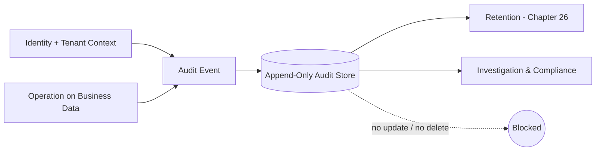

# Volume 09 - Audit Data

| Field | Value |
|---|---|
| Document ID | WORLD-VOL09-022 |
| Title | Audit Data |
| Version | 1.0 |
| Status | Approved |
| Classification | Internal |
| Founder | Mahesh Choudhary |

## Purpose

This chapter defines how WORLD records, at the data tier, an immutable account of who did what to which data and when. Access control protects the data and encryption conceals it; audit data proves what happened to it. Its purpose is to give the enterprise a trustworthy, tamper-evident record that supports investigation, compliance, and accountability - the data-tier realization of the Volume 05 Audit Trail (Chapter 34).

## Scope

Covered: the concept of audit data, what WORLD captures at the data tier, the structure and immutability of audit records, and their retention and separation from operational data. Excluded: the security controls that generate access decisions (Chapter 20) and the encryption of the records themselves (Chapter 21), both of which the audit layer relies upon. This chapter concerns the evidentiary record, not the enforcement.

## Concept

From first principles, an audit trail is trustworthy only if it is complete, attributable, ordered, and immutable. Complete means every material change and sensitive read is captured, with no silent gaps. Attributable means each entry names the responsible identity, not a shared account. Ordered means entries carry reliable, monotonic timing so a sequence of events can be reconstructed. Immutable means an entry, once written, cannot be altered or deleted by the actors it observes - otherwise the trail can be edited to hide the very act it should record. WORLD therefore treats audit data as append-only and write-once: the audit store accepts inserts but not updates or deletes from operational principals. Because the point of an audit record is to be believed later, its integrity is protected independently of the systems it watches.

## Application in WORLD

WORLD captures audit data as an append-only stream of events describing changes to and sensitive access of business data: the acting identity, the tenant context, the operation, the affected entity, before-and-after state where applicable, and a trusted timestamp. This aligns with the platform Audit Trail of Volume 05, Chapter 34, which the data tier feeds and enforces. Audit records are stored separately from the operational data they describe, so that compromising a business table does not grant the ability to rewrite its history. Operational service identities can append audit entries but hold no privilege to modify or remove them; that separation is enforced by the least-privilege model of Chapter 20. The records are encrypted per Chapter 21 and retained under the retention policy of Chapter 26, since an audit trail that expires too soon fails the very investigations it exists to support.

## Key Components

| Attribute | Captured Value | Why It Matters |
|---|---|---|
| Actor identity | Unique principal that acted | Attribution - no shared blame |
| Tenant context | Company scope of the action | Isolation and cross-tenant integrity |
| Operation | Create, update, delete, sensitive read | Defines what happened |
| Affected entity | Object and key touched | Locates the change |
| Before / after state | Prior and new values on change | Reconstructs and reverses |
| Trusted timestamp | Reliable, ordered time | Sequences events for reconstruction |
| Integrity marker | Tamper-evidence over the entry | Proves the record was not altered |

## Trade-offs & Considerations

Comprehensive auditing generates volume and cost: every material change and sensitive read produces a durable, retained, encrypted record, which grows continuously and must be stored apart from operational data. WORLD accepts this because a partial or mutable trail is worse than none - it invites false confidence. The design avoids three failure modes: auditing so narrowly that material actions go unrecorded, storing audit data in the same place and under the same privileges as the data it watches (which lets an attacker erase their tracks), and retaining records for too short a period to satisfy investigation and compliance. To manage volume, WORLD distinguishes high-value events that are always captured from low-value noise, and tiers older audit data into cheaper storage under Section F rather than discarding it prematurely.

### Enterprise Example

A ledger entry is altered shortly before a period close. The audit stream holds an append-only record: the acting identity, the company context, the prior and new amounts, and a trusted timestamp - written to a separate, write-once store that the acting service cannot modify. During review, the discrepancy is traced to the exact actor and moment, the before-state supports correction, and because the record is tamper-evident and immutable, it stands as reliable evidence. Even if the actor still held access to the ledger table, they held no privilege to rewrite the audit history that convicts the change.

## Relationship to Other Layers

Audit data is the accountability layer that completes Section E: Chapter 20 controls access, Chapter 21 conceals content, and this chapter proves conduct. It depends on the least-privilege separation of Chapter 20 to keep the trail unforgeable and on the encryption of Chapter 21 to keep the records confidential, and it is governed by the retention policy of Chapter 26. Upward, it is the data-tier source for the platform Audit Trail of Volume 05, Chapter 34, and it complements the application-level logging of Volume 08, Chapter 21, which records behaviour while audit data records data change.

## Cross-References

- [Database Security](/docs/blueprint/volume-09-database/section-e-security-and-audit/20-database-security.md)
- [Data Encryption](/docs/blueprint/volume-09-database/section-e-security-and-audit/21-data-encryption.md)
- [Volume 08 - Logging](/docs/blueprint/volume-08-architecture/section-e-cross-cutting-concerns/21-logging.md)
- [Volume 05 - ERP Foundation (Audit Trail, Chapter 34)](/docs/blueprint/volume-05-erp-foundation/README.md)

## References

- [Volume 01 - Vision and Philosophy](/docs/blueprint/volume-01-vision-and-philosophy/README.md)
- [Document Standards](/docs/governance/document-standards.md)

## Change Log

| Version | Date | Author | Notes |
|---|---|---|---|
| 1.0 | 2026-07-12 | Lead Software Engineer | Initial approved version. |
