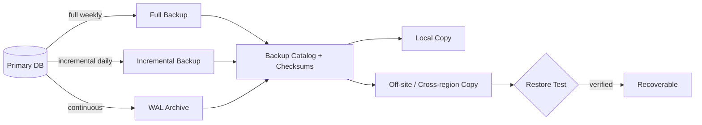

# Volume 09 - Backup Strategy

| Field | Value |
|---|---|
| Document ID | WORLD-VOL09-023 |
| Title | Backup Strategy |
| Version | 1.0 |
| Status | Approved |
| Classification | Internal |
| Founder | Mahesh Choudhary |

## Purpose

This chapter defines the backup discipline that guarantees WORLD can always recover a correct, recent copy of its data after loss, corruption, or catastrophe. Its purpose is to establish, from first principles, what a backup is, which recovery objectives it must satisfy, and how WORLD produces durable, verifiable, restorable copies of every data category. Backup is the first half of survivability; restore (Chapter 24) is the second, and both realize the resilience posture set out in the Disaster Recovery chapter of Volume 08.

## Scope

Covered: the backup concept, backup types, the recovery objectives (RPO and RTO) that drive frequency and topology, copy placement, and verification. Excluded: the mechanics of recovery execution (Chapter 24), long-term retention of aged data for value rather than survivability (Chapters 25 and 26), and the physical infrastructure that hosts backup targets, which belongs to Volume 11.

## Concept

A backup is a point-in-time copy of data, stored independently of the primary system, from which the primary can be reconstructed. From first principles, durability is not a property of a single copy; it emerges from independent copies that do not share a common failure. A backup that lives on the same disk, host, or region as the source is not a backup - it is a second victim of the same event. Two objectives quantify how good a backup regime must be. The Recovery Point Objective (RPO) is the maximum acceptable data loss measured in time - how far back the most recent usable copy may sit. The Recovery Time Objective (RTO) is the maximum acceptable time to restore service. RPO is governed by backup frequency and continuous log capture; RTO is governed by restore speed and copy proximity. WORLD adopts the 3-2-1 principle as its baseline: at least three copies, on at least two distinct media or storage classes, with at least one copy off-site.

## Application in WORLD

WORLD backs up each data category (Section B) according to its criticality. Transactional write models are protected by full backups plus continuous write-ahead log (WAL) archiving, enabling point-in-time recovery to any committed instant within the retention window. Master and reference data are captured on the same cadence but carry the strictest RPO because they anchor every module. Analytical stores are rebuildable from their sources, so they are backed up less aggressively and rely on reprojection. Every backup is encrypted at rest using the keys defined in Chapter 21, catalogued with checksums, and immutable for its protection window so that ransomware or accidental deletion cannot alter it.

### Enterprise Example

Consider WORLD's Finance ledger, which must never lose a posted journal. A weekly full backup establishes a base; daily incrementals capture changed blocks; and continuous WAL archiving streams every committed transaction to an off-site, immutable object store. If the primary is corrupted on a Thursday afternoon, WORLD restores the last full backup, applies the intervening incrementals, then replays WAL up to the second before corruption. The effective RPO is near-zero and the ledger is reconstructed exactly, with no double-posted or missing entries.

## Key Components

| Backup Type | What It Captures | Typical Cadence | RPO Contribution | RTO Cost |
|---|---|---|---|---|
| Full | Entire dataset | Weekly | Baseline point | Highest to take, fastest single-source restore |
| Incremental | Changed blocks since last backup | Daily | Narrows loss window | Must chain from full |
| WAL / Log archive | Every committed transaction | Continuous | Near-zero | Requires replay time |
| Snapshot | Storage-level point-in-time image | Hourly | Short window | Fast local rollback |

## Trade-offs & Considerations

Backup frequency trades cost and system load against RPO: tighter RPO demands more frequent copies and continuous log shipping, which consume storage and I/O. Full backups are simple to restore but expensive to take; incremental and log-based schemes are cheap to take but require an intact chain, so a single missing link breaks the sequence. WORLD resolves this by combining periodic fulls with continuous WAL, capping chain length, and treating an unverified backup as no backup - a copy that has never been test-restored cannot be trusted. Immutability and encryption add protection against tampering at the cost of key-management rigor, which WORLD accepts as non-negotiable.

## Relationship to Other Layers

Backup consumes the encryption keys and audit posture of Section E and feeds directly into the restore procedures of Chapter 24, which turn copies into recovered service. Together they implement the Disaster Recovery strategy of Volume 08, where RPO and RTO are set per business tier. Backup is distinct from archival (Chapter 25): backups exist to survive loss and are eventually superseded, whereas archives preserve aged data for long-term value and compliance under the retention policy of Chapter 26.

## Cross-References

- [Restore Strategy](/docs/blueprint/volume-09-database/section-f-data-lifecycle/24-restore-strategy.md)
- [Data Encryption](/docs/blueprint/volume-09-database/section-e-security-and-audit/21-data-encryption.md)
- [Volume 08 - Architecture](/docs/blueprint/volume-08-architecture/README.md)
- [Volume 05 - ERP Foundation](/docs/blueprint/volume-05-erp-foundation/README.md)

## References

- [Volume 01 - Vision and Philosophy](/docs/blueprint/volume-01-vision-and-philosophy/README.md)
- [Document Standards](/docs/governance/document-standards.md)

## Change Log

| Version | Date | Author | Notes |
|---|---|---|---|
| 1.0 | 2026-07-12 | Lead Software Engineer | Initial approved version. |
