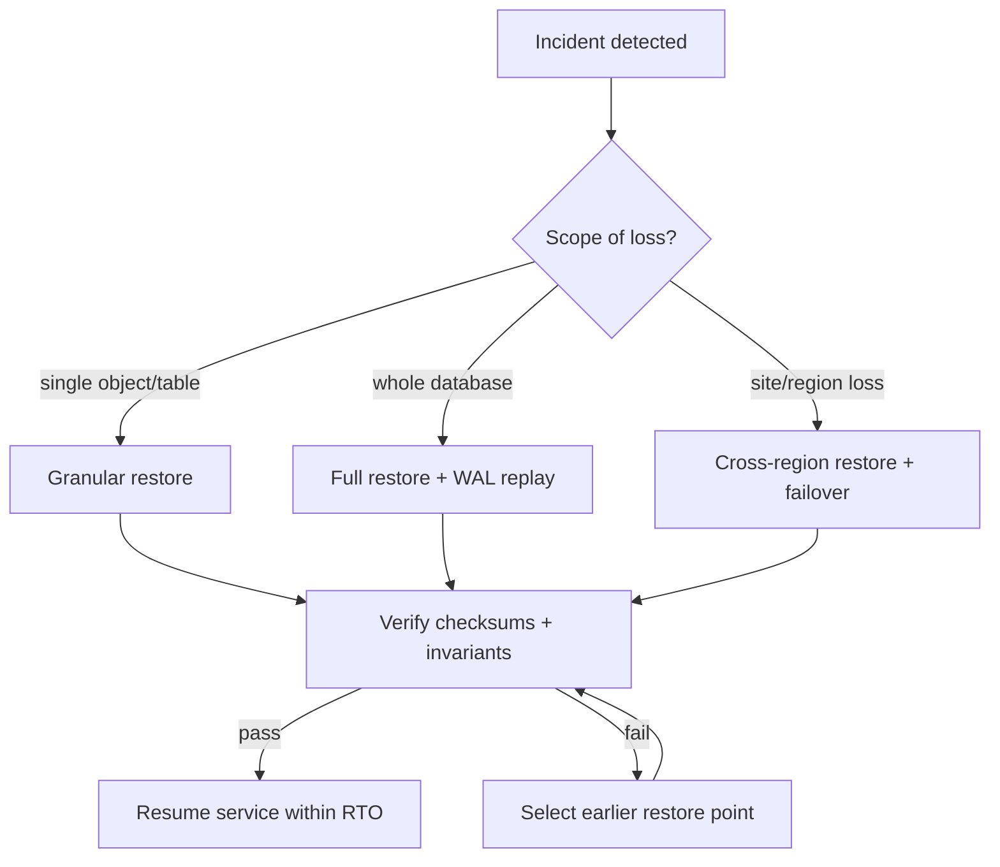

# Volume 09 - Restore Strategy

| Field | Value |
|---|---|
| Document ID | WORLD-VOL09-024 |
| Title | Restore Strategy |
| Version | 1.0 |
| Status | Approved |
| Classification | Internal |
| Founder | Mahesh Choudhary |

## Purpose

This chapter defines how WORLD turns backup copies into recovered, trustworthy, running data. A backup has no value until it is restored correctly and on time; this chapter establishes the restore concept, the recovery scenarios WORLD must handle, and the procedures that meet the Recovery Time and Recovery Point Objectives set by the Disaster Recovery strategy of Volume 08. Restore is the proof that the backup strategy of Chapter 23 actually works.

## Scope

Covered: the restore concept, restore types and scenarios, point-in-time recovery, verification, and the drills that keep recovery reliable. Excluded: the creation and durability of backup copies (Chapter 23), long-term archival retrieval (Chapter 25), and the infrastructure failover and orchestration that surround a restore, which belong to Volume 08 and Volume 11.

## Concept

Restore is the reconstruction of a dataset from one or more backup copies to a known-good state at a chosen point in time. From first principles, a restore is only successful if it is correct, complete, and fast enough: correct means the recovered data satisfies every invariant the write model enforces; complete means no committed transaction is silently missing; fast enough means service returns within the RTO. Point-in-time recovery (PITR) is the ability to restore not merely to the last full backup but to any committed instant, achieved by restoring a base copy and replaying the write-ahead log forward to the target moment. The two governing measures mirror Chapter 23: RPO is fixed by how recent the usable copy is, and RTO is fixed by how quickly the restore completes.

## Application in WORLD

WORLD treats restore as a first-class, rehearsed operation, not an emergency improvisation. Each data tier has a defined restore path: transactional stores are restored from the latest full plus incrementals plus WAL replay to a chosen instant; master and reference data are restored first because dependent modules cannot start without them; analytical stores are preferentially rebuilt by reprojection from restored sources rather than restored directly. Every restore is verified before it is trusted - checksums are compared, invariants are re-checked, and the audit trail of Chapter 22 is used to confirm the recovered state is internally consistent. Restore drills are scheduled so that RTO and RPO are measured against reality, not assumed.

### Enterprise Example

At 14:05 an operator error truncates a live Inventory table. WORLD does not restore the entire database - it performs a granular restore of the affected table from the most recent snapshot, then replays WAL for that object up to 14:04, one minute before the error. The recovered table is checksum-verified and its foreign-key invariants against Master Data are re-validated before it rejoins the live schema. Because the restore path was pre-defined and drilled, service resumes well inside the tier's RTO and no committed stock movement is lost.

## Key Components

| Restore Type | Scenario | Source Used | RTO Profile | RPO Achieved |
|---|---|---|---|---|
| Granular | Single object or table loss | Snapshot + object WAL | Fast | Near-zero |
| Full database | Corruption of whole store | Full + incrementals + WAL | Moderate | Chosen PITR instant |
| Point-in-time | Logical error to precise moment | Base + WAL replay to target | Moderate | Exact instant |
| Cross-region | Site or region failure | Off-site copy + failover | Longest | Last replicated point |

## Trade-offs & Considerations

Restore strategy trades speed against granularity and cost. Granular restores are fast and cheap but assume the loss is localized; full restores are comprehensive but slower and heavier. PITR gives exact control at the cost of replay time proportional to how much log must be applied - a distant recovery point means longer replay and higher RTO. Cross-region restore gives the strongest protection against regional loss but incurs the highest RTO due to data transfer and failover coordination. WORLD mitigates these by pre-selecting the narrowest sufficient restore path per scenario, keeping backup chains short so replay is bounded, and rehearsing regularly, because an untested restore procedure is a latent RTO breach.

## Relationship to Other Layers

Restore is the direct counterpart of Chapter 23: backup produces copies, restore consumes them, and only their combination delivers survivability. Both are governed by the RPO and RTO tiers defined in the Disaster Recovery chapter of Volume 08, and restore relies on the encryption keys of Chapter 21 to decrypt protected copies and the audit data of Chapter 22 to verify recovered state. Restore differs from archival retrieval (Chapter 25), which serves aged data for value and compliance rather than reconstructing live service.

## Cross-References

- [Backup Strategy](/docs/blueprint/volume-09-database/section-f-data-lifecycle/23-backup-strategy.md)
- [Archival Strategy](/docs/blueprint/volume-09-database/section-f-data-lifecycle/25-archival-strategy.md)
- [Volume 08 - Architecture](/docs/blueprint/volume-08-architecture/README.md)
- [Audit Data](/docs/blueprint/volume-09-database/section-e-security-and-audit/22-audit-data.md)

## References

- [Volume 01 - Vision and Philosophy](/docs/blueprint/volume-01-vision-and-philosophy/README.md)
- [Document Standards](/docs/governance/document-standards.md)

## Change Log

| Version | Date | Author | Notes |
|---|---|---|---|
| 1.0 | 2026-07-12 | Lead Software Engineer | Initial approved version. |
